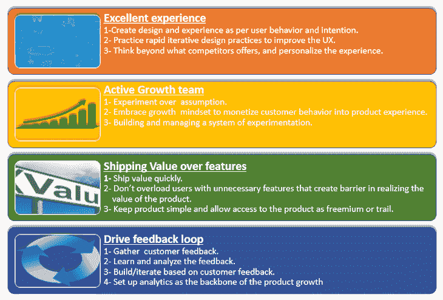
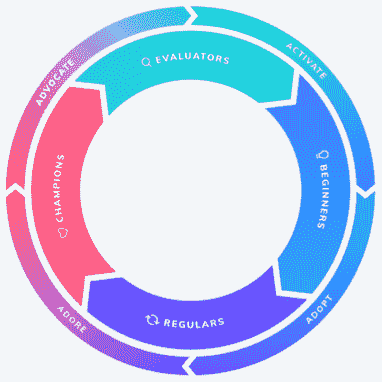

# 什么是产品主导型增长？策略、原则和示例

> 原文：<https://blog.logrocket.com/product-management/what-is-product-led-growth-strategies-principles-examples/>

## 目录

* * *

## 什么是产品主导型增长？

产品导向的增长将产品置于组织所做的一切的中心。任何以产品为导向的增长战略的目标都是打造一款通过出色的用户体验实现增长的产品。

在产品导向的增长中，整个组织致力于在增长循环中吸引和服务客户，通常称为[产品导向的增长飞轮](https://www.productled.org/foundations/the-product-led-growth-flywheel)。无需太多人工干预，增长飞轮就成为收入和扩张来源。

最近，以产品为导向的增长受到了广泛的欢迎，许多初创公司和大公司在保持低销售和营销成本的同时更快地扩大规模。

Zoom、Slack、Pinterest、Grammarly 和 Calendly 是几个以产品为导向的成长型公司的例子，它们通过提供世界级的个性化用户体验、持续创新和不可否认的价值，展示了复合式的成功。

用户行为模式正在转变。如果客户坚持使用一种产品，他们需要卓越的体验，而产品导向的增长将用户和他们的需求放在首位。

## 成长型产品经理(GPM)是做什么的？

在产品导向的增长中，用户体验(UX)和[产品体验(PX)](https://blog.logrocket.com/product-management/what-is-product-experience-examples-how-to-improve-px/) 是获得、激活、满足和保留客户的主要驱动力。产品经理认为[产品指标](https://blog.logrocket.com/product-management/what-metrics-kpis-product-managers-track/)是增长的支柱和产品升级的关键。

专注于[产品增长指标](https://blog.logrocket.com/product-management/product-growth-channels-strategies-examples/)的项目经理被称为增长型产品经理(gpm)。成长项目经理的目标是[通过产品传递价值，以实现业务成果](https://blog.logrocket.com/product-management/what-is-business-value-how-to-measure-it/)。当团队[采用敏捷原则](https://blog.logrocket.com/product-management/agile-product-management-what-does-it-mean/)来快速响应变化以最小化上市时间时，这个价值被优化。

为了验证这些变化，成长项目经理创建了实验，包括运行 A/B 测试，并通过调查和访谈收集客户反馈，以验证 PX 的变化是否有可能[提高忠诚度和忠诚度](https://blog.logrocket.com/product-management/what-is-customer-retention-rate-how-to-calculate/)。

成长型项目经理通常在快节奏的环境中工作，以指标为导向，以目标为导向。这种对指标和 KPI 的关注有助于他们在整个转化漏斗中关注客户的旅程。基线的任何下降都会促使增长项目经理寻找机会调整以产品为导向的增长战略。

与传统的项目经理不同，成长型产品经理依靠短期实验来跟踪客户获取、转化和保留以及可扩展性方面的成功。普通产品经理更注重发现客户的痛点，并与设计和工程部门密切合作，以[特性和功能](https://blog.logrocket.com/product-management/what-are-product-features-define-examples/)的形式传递价值，以解决客户的痛点。

另一方面，成长型项目经理与工程、分析、UX、设计、业务利益相关方和[营销](https://blog.logrocket.com/product-management/product-marketing-manager-job-description-role-skills/)合作，通过交叉协作提高上述指标并展现适应性和灵活性。

通常，成长项目经理不喜欢程序化的方法或与剧本一致的过程。[增长引擎不是万能的](https://blog.logrocket.com/product-management/product-growth-channels-strategies-examples/)；同样，增长型项目经理是动态的，相信识别核心问题并相应地不断调整增长战略。

## 4 产品导向型增长的原则

这是产品导向型增长的四个原则:

1.  [出色的体验](#excellent-experience)
2.  [活跃的成长团队](#active-growth-team)
3.  [运输价值超过功能](#shipping-value-over-features)
4.  [驱动反馈回路](#drive-feedback-loop)

### 出色的体验

出色的用户和产品体验使得[留住](https://blog.logrocket.com/product-management/what-is-customer-retention-rate-how-to-calculate/)和[收购](https://blog.logrocket.com/product-management/what-is-aarrr-pirate-metrics-framework/#acquisition)。对于一个以产品为导向的组织来说，没有什么比失去潜在客户更糟糕的了。

出色的设计和产品体验确保了无摩擦和直观的客户之旅，这使用户能够发展他们感到舒适的行为和模式，这是实践产品导向型增长的预期结果。

舒适的行为模式转化为出色的用户和产品体验，为客户的日常生活增加价值，并帮助他们[完成工作](https://blog.logrocket.com/product-management/what-is-jobs-to-be-done-framework-examples/)。

### 积极成长团队

活跃的成长团队是产品导向型组织的重要支柱。它使产品交付到市场，客户获取，转换和扩展。

为此，增长团队[通过产品获取价值](https://blog.logrocket.com/product-management/what-is-business-value-how-to-measure-it/),以保持短期和长期盈利。它通过积极进行试验，拒绝满足于一种一刀切的流程或不能为客户创造价值的增长战略来做到这一点。

在以产品为导向的组织中，失败和快速转型是积极成长团队的两种重要方法。

### 运输价值高于功能

运输价值高于功能对于产品导向的增长至关重要。产品促进增长，因此客户必须了解产品如何改善他们的日常生活。

在最初的探索阶段，有一段很短的时间让用户认识到你产品的价值。如果他们这样做了，这种认识可能会将潜在客户转化为现有客户。

相反，[交付闪亮的新功能](https://blog.logrocket.com/product-management/what-is-feature-creep-how-to-avoid/)可能会引人注目，但它实际上并没有帮助客户实现这种价值，因此不支持产品导向的增长。

例如，体验免费试用版 Zoom (40 分钟通话限制——听起来熟悉吗？)通常会购买付费版本，以获得不间断的体验。产品价值不仅在于付费版本，还在于免费增值模式，这是客户转化的切入点和增长飞轮。

### 驱动反馈回路

当顾客使用产品时，他们喜欢精心策划的体验。实现这一点的最佳方式是通过持续不断地积极倾听来了解客户的需求和痛点。

产品导向型增长背后的理念是[根据客户反馈](https://blog.logrocket.com/product-management/customer-feedback-why-you-should-seek-how-to-obtain/)来扩展产品，而不是基于假设来构建。在任何以产品为导向的组织中，调查、实验和发现会议都是广泛采用的实践，通过洞察力和趋势来分析客户旅程。

反过来，一个封闭的反馈循环增加了客户保留率，并通过增强的体验实现了收购。

产品导向型增长的原则可以总结如下:

Principles of product-led growth

## 产品导向型公司的例子

一流的产品主导型公司包括:

*   特雷罗
*   一款云视频会议软件
*   松弛的
*   Dropbox
*   开源代码库
*   销售力量
*   语法上
*   拼趣
*   最近

这些公司采用以产品为导向的增长战略，让客户通过免费增值或试用版发现其产品的价值。这种策略经常触发激活和获取，因为它使用户体验到发起购买的价值。

不要把钱花在营销和销售策略上(例如，销售导向的增长)，采用产品导向的增长方法有助于组织通过一流的 UX 和 PX 专注于扩展和改进产品。

这些公司制定数据驱动的决策，并将用户意图和行为作为改进产品的关键。他们量化客户意图，通过个性化和独一无二的功能改善客户旅程，提供啊哈时刻。

此外，以产品为导向的公司[在整个组织中发展一种增长思维](https://blog.logrocket.com/product-management/growth-mindset-what-does-it-mean/)，从高管到内部和外部利益相关者。

使他们保持一致的是北极星度量，这是该组织努力实现的共同目标。北极星是挖掘客户价值和业务最佳点的方法。它还确保了公司不会成为一个运输功能工厂，而是专注于提供改变客户生活的价值。

* * *

订阅我们的产品管理简讯
将此类文章发送到您的收件箱

* * *

每个以产品为导向的增长型组织都有自己的北极星指标。例如，Zoom 的北极星指标是平均每周主持会议。

## 哪些指标对产品导向的增长很重要？

产品导向的增长飞轮是一个战略框架，将客户的旅程分为四个关键阶段:

1.  求值程序
2.  新手
3.  规则的
4.  冠军

用户在每个阶段的行为展示了他们在激活、采用、崇拜和倡导度量标准方面的行为。这就是所谓的飞轮增长效应，把免费增值客户变成付费客户。

Source: [AppCues](https://www.appcues.com/product-led-growth-flywheel)

这个飞轮与 500 Startups 的创始人、硅谷投资者戴夫·麦克卢尔(Dave McClure)提出的概念 [AARRR 或盗版指标](https://blog.logrocket.com/product-management/what-is-aarrr-pirate-metrics-framework/)密切相关。

现在，让我们寻找一些 SaaS 指标，帮助项目经理获得他们需要的洞察力，以衡量由产品导向型飞轮驱动的增长:

### 价值实现时间

价值实现时间是新用户实现产品价值所需的时间。实现价值的时间越短，激活率越高。

目标是尽可能缩短价值实现时间。这个指标介于产品导向飞轮的两个阶段之间:评估者和初学者。

### 产品合格的销售线索(pql)

产品导向型增长的关键要素之一是将免费试用用户转化为付费用户。PQL 洞察捕捉那些接近采纳阶段并准备转化的用户。

### 扩张收入

扩张收入是一个重要的增长指标，衡量通过追加销售、附加产品、交叉销售、个性化等产生的收入。

扩张收入值越高越好。

### 每次访问的平均收入(ARPU)

ARPU 是个人用户每次访问产品时花费的平均金额。

ARPU 是基于订阅的模式业务增长的一个很好的指标。ARPU 的价值越高，企业就越健康。

### 净流失百分比

净流失衡量的是计入新收入、扩张收入和重新激活收入后的资金损失百分比。

净流失百分比的计算方法如下:

**净营收流失率%** = ( *期间损失的营收*–*新增、扩张和重新激活的营收* ) / *期初营收*

这个数字有助于解释客户流失对业务的影响。

例如，假设您失去了 50 美元的客户收入，同时通过扩张、重新激活和新客户获得了 100 美元。净流失将是负的(50-100 美元)=-50 美元。净负流失是一个好迹象。

### 活力

随着越来越多的人分享和推荐你的产品，病毒式传播促进了采用率的指数增长。这就像通过口碑和分享积极的反馈来获取现有用户可以带来的新用户。

病毒式传播是基于订阅的产品的一个强有力的衡量标准。如果病毒式传播指标很高，产品将呈指数级增长。

## 以产品为导向作为走向市场的策略

在以产品为导向的[走向市场战略](https://blog.logrocket.com/product-management/what-is-go-to-market-strategy-examples-guide/)中，产品在吸引、留住和获得客户方面发挥着关键作用。这与传统的销售导向战略不同，在传统的销售导向战略中，庞大的销售队伍会建立一个程序化的预算计划来推广产品。

整个产品导向的 GTM 战略是由客户行为、产品使用和客户体验驱动的，这些因素激活了产品导向增长阶段的转换漏斗。

产品导向的 GTM 是非常迭代和敏捷的，因为产品导向的公司经常改变他们的 GTM 策略。此外，[营销和品牌](https://blog.logrocket.com/product-management/pragmatic-marketing-framework-explained-examples/)信息和活动也在不断调整，通过数据驱动的洞察，了解产品使用情况和各种渠道和设备上的 CX。

以产品为导向的 GTM 战略考虑了客户产品之旅中展示的一些发人深省的轶事。

例如，与第一次购买后经常流失的其他细分市场类型相比，特定用户细分市场保留时间更长，并显示出更好的终身价值(LTV)；潜在客户使用免费增值，但不购买订阅。新用户的行为表现出病毒式传播和网络效应，但现有用户不会分享或向他人推荐产品，等等。

这些见解允许以产品为导向的 GTM 战略根据需求和价值发展。

销售导向和产品导向的走向市场之间的主要区别在于，后者通过允许客户使用产品来获得客户，而不是通过传统的销售线索挖掘渠道来推动他们:电话推销、电子邮件、用于收集销售线索信息的冗长表格填写等。这种方法解决了产生不良销售线索的问题，并减少了培养不良销售线索所花费的销售努力和时间。

以产品为导向的 GTM 也使客户获取成本尽可能低。因此，注册免费试用成为一种更有意义的手段。

Zoom 和 Slack 等以产品为导向的公司正在通过以产品为导向的 GTM 战略快速增长，这种战略有助于他们根据用户意图个性化客户旅程，从而导致转化。

## 如何成为产品主导的公司

在采用产品导向的增长策略之前，你必须确定这是否适合你的公司。商业领袖必须评估与提供免费产品相关的风险和成本。

产品导向的增长是关于客户和产品体验的。客户期望得到良好的支持，即使他们只使用产品的免费增值版本。

当然，任何支持团队都需要良好的基础设施和 CRM 支持，这不是免费的。你可能会发现自己以失去底线为代价，接受了产品导向的原则。然而，让潜在客户免费试用你的产品可能是一项增长战略的核心，随着时间的推移，这一战略将弥补这些损失。

希望采用产品导向型增长战略的组织应该采取以下步骤:

1.  [让用户免费试用你的产品](#let-users-try-your-product-for-free)
2.  [关注客户旅程](#focus-on-the-customer-journey)
3.  [利用产品分析](#leverage-product-analytics)

为采用产品分支增长战略而进行的组织转型总结如下-

### 1.让用户免费试用你的产品

以产品为导向的公司在转换周期开始时提供免费的产品访问是很常见的。这可以通过注册、免费试用、免费增值版等形式实现。

### 2.关注客户之旅

随着公司向产品导向的方法转变，他们变得更加以用户为中心，并依赖客户生命周期作为获取、采用、保留和扩大客户群的主要方式。他们不断管理和优化客户旅程，并开始使用实时客户活动来改善他们的体验。

### 3.利用产品分析

以产品为导向的公司利用全面的客户数据，对下一步的生产做出明智的决定。此外，他们根据客户的实时数据和产品使用情况来计划和执行 GTM 战略。

## 关键要点

作为这份全面指南的总结，以下是希望接受产品导向型增长思维的组织的五大要点:

1.  当客户获取成本(CAC)较低时，产品导向型增长是一种成功的模式。该产品应该提供有价值的解决方案，提供个性化的体验，以满足个人用户的需求。在这一点上，转换变得更快
2.  简化 PX，以便客户可以在没有任何支持的情况下轻松浏览和探索产品
3.  该产品应该有潜在的病毒，所以现有的和新的用户可以分享和参考他人
4.  产品导向型增长的支柱是数据和假设驱动的产品开发。一个强大的[产品分析](https://blog.logrocket.com/product-management/what-metrics-kpis-product-managers-track/)团队应该能够监控和调整用户行为。
5.  产品导向的增长不仅仅是一个过程，而是一种思维模式。整个组织，从领导到工程、产品管理、销售和 UX，都需要接受产品导向战略取得成功的原则

通过接受上述原则和活动，您将顺利地将您的组织转变为产品导向的增长机器。

*精选图片来源:[icon scout](https://iconscout.com/icon/chart-growth-1913955)*

## [LogRocket](https://lp.logrocket.com/blg/pm-signup) 产生产品见解，从而导致有意义的行动

[LogRocket](https://lp.logrocket.com/blg/pm-signup) 确定用户体验中的摩擦点，以便您能够做出明智的产品和设计变更决策，从而实现您的目标。

使用 LogRocket，您可以[了解影响您产品的问题的范围](https://logrocket.com/for/analytics-for-web-applications)，并优先考虑需要做出的更改。LogRocket 简化了工作流程，允许工程和设计团队使用与您相同的[数据进行工作](https://logrocket.com/for/web-analytics-solutions)，消除了对需要做什么的困惑。

让你的团队步调一致——今天就试试 [LogRocket](https://lp.logrocket.com/blg/pm-signup) 。