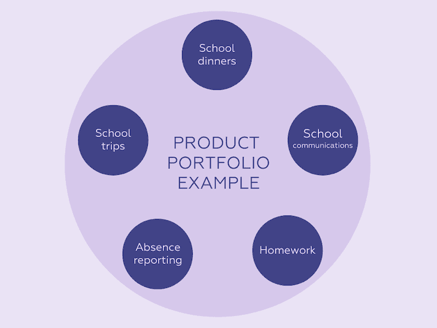
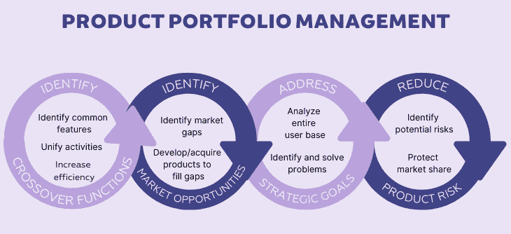

# 什么是产品组合管理？

> 原文：<https://blog.logrocket.com/product-management/what-is-product-portfolio-management/>

企业通常从如何解决问题的想法开始。努力工作和灵感导致解决方案的开发，因此，产品诞生了。

随着时间的推移，产品会开发和扩展，以解决新发现的用例。这可能意味着扩展现有产品的功能或开发全新的产品与之共存。

此外，公司可以购买其他公司和产品来填补其发现的缺口，而不是开发新产品来加入原有产品。

无论您如何实现，一旦您发现自己在同一个组织中拥有多种产品，您就拥有了一个产品组合。

* * *

## 目录

* * *

## 产品经理和产品组合经理有什么区别？

在拥有大量产品的组织中，产品管理的作用可以扩大。这时，产品组合管理(PPM)开始解决所有产品的产品管理责任。

在产品经理负责单个产品的开发和成功的情况下，产品组合经理将关注众多产品，它们如何协同工作，以及它们如何在市场中发挥作用。

例如:

假设我们有一家从事教育行业的公司。当它还年轻的时候，它提供了一种产品，使父母能够在线支付学校的晚餐。

随着时间的推移，该公司开发或购买的产品涵盖了学校与家长的沟通、布置家庭作业、缺勤报告和管理学校旅行。

该公司现在有一个产品组合，可以在市场上协同工作:

每个产品都有自己的产品经理，但项目经理只专注于在自己的特定领域交付产品。产品组合经理负责查看所有产品，以确定协同作用、运营缺陷以及更广泛的教育技术市场中的机会。

## 产品组合经理是做什么的？

PPM 的任务既与标准的[产品经理](https://blog.logrocket.com/product-management/product-manager-vs-project-manager/)的任务相似，也明显不同。

产品组合经理的主要目标是:

让我们从示例教育产品提供商的角度来放大这些关键任务。

### 识别交叉功能

当查看学校聚餐应用程序和学校旅行应用程序的功能时，PPM 可能会发现这两个应用程序共享共同的用例及相关功能。

就个人而言，每个应用的产品经理不会考虑如何将他们的产品与其他产品相结合，因为他们会专注于自己的[参与度指标](https://blog.logrocket.com/product-management/what-product-management-metrics-matter-most-to-pms/)、满意度得分等。PPM 能够查看所有产品，并确定所有学校付款向单一应用程序转移的机会。

通过识别共同特征，PPM 可以整合活动，这带来了运营的经济性和市场内更大的清晰度。如果没有项目组合管理的前景，组织将面临运营效率低下、浪费资源、蚕食自己的客户群以及错失创新机会的风险。

### 识别市场机会

学校晚餐应用的个人项目经理负责识别和分析其他竞争应用的[差异化因素](https://blog.logrocket.com/product-management/what-is-product-positioning-examples-strategies-template/#product-positioning-vs-differentiation)以吸引顾客。另一方面，投资组合经理花时间关注更广泛的教育市场，以确定与当前产品组合中的缺口相匹配的潜在机会。

也许 ppm 可以发现安排家长会的系统中的漏洞，并发现目前产品组合中没有一款产品可以满足这些需求。通过开发或收购解决这一问题的产品，这将使组织朝着这个方向前进。

如果没有更广阔的 PPM 视角，组织将面临错过这些机会并让竞争对手超越市场的风险，这可能会损害现有的产品性能。

### 实现战略目标

学校通信应用程序的 PM 可能会遵循战略目标，通过注册流程、产品共享工具和学校参与来增加用户群和提高转化率。然而，PPM 的权限比这更广。

PMM 负责查看整个产品组合的用户群。这可能使他们能够识别，例如，在整个小学人口中客户增长已经放缓，这可能导致进入高中市场的战略决策。PPM 现在可以评估投资组合，并确定实现这一目标的最佳方式。

### 降低产品风险

学校家庭作业应用程序的项目经理必须努力工作，以确保他们的产品取得成功，但鉴于他们的关注范围狭窄，他们可能无法识别该领域的潜在风险。另一方面，PPM 具有更广泛的职权范围，也许能够。

PPM 知道产品有一定的寿命，并且能够识别产品从哪里开始面临困难。然后，他们可以推出替代产品来保护整个组织的市场份额。

* * *

订阅我们的产品管理简讯
将此类文章发送到您的收件箱

* * *

也许向远程学习的过渡将减少对家庭作业专用应用程序的需求，因为作业越来越多地被分配并与课程广播工具一起完成。项目组合管理将负责解决这一风险，要么通过扩展学校家庭作业应用程序来满足远程学习的需求，要么通过引入远程学习产品。如果没有这种观点，现有产品就有被竞争对手超越的风险，并会降低整个组织的绩效。

## 产品组合经理如何评估活动？

在产品组合管理中有几个非常流行的工具，每一个都着眼于产品组合分析的不同方面。这些工具包括:

*   **Boston Consulting Group 的增长份额矩阵** — 该矩阵着眼于产品的相对市场份额及其所在市场的增长，前提是你希望在高份额和增长象限进行更多投资，在低份额和增长象限进行撤资
*   **通用电气/麦肯锡的投资组合分析矩阵** —这看起来是类似的分类，但指的是竞争实力和行业吸引力
*   **安索夫矩阵** —它从基于市场和基于产品两个方面来判断你是否应该发展、渗透或利用多元化来最大化机会

每个矩阵查看组合中的产品如何符合一组标准，旨在允许 PPM 确定如何处理市场中更广泛的机会或风险。

无论结果如何，PPM 的结果都将是一个用(n)来处理这种情况的计划:

*   **核心产品** —对现有产品的改造，以融入机会或抵消风险
*   **邻近产品** —将新产品引入新的市场机会或对现有产品进行重大修改
*   **转型产品** —全新市场中的全新产品

这些评估的结果可以通过投资组合级别的路线图来实现。这显示了产品组合中所有产品的战略方向，并说明了组织中的产品活动如何补充和支持既定的战略目标。

## 我需要产品组合经理吗？

这个问题最明显的答案是:除非你有产品组合。然而，你需要多少产品才能称之为投资组合呢？

实际上，一旦你在一个特定的市场中有许多不同但互补的产品，那么 PPM 就有机会监管所有这些产品。PPM 可以通过全面了解您的产品在市场上的情况来增加一些价值，并可以就如何最好地定位产品以提供最佳结果做出战略决策。

*精选图片来源:[icon scout](https://iconscout.com/icon/portfolio-3524085)*

## [LogRocket](https://lp.logrocket.com/blg/pm-signup) 产生产品见解，从而导致有意义的行动

[LogRocket](https://lp.logrocket.com/blg/pm-signup) 确定用户体验中的摩擦点，以便您能够做出明智的产品和设计变更决策，从而实现您的目标。

使用 LogRocket，您可以[了解影响您产品的问题的范围](https://logrocket.com/for/analytics-for-web-applications)，并优先考虑需要做出的更改。LogRocket 简化了工作流程，允许工程和设计团队使用与您相同的[数据进行工作](https://logrocket.com/for/web-analytics-solutions)，消除了对需要做什么的困惑。

让你的团队步调一致——今天就试试 [LogRocket](https://lp.logrocket.com/blg/pm-signup) 。