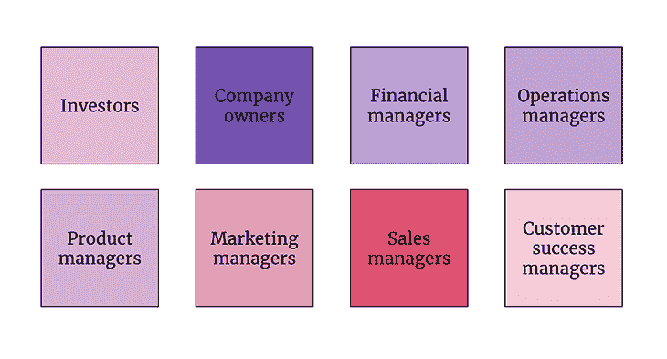
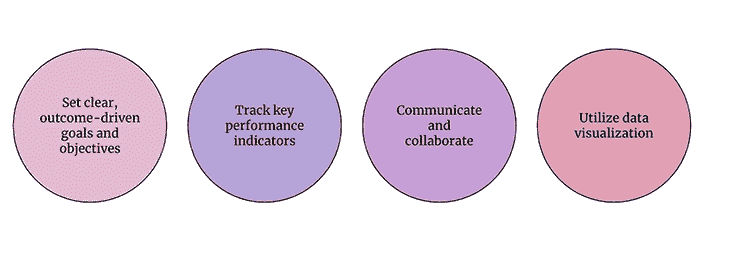
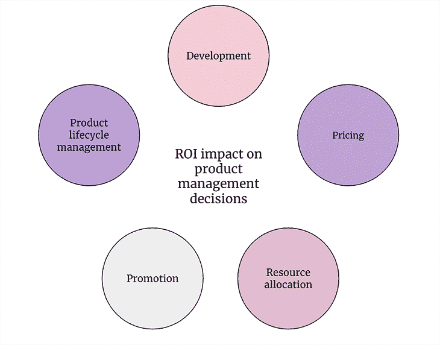

# 什么是投资回报率:定义，公式，例子，以及如何提高它

> 原文：<https://blog.logrocket.com/product-management/what-is-roi-definition-formulas-examples-how-to-improve/>

成长于 90 年代的互联网是一个疯狂的新兴事物。这是令人兴奋的，我很高兴亲眼目睹了这一切。

在那个时候，上网意味着通过拨号上网——这发出了类似于“[Pshhhkkkkkkrrrr kakingkakingsh chchchchchchcch * ding * ding * ding *](https://twitter.com/briannekimmel/status/1076677576314310656?lang=en)的声音。”在很多情况下，我试图偷偷摸摸地上网，结果我的父母大喊，“谁在用互联网，走开，我们在等电话！”

早期，互联网公司如雨后春笋般遍地开花。在那个时候，超级马里奥肯定会喜欢生活在现实世界中，而不是在视频游戏中。

大量公司的负面影响是什么？许多收入很少或没有收入的互联网公司被估价为数十亿美元。结果呢？破产无处不在，“网络泡沫”一词由此诞生。如果你投资了，你的钱现在是著名的南方公园景点。

现在，在 2023 年，它觉得类似的场景可能会在拐角处露出丑陋的头。

这让我想到了一个叫做投资回报(ROI)的小东西的重要性。在本文中，我们将探索什么是 ROI 以及如何计算它，并提供一些例子。Pinky 承诺，你花在阅读上的时间是值得的，给你一个积极的投资回报率。

* * *

## 目录

* * *

## 什么是 ROI？

在网络时代，大量投资被投入到公司中，基于这样一个前提，即投资是稳赚不赔的，而且利润极高，能产生至少 10 倍于原始投资的回报。

这就是 ROI 发挥作用的地方。ROI 是衡量投资盈利能力的指标。它衡量原始投资的收益或损失。它以百分比表示，可用于比较投资组合中投资的盈利能力。

公司和个人都受益于跟踪投资回报率。

如果你有一个股票投资组合，你可能会跟踪股票相对于原始投资的表现，以及相互之间的比较。

公司关注的是投资总额以及它们对公司整体业绩的贡献。

如果你是一个产品经理，你会不断地在一个特性的合意性、可行性和可行性之间取得平衡。换句话说，通过检查有多少客户感兴趣，他们的兴趣是否会增加收入，以及以什么样的成本，你会不断检查新功能是否会带来培根(或百吉饼，使其成为素食主义者)。

总的来说，跟踪投资回报率有助于决定在哪里投资。

## 谁需要跟踪投资回报率？

现在，让我们把目光聚焦在公司上，放大到产品经理身上。

在一个公司里，你会发现几个利益相关者对投资回报感兴趣。他们的理由是相似的:评估企业运营的效率和盈利能力。*请记住，利益相关者可能因行业和公司设置而异*。

那么这些神秘的生物是谁呢？

### 投资者

如果你在上市公司或初创企业工作，那就是投资者。他们投资你的公司，想评估整体业绩，看看他们的钱花得值不值。

天使投资者可能期望在 3 到 10 年内看到他们投资的 30%到 40%的年回报率。风险资本家可能会满足于投资生命周期内每年 25-35%的 T2，而公共贸易公司的投资者可能会满足于 10%的 T4，即标准普尔 500 指数的历史表现。

### 公司所有者

他们是最终负责人，渴望看到他们的投资得到回报，并发展他们的公司。ROI 有助于他们衡量绩效，确定需要改进的领域，并做出战略决策以提高盈利能力。

### 财务经理

财务经理对数字负责，领导着一个公司的数字分析团队和数字奇才。他们使用投资回报率来评估部门、产品或计划的财务表现，并就资金分配向最高管理层提出建议。

### 运营经理

他们是负责顺利操作和正确操作的人。他们对 ROI 的兴趣在于评估部门的绩效，识别效率低下的领域，并做出提高生产率和盈利能力的决策。

* * *

订阅我们的产品管理简讯
将此类文章发送到您的收件箱

* * *

### 产品经理

产品经理负责产品的成功，并使其成为客户需要的产品。他们使用 ROI 来识别机会和改进区域，并评估特性的性能。

### 营销经理

他们大多使用投资回报率来评估营销活动的绩效。例如，脸书的广告活动有多成功？花费的时间和资源是否产生了足够的新销售额？

### 销售经理

他们用投资回报率来衡量销售团队的效率。想想[客户终身价值](https://blog.logrocket.com/product-management/what-customer-lifetime-value-clv-how-calculate/) (CLV)与[客户获取成本](https://blog.logrocket.com/product-management/what-is-customer-acquisition-cost-how-to-reduce/) (CAC)的对比。

### 客户成功经理

他们使用 ROI 来查看他们的团队在管理客户方面有多成功。例如，他们根据团队对追加销售和减少客户流失的贡献来评估部门的总运营支出(OPEX)和资本支出(CAPEX)。

## ROI 的计算公式是什么？

幸运的是，计算投资回报率的公式比 Getafix 的公式更简单，因为 geta fix 的公式可以创造出一种神奇的药剂，让高卢战士在阿斯特里克斯和奥贝里克斯拥有超人的力量。

计算 ROI 的公式是投资收益减去投资成本，除以投资成本，然后乘以 100。

举两个例子:

1.  如果您在一项新功能上花费 25，000 美元，而它产生了 30，000 美元的新收入，则投资回报率为((30，000–25，000)/25，000 x 100 = 20%
2.  如果您开展的营销活动产生了 100，000 美元的收入，而运营成本为 50，000 美元，则其投资回报率为((100，000–50，000)/50，000) x 100 = 200%

## 什么是“好的”投资回报，什么时候应该关注？

现在你可能已经意识到一个“好的”ROI 对每个利益相关者和投资领域来说意味着不同的东西。即使只考虑产品经理的投资回报率，也很难说什么是“好的”投资回报率。

简单来说，高投资回报率比低投资回报率好。我可以想象此时此刻你在想“真的吗？你的第一个线索是什么？”

事实是，有很多因素在决定一个“好”的投资回报率。不要看“好的”和“关注的”，要看结果驱动的度量。

产品经理注重结果。它是关于目标客户生活中的变化，这最终说明了为什么要为产品创造一些东西。

制定路线图、目标和关键成果(okr)。衡量[基于结果的关键绩效指标(KPI)和衡量标准](https://blog.logrocket.com/product-management/what-metrics-kpis-product-managers-track/)让您深入了解是否达到了预期目标。你是应该停止工作，还是需要改变方式或集中注意力？定期测量和评估。

## 提高投资回报率的方法有哪些？

建立了以结果为导向的目标和指标，当跟踪实现这些目标的进度时，您对结果不满意？别担心，有几种方法可以提高你的投资回报率。

让我们来看看有助于提高投资回报率的一些策略。

### 降低成本

提高投资回报率的一个有效方法是降低成本。考虑缩小范围，简化开发，自动化过程，甚至外包。

### 增加收入

“现在你不会说”对吧？另一个提高投资回报率的方法是*宣传*增加收入。这可以通过增加销量或提高价格来实现。

### 投资营销

心不在焉。营销擅长通过营销活动提高品牌知名度和推动销售。他们的努力增加了收入，提高了投资回报率。

### 大量实验

快速、早期、廉价地失败。避免把所有的精力都放在一个功能上。虽然你可能会下大赌注，但是验证和实验可以让你从大量有助于提高投资回报率的快速胜利中获益。这就是为什么建立一种实验文化如此有益。

### 提高效率

提高效率有助于增加收入和降低成本。找出流程中的瓶颈并消除浪费。投资新技术或培训员工。当谈到提高效率时，你不得不喜欢一些[精益六适马](https://en.wikipedia.org/wiki/Lean_Six_Sigma)实践。

### 关注客户维系

留住客户比获得新客户更划算。成功的客户维系减少了在营销和客户获取上花费的资源。

### 定期监测和评估

我们在上一节已经提到了这一点。定期监控和评估性能，并相应地实施纠正措施，有助于随着时间的推移优化投资回报。

## 产品团队应该如何跟踪投资回报率的 4 个技巧

ROI 在产品团队的日常生活中起着至关重要的作用，它提供了对哪些功能和策略有回报，哪些没有的洞察。

跟踪 it 有助于您做出基于数据的决策，决定将精力分配到何处，并根据需要进行调整以提高盈利能力。

以下是产品团队如何有效跟踪 ROI 的一些技巧:

### 设定明确的以结果为导向的目标

我像建筑者 Bob 一样不断地在这上面敲打，但是清晰的结果驱动的目标和目的是 ROI 的基础。如果有的话，为你的产品建立清晰的目标。

### 跟踪关键绩效指标

产品经理应该跟踪投资回报率，以便对他们的产品做出数据驱动的决策，并优化盈利能力。考虑客户获取成本、客户终身价值、客户流失等。

### 交流和协作

沟通和协作对于交付超出既定目标的惊人特性至关重要。

产品经理从优秀的沟通和建立关系技巧中受益匪浅。它们让你获得并分享正确的数据和见解，以达到甚至超越目标和目的。

### 利用数据可视化

除了持续监控和审查进展之外，数据可视化也很有优势。一张图胜过千言万语。可视化有助于理解绩效、讲述故事，并使您能够说服利益相关者并做出更好的决策。

## ROI 如何帮助产品经理在做出产品决策时保持灵活性

产品经理有这种超能力来做决定和前进，同时保持灵活性和适应变化。

让我们来看看 ROI 决策如何帮助产品经理在制定产品管理决策时保持灵活性:

### 产品开发决策

在投入时间和资源开发新功能之前，产品经理使用 ROI 来评估新功能的潜在盈利能力。ROI 帮助他们决定追求哪些想法，拒绝哪些想法。

### 产品定价决策

产品经理需要做的另一个决定是定价。ROI 用于确定最佳价位。通过了解价格、成本和收入之间的关系，可以做出明智的定价决策，从而最大限度地提高利润。

### 资源分配决策

投资回报率帮助你决定在什么时候花什么资源。例如，它允许您决定投资或投入更多精力的特性，以及准备淘汰的特性。

没有适当的促销，即使最好的产品也会失败。微软 Zune 是一个浮现在脑海中的东西。你不知道吗？我想我已经表达了我的观点。ROI 有助于产品经理决定投入资源的营销策略，以及避免或缩减的营销策略。

### 产品生命周期管理决策

[产品生命周期管理](https://blog.logrocket.com/product-management/what-is-product-development-lifecycle-stages-examples/) (PDLC)让产品经理坚持下去。ROI 用于评估产品在其生命周期中的盈利能力。通过理解它，可以决定什么时候引入新功能，什么时候停止产品。

## 归根结底是什么

总之，ROI 是产品经理的一个关键指标。什么是好的投资回报，什么是坏的投资回报取决于环境和设定的目标。

ROI 允许您评估效率和盈利能力，并在产品开发、定价、资源分配、促销和产品生命周期管理方面做出基于数据的决策。

*精选图片来源:[icon scout](https://iconscout.com/icon/chart-growth-1913955)*

## [LogRocket](https://lp.logrocket.com/blg/pm-signup) 产生产品见解，从而导致有意义的行动

[LogRocket](https://lp.logrocket.com/blg/pm-signup) 确定用户体验中的摩擦点，以便您能够做出明智的产品和设计变更决策，从而实现您的目标。

使用 LogRocket，您可以[了解影响您产品的问题的范围](https://logrocket.com/for/analytics-for-web-applications)，并优先考虑需要做出的更改。LogRocket 简化了工作流程，允许工程和设计团队使用与您相同的[数据进行工作](https://logrocket.com/for/web-analytics-solutions)，消除了对需要做什么的困惑。

让你的团队步调一致——今天就试试 [LogRocket](https://lp.logrocket.com/blg/pm-signup) 。

[Klaas Hermans Follow](https://blog.logrocket.com/author/klaashermans/) Lifetime in digital and innovation, ensuring value delivery. I enjoy energizing and motivating teams that create and exceed product expectations.