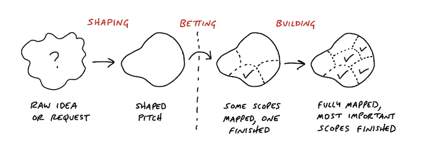

# 什么是塑造方法？定义和何时使用它

> 原文：<https://blog.logrocket.com/product-management/what-is-shape-up-methodology/>

你是一个喜欢打赌的人吗？将你的资源投入到另一种方法中会让人感到畏惧。然而，如果你习惯了艰苦的冲刺和 scrum 流程，那么“塑造形象”就是一股新鲜空气。

塑造方法论不是在阳光明媚的加州研讨会上构想出来的，也不是由一位开明的大师提出来的；它是由和*为创新软件公司 Basecamp/37signals 的*项目和产品团队设计的*。*

从一开始，Shape Up 的实用性就使它适用于软件开发之外的许多行业。改进方法旨在提高项目/产品和时间意识，避免团队和任务之间的脱节。

在本指南中，我们将涵盖产品经理需要了解的关于 Shape Up 的一切，包括它的历史，为什么和什么时候使用它，以及关键概念。然后，我们将揭开它成功实现的秘密。

* * *

## 目录

* * *

## 什么是塑造方法？

改进方法是一种产品开发和优化的方法，优先考虑运输。

理论上，所有的生产力方法都集中在推出最终产品或服务上。但在实践中并不总是这样。

以时间阻塞技术为例。通常，这种方法不会限制在给定任务上花费的时间，而是会导致团队精确地花费预定的时间，而不管任务的大小或复杂性。换句话说，如果管理不当，时间效率工具可能会变成一个耗费时间的陷阱。

团队也可能沉迷于与最终产品和客户期望脱节的关键度量。执行敏捷方法的匆忙会导致团队忘记真正重要的事情，忽略重要的工作来优先处理繁忙的工作。这就是“塑造形象”发挥作用的地方。

## 塑造的 4 个原则

Shape Up 方法论的基本原则如下(如其创造者在 [Basecamp](https://basecamp.com/shapeup/0.3-chapter-01) 所述):

1.  [6 周周期](#6-week-cycles)
2.  [塑造作品](#shaping-the-work)
3.  [让团队负责](#making-teams-responsible)
4.  [瞄准风险](#targeting-risk)

### 6 周周期

塑造方法中最著名的部分是六周周期。这是一个预定的时间表，不能推迟。

时间线不一定被分成时间块。相反，参与该产品的每个人都知道，新功能、技术解决方案或设计改进必须在六周内准备就绪。

Source: [Basecamp](https://basecamp.com/shapeup/4.2-appendix-03#six-week-cycles-two-tracks)

然而，这并不意味着混乱占主导地位。

### 塑造作品

第二个组成部分，工作成形，包括高级团队成员计算出组件或解决方案的关键步骤。

这不是一门精确的科学，而是基于管理者对团队能力和当前能力的深入了解。在六周内实际上可以执行什么来推动项目向前发展？

### 让团队负起责任

团队从高级经理那里获得这个任务，并真正努力使它成为他们自己的任务。换句话说，[团队完全负责](https://blog.logrocket.com/product-management/12-agile-manifesto-principles-how-to-adopt-them/#11-trust-your-team)概述里程碑，使目标与能力相匹配，以及理解关键的依赖性和瓶颈。

高级团队成员不是微观管理，而是专注于塑造项目，同时将执行委托给团队。

### 目标风险

最后，Shape Up 专门针对所有产品团队共有的一个风险:错过最后期限。

与其花几个月的时间追求天马行空的想法，用排得满满的几周来束缚你的团队，不如在执行之前确定差距、需求和问题。这六个星期不能延长，所以解决方案要尽早测试，利益相关者从一开始就要讨论，无用的积压工作不会被带到新的项目中。

虽然对这四个关键原则的依赖可能看起来很激进，但下面的部分会让你明白为什么 Basecamp/37signals 的人会想出这个解决方案。

## Basecamp 开发的 Shape Up 方法简史

根据 Jason Fried 的说法，Basecamp/37signals 的软件和由此产生的 Shape Up 方法是 15 年来重复不同的工作和生产力方法的结果。随着产品组合的增长，该公司看到了捆绑其 SaaS 解决方案的价值。

在成功推出捆绑包后，Basecamp 发展得更快，新进入者尽管才华横溢，但显然缺乏对原创产品理念的执着。这就是快速人员发展的本质:你在能力方面获得的，是在沟通的适应性和敏捷性方面的损失。

很容易理解为什么一旦任何公司发展到相当大的规模，本能的、迅速达成一致的产品决策基本上不可能执行。时间稀缺，日程变得错位，在翻译中失去了方向性。他们在 Basecamp 做了什么来防止落入这个成长陷阱？

最重要的是，他们没有实施持续的截止日期或特定的项目管道，而是将周期作为一种时间管理方法。经过测试，六周似乎是合适的时间长度:足够长的周期允许对项目产生重大影响，但又足够短，因此最后期限迫使团队快速做出决策。

其余的原则自然发展。公司已经发展到领导者不再有时间指导团队的地步。然而，用严格的规则和等级制度取代领导似乎是限制创造性解决方案的好方法。

* * *

订阅我们的产品管理简讯
将此类文章发送到您的收件箱

* * *

作为一种解决方案，Basecamp 的领导者专注于高层次的规划，即塑造。团队没有受到持续的监控；他们只需要担心一件事:运输。

Source: Basecamp

这种后来成为“塑造”方法的劳动分工使 Basecamp 能够保持增长，而不损害早年推动成功的灵活性和创新性。

## 如何实施改进方法

希望在其组织中实施“塑造”方法的产品经理应该采取以下步骤，并回答如下概述的问题。

1.  [可视化](#step-1-visualize)
2.  [定义](#step-2-define)
3.  [对齐](#step-3-align)
4.  [委托人](#step-4-delegate)
5.  [轨道](#step-5-track)
6.  [发货并重复](#step-6-ship-and-repeat)

### 第一步:想象

*   对您的产品组合至关重要的下一个功能或产品是什么？
*   他们如何满足内部或外部客户的需求？

### 第二步:定义

*   实施这些特性后，您的产品会有怎样的改进？
*   他们需要多长时间来完成？
*   完成它需要多少时间和人力？

### 第三步:对齐

*   在当前的资源条件下，你的团队能在六周内完成什么？
*   哪些功能会在最短的时间内产生最大的影响？

### 第四步:委派

### 追踪

*   你对时间和资源的估计有多准确？
*   你的团队有多准确？

### 第六步:发货并重复

最后一步是运送你的产品，并从头开始。

## 使用 Shape Up 的 3 个理由

产品组织经常遇到团队士气、经理带宽和人类走过场倾向的障碍。Shape Up 旨在帮助所有参与产品开发的人关注真正重要的事情:运输产品。

为了帮助团队正面迎接这些挑战，改进方法使产品经理能够:

### 提高团队士气

比方说，你的团队已经因为持续的混乱、不断变化的截止日期、[不断增长的积压订单](https://blog.logrocket.com/product-management/product-vs-sprint-vs-release-backlog/)以及不断变化的方向而陷入困境或士气低落。改善方法提供了缓解，因为六周后，你可以重新开始。

产品团队可能会将此视为一股新鲜空气，特别是一旦他们发现运输将允许他们定义任务和里程碑——当然，只要他们完成简要任务。

### 释放经理

经理们花了太多时间在小问题上，而忽略了大局。团队的高级成员必须不断地监督项目涉众，传递信息，确保满足最后期限，并灌输全面的责任。

“塑造”改变了这一点，将责任委派给团队，解放了经理的时间，让他们专注于将能力与目标相匹配。

### 专注于航运

客户不再在画面中；他们的声音已经被无意义的度量标准和新奇的冲刺技巧所取代。

如果一种方法已经存在了很长时间，团队和经理花太多时间勾选框是很常见的。塑造迫使双方忽略无用的目标，专注于真正重要的事情:发布功能和产品。

## 避免常见陷阱

同时，避免过于依赖任务和积压工作也很重要。振作起来意味着强迫你做相反的事情:六个星期后，这是新的一天！

另一个潜在的缺点是经理们没有认真对待塑造阶段。没有一个关于里程碑、能力、陷阱、依赖和策略的现实的大纲，你的团队仍然会像一群无头鸡一样跑来跑去。

如果你记住这些问题，一旦你开始塑造你的产品，你就会避免很多问题。

## 何时考虑使用“向上成形”方法

整形对以下情况特别有用:

### 快速发展的公司

这正是 Basecamp 开发 Shape Up 的原因。可以说，快速增长的空间是塑造的绝佳场所，因为团队和领导者在处理快速发展带来的微小危机时，可能会很快忽视什么是重要的。

有了清晰的六周指令，产品团队可以轻松适应增长，同时保留每个周期的关键原则。

### 产品导向型公司

Shape Up 出现在数字产品革命期间并非巧合。产品团队强调产品开发服务于客户需求(无论是内部的还是外部的)，而不是根据强大的项目经理的突发奇想来调整产品和服务。

对塑造需求和快速启动的强调使得 Shape Up 成为大多数数字团队的完美系统。

### 短周期技术公司

某些类型的产品和服务很快就会过时。想想智能手机和智能电视，它们的硬件、功率和功能随着每一次迭代而显著扩展。

Shape Up 的变化周期非常适合不断发展的需求和不断扩大的可能性影响产品战略的情况。

### 与行业无关的公司

基本上，当你选择的部门没有外部限制或约束时，特别是在时间方面，调整是组织工作的一个很好的技巧。你只需要看看这里列出的优势，然后决定它是否最适合你和你的团队。

## 何时不使用形状

相反，改进方法不太适合以下类型的组织:

### 老牌公司

大公司和已建立的团队可能会发现很难实施改进。改变是有风险的，如果事情没有坏，为什么要尝试去修复它呢？

此外，传统企业巨头通常有特定的工作方式是有原因的。如果没有高层领导的支持或聘请外部顾问的资源，挑战一家公司的商业文化是危险的。

### 面向运营的公司

一些团队不太关注发布解决方案，而是更关注持续运行。例如，想象一下航空公司的客户服务部门:如果团队每六周循环一次聊天系统和投诉途径，客户会很快失去耐心，转而发送电子邮件，而不是处理网站或应用程序。

在这种情况下，避免使用像 Shape Up 这样的方法可能更合适。

### 长周期技术公司

一些技术和创新需要几十年才能实现。例如，制药部门的产品从其在大学基础研究中的最初概念到其在医院和药店中的最终部署，周期非常长。

成形在某些离散阶段可能是有用的，但不建议将其作为长周期技术的产品和服务设计的基础。

### 特定行业的公司

对于特定行业的公司，重点是强调产品开发如何受到与特定经济领域相关的商业因素的影响。

例如，国防部门几乎专门为政府客户服务，这些客户可能有自己的理解和优先事项。例如，可能有明确的安全规定和明确的理由来解释为什么项目里程碑不能限制在六周内，或者高级领导不能将责任委托给较低级别的团队。

## 关键要点

由 Basecamp 开发并被软件开发界和其他领域广泛采用的 Shape Up 方法，是帮助产品团队关注最重要的事情:交付产品的一种很好的方式。

“向上塑造”方法的支柱如下:

*   **六周工作周期** —改进过程的首选持续时间，长到足以实现实质性的改变，短到足以确保团队完成工作
*   **工作塑造** —高级团队成员的关键任务。团队能力和资源必须与项目需求一致，重点是限制产品团队最常见的风险
*   **限制风险** —塑造者的任务是避免最常见的风险，即不能在截止日期前完成任务。有效的塑造避免了士气低落，把每个周期都变成了做得更好的机会
*   **下注** —每一个塑造周期中涉及的关键谈判。一旦塑造者概述了关键目标，并使其与六周的资源保持一致，他们就与团队的其他成员一起确定可以在周期中完成的功能
*   **团队责任** —团队不应该遵循结构化的指导方针或等待领导的指示，而是应该在截止日期之前承担实现既定目标的责任
*   发货——每六周发布一次产品带来的简单快乐和士气提升

*精选图片来源:[icon scout](https://iconscout.com/icon/workflow-4462280)*

## [LogRocket](https://lp.logrocket.com/blg/pm-signup) 产生产品见解，从而导致有意义的行动

[LogRocket](https://lp.logrocket.com/blg/pm-signup) 确定用户体验中的摩擦点，以便您能够做出明智的产品和设计变更决策，从而实现您的目标。

使用 LogRocket，您可以[了解影响您产品的问题的范围](https://logrocket.com/for/analytics-for-web-applications)，并优先考虑需要做出的更改。LogRocket 简化了工作流程，允许工程和设计团队使用与您相同的[数据进行工作](https://logrocket.com/for/web-analytics-solutions)，消除了对需要做什么的困惑。

让你的团队步调一致——今天就试试 [LogRocket](https://lp.logrocket.com/blg/pm-signup) 。

[Roy Cobby Follow](https://blog.logrocket.com/author/roycobby/) Researcher with a professional background in marketing and social media management in education and public policy, at business schools, academic journals, and stakeholder-based organizations.