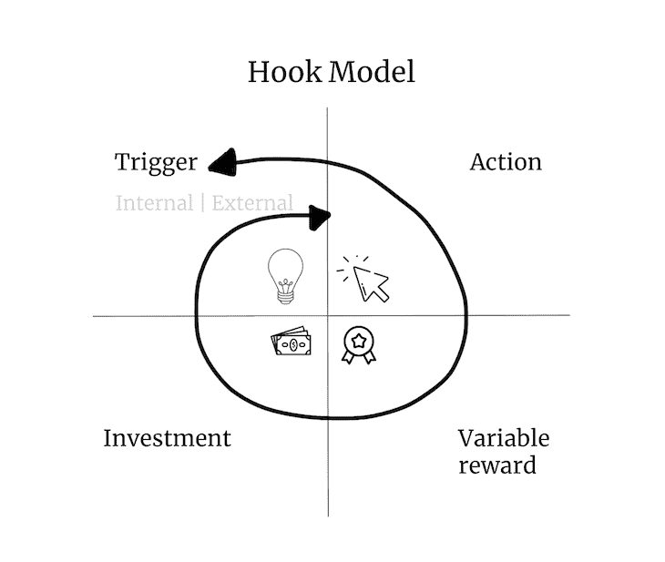

# 钩子模型是什么？如何打造形成习惯的产品

> 原文：<https://blog.logrocket.com/product-management/what-is-the-hook-model-how-to-build-habit-forming-products/>

在大多数情况下，人们试用一个产品，激活它，使用几个星期或几个月，然后流失。但也有顾客喜爱并使用多年的产品。Spotify 就是一个最好的例子。

是什么区分了粘着和不粘着的产品？习惯。

能够成功帮助人们建立习惯的产品具有更低的[流失率](https://blog.logrocket.com/product-management/what-is-customer-retention-rate-how-to-calculate/#how-to-calculate-churn-rate)和更高的[终身价值(LTV)](https://blog.logrocket.com/product-management/what-customer-lifetime-value-clv-how-calculate/) 。简单来说，习惯让人定期回来。

但是，你如何打造能够培养强大、持久习惯的产品呢？一种方法是使用 hook 模型，这是 Nir Eyal 在他的书*[Hooked:How to Build Habit-Forming Products](https://www.amazon.com/Hooked-How-Build-Habit-Forming-Products/dp/1591847788)*中描述的习惯形成系统。

* * *

* * *

## 什么是钩子模型

hook 模型描述了一个有利于形成强习惯的用户旅程。它从一个触发器开始，提示用户采取特定的操作。行动之后会有可变的奖励，以用户投资结束。

循环重复的次数越多，用户养成习惯的可能性就越大。

挂钩模型的组件如下:

## 

### 引发

有两种类型的触发器:内部触发器和外部触发器。

外部触发器是来自环境的提示。例子可能包括:

*   接收推送通知
*   看到脸书的广告
*   收到朋友的推荐信

用户经历的外部触发越多，他们就越有可能形成内部触发——一种来自内部的暗示。这通常包括感觉和想法。

为了让它更具体，我们来看一个例子。

假设你正在浏览你的脸书订阅源。你可能至少有点无聊。突然，你看到一个来自 YouTube 的广告(触发器)。你试试(动作)，看个视频(可变奖励)，微调算法(投资)，这样你就能得到更好的推荐。

第二天，一个朋友与你分享另一个 YouTube 视频，所以你将它加入书签，以便在晚上观看。随着时间的推移，你开始将看猫视频与无聊联系起来——也就是说，你形成了一个内部触发器。

一旦发生这种情况，你不再需要外部触发来采取行动。你内心的厌倦感将足以推动你继续前进。

最强有力的内在触发因素是负面情绪，如焦虑、害怕与社会脱节、不确定性，以及如上例所述的厌倦。

### 行动

行动是用户在期待回报时的行为。这也是满足触发条件的主要方式。

回到 YouTube 的例子:当你看到一个激起你好奇心的广告时，点击链接看看这个视频是否真的很搞笑(可变奖励)就满足了触发器(好奇心)。当朋友与你分享视频时也是如此。

如果你已经开发了一个内部触发器，那么去 YouTube 主页(action)会帮你找到一个有趣的视频(可变奖励)，消磨无聊(满足内部触发器)。

要养成习惯，行动应该比想都容易。触发器应该几乎自动引发一个动作。完成动作的摩擦越多，用户完成动作的频率就越低，不利于养成习惯。

造成摩擦的因素包括:

*   **时间** —行动需要大量的时间投入
*   **金钱** —行动需要金钱投入
*   **体力** —用户必须进行体力活动来完成一个动作
*   脑力劳动 —完成一个动作需要一些脑力劳动
*   **社会越轨** —用户可能会觉得执行这个动作很奇怪
*   **常规-适合**-动作不适合用户的常规

每一点摩擦都会降低产品建立牢固习惯的机会。

### 可变奖励

每个习惯都需要奖励——理想情况下，是不可预测的奖励。

那是因为可预测的奖励不会引起渴望。如果结果是可预测的，人们很快就会对此感到厌倦。

另一方面，可变奖励会促使多巴胺大量分泌。事实上，渴望变化比奖励本身引起更强烈的情绪反应。

* * *

订阅我们的产品管理简讯
将此类文章发送到您的收件箱

* * *

可变奖励有三种类型:

*   **部落的奖励***——*让我们感到被接受和重要的奖励。这些奖励给了我们社会认可。Instagram 上的 Hearts 是部落可变奖励的一个例子
*   **狩猎的奖励***——*看得见摸得着的奖励。例如，奖励可变金额的老虎机
*   自我的奖励*——*让我们有成就感的奖励。在电子游戏中击败那个硬水平(或者再次死亡)是一个完美的例子

可变奖励应该满足用户的需求，同时鼓励他们重新参与产品。

可变性应该是无限的。即使奖励是可变的，如果它提供有限数量的选择，随着时间的推移，用户将习惯它，奖励将变得多少有些可预测性。

用户生成的内容就是无止境变化的一个例子——总会有新的东西出现，而且很难预测。

### 投资

尽管“触发”>“行动”>“奖励”的循环足以建立习惯行为，但是一个额外的因素使得习惯建立过程更加有效:用户投资。

用户采取的行动不仅应该导致即时的可变奖励，还应该是改善未来奖励质量的一项小投资。一些例子包括:

*   **内容监管(Spotify)** —每当用户听一首歌，喜欢它，或者跳过它，他们就会教算法在未来提供更好的歌曲推荐
*   **数据(LinkedIn)** *—* 填写个人资料、参与 feed 和申请工作将数据反馈给 LinkedIn，这使它能够为用户提供更好的工作和关系建议
*   **声誉(易贝)***——*在易贝上卖或买会得到评论。用户评论越多，他们在特定平台上的声誉就越高。高声誉提高了人们参与拍卖的机会
*   社交关系(Twitter)*——*人们在 Twitter 上越活跃，他们的关注者就越多，点赞和转发的数量也就越高

这种投资不仅提高了可变报酬，也使离开产品变得更加困难。如果你在易贝上有 20，000 条评论，你可能不会轻易转向亚马逊，即使他们可能会提供一个更好的 UX。

此外，在多年微调 Spotify 的算法并建立完美的播放列表后，改变流媒体服务并从头开始感觉像是恐怖电影的一个好前提。

只要确保投资自然到位。你不想仅仅为了增加投资而引入太多的摩擦。记住，动作部分本身要尽量简单。

## 看人的伦理

你可能想知道，使用钩子模型是否道德？尤其是像吃角子老虎机这样的东西——这难道不是操纵吗？

这是一个棘手的问题。

钩子模型确实利用了我们大脑的缺陷和自然机制。但是使用钩子模型是否错误取决于你如何使用它。

如果你只是为了赚点钱而试图建立有害的用户习惯，那么毫无疑问，你是在不道德地使用 hook 模型。

但是你可以用这个模型来帮助人们。想想 Duolingo:整个产品都是为了帮助用户建立强大的学习习惯。这些习惯可以帮助用户更轻松地学习新语言，并最终成长为真正的人。我坚信以这种方式使用钩子模型是不道德的。

说到底，钩子模型只是一个工具。

## 关键要点

表现最好的产品是那些为用户建立新习惯的产品。如果人们习惯性地回来，他们流失的可能性就会大大降低。

让我们回顾一下:要养成一个习惯，你需要三个要素:

*   引发
*   行动
*   可变奖励

虽然真正的习惯是基于内部触发因素，比如情绪，但产品必须首先依靠外部触发因素，将人们置于循环中足够长的时间，以开始建立与内部触发因素的关联。

真正持久的习惯需要一个额外的因素:投资。随着时间的推移，可以提高奖励质量的东西。投资越大，放弃一个产品就越难。

钩子模型本身只是一个工具。勾搭用户是否道德，取决于你怎么用。确保你的产品努力建立的习惯能改善用户的生活，而不是伤害他们。

## [LogRocket](https://lp.logrocket.com/blg/pm-signup) 产生产品见解，从而导致有意义的行动

[LogRocket](https://lp.logrocket.com/blg/pm-signup) 确定用户体验中的摩擦点，以便您能够做出明智的产品和设计变更决策，从而实现您的目标。

使用 LogRocket，您可以[了解影响您产品的问题的范围](https://logrocket.com/for/analytics-for-web-applications)，并优先考虑需要做出的更改。LogRocket 简化了工作流程，允许工程和设计团队使用与您相同的[数据进行工作](https://logrocket.com/for/web-analytics-solutions)，消除了对需要做什么的困惑。

让你的团队步调一致——今天就试试 [LogRocket](https://lp.logrocket.com/blg/pm-signup) 。

[Bart Krawczyk Follow](https://blog.logrocket.com/author/bartkrawczyk/) Learning how to build beautiful products without burning myself out (again). Writing about what I discovered along the way.