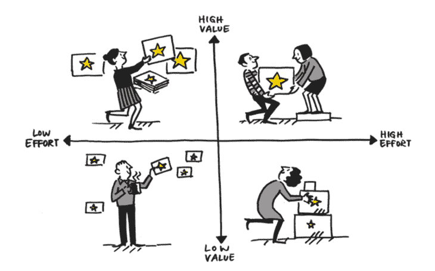
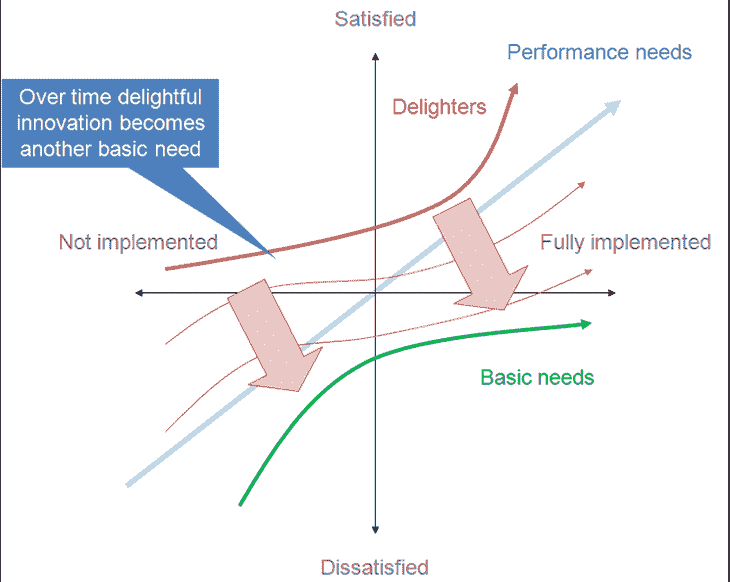
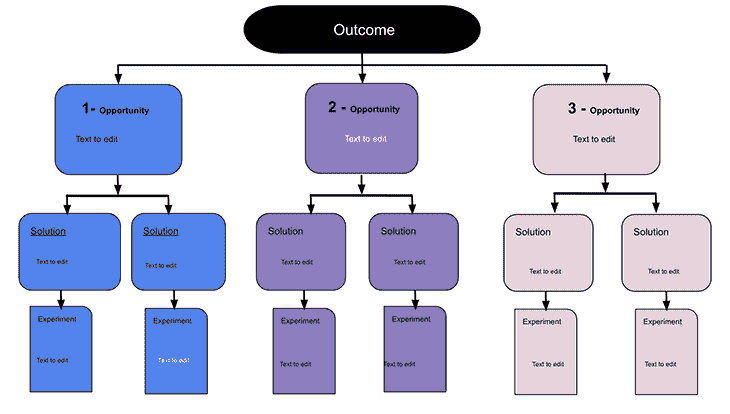
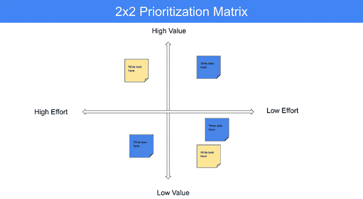
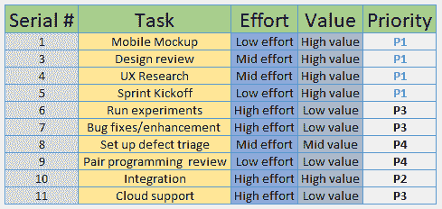
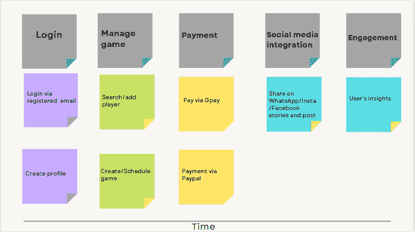

# 什么是优先级矩阵？定义、示例、模板

> 原文：<https://blog.logrocket.com/product-management/what-prioritization-matrix-definition-examples-template/>

产品团队和管理层必须优先考虑他们的任务和活动，以构建成功的产品。因此，将一组任务组织起来，根据影响、努力、风险、范围、时间等众多因素进行排序，带来了清晰性。它帮助产品团队在期望的时间框架内完成每项任务。

此外，区分活动的优先级决定了任务的最大价值和预期结果，这进一步加快了产品团队完成更多任务的速度。

在本文中，我们将讨论优先级矩阵以及如何在产品管理中使用它。在文章的最后还会有一个下载样本模板的链接。

* * *

## 目录

* * *

## 背景资料

通常，产品经理会在多个产品优先级之间周旋。许多调查显示，大多数产品经理不确定他们构建的功能是否解决了正确的客户问题，从而创造了用户价值。在这些不确定性中，产品团队通常最终会迎合多个利益相关者的请求，并根据其他优先级处理随机的功能积压，这总体上使产品路线图朝着随机的方向发展。

在这种情况下，团队同时与几个涉众接触和谈判，浪费了他们的精力和时间。结果，项目经理不再专注于解决正确的问题和构建正确的功能来交付价值。产品优先级框架可以帮助解决这个问题。

## 什么是优先级矩阵？

优先级矩阵提供了对应该首先完成的内容的直观了解。不同的优先级矩阵通常被称为问题优先级、特性优先级等。

优先级矩阵还有助于产品团队理解与任务和积压相关的价值。此外，它帮助产品团队形成影响组织目标的路线图。优先级矩阵还有助于缩短上市时间。

## 使用优先级矩阵的好处

在我们深入研究不同的优先级框架之前，让我们先来谈谈优先级矩阵的好处。

### 降低产品增强流程的风险

降低产品风险是一个重要的概念，优先级矩阵有助于产品经理降低机会和解决方案的风险。这也有助于他们降低构建无用功能的风险，这些功能不会为客户创造价值。

通过降低产品的风险，产品团队节省了时间、精力和成本。这些都是扩展产品、缩短上市时间和缩短价值实现时间的重要因素。

### 简化产品路线图

大多数流行的优先级矩阵都重视有助于确定任务优先级和简化路线图的评分方法。简化的路线图总是包含基于工作、成本和时间的高优先级项目，这意味着用户将持续获得他们所寻求的价值，而无需等待数月或数个季度。

### 提高领导层和产品团队的一致性

对于产品团队来说，处理多个利益相关者和他们的优先级绝对是一场噩梦。保持按优先顺序排列的路线图是一种一站式解决方案，可以围绕潜在风险、阻碍因素、复杂性和按优先顺序排列的积压工作进行清晰的沟通。它确保所有内部和外部的利益相关者，以及领导层，都在同一页上。

最终，这减少了由于不同涉众的优先级而导致的优先化和非优先化任务/待办事项列表之间的权衡。

## 选择正确的优先级矩阵

使用优先级矩阵的第一步是为产品团队选择正确的框架。每个框架都有独特的优势，但它们都有助于根据时间、工作量、复杂性、业务价值、发生频率和范围来确定任务的优先级。

强烈建议只使用一个优先级矩阵，因为一刀切的框架是行不通的。产品经理必须记住两到三个框架。让我们深入了解不同类型的优先级矩阵。

### 2×2 矩阵:价值与复杂性

这是一个做出快速决策的优秀优先框架。2×2 网格在 y 轴上显示价值，在 x 轴上显示复杂性/工作量。

在将每个特性、修复和缺陷放入网格之前，产品团队会在它们之间分配价值和复杂性。团队优先考虑那些低成本高价值的快速冲刺/发布的特性。

* * *

订阅我们的产品管理简讯
将此类文章发送到您的收件箱

* * *

这种优先级矩阵的最大缺点是过于杂乱——2×2 矩阵很小，可能会被太多的功能淹没。团队可以不使用矩阵，而是使用一个简单的模板来根据特性的价值和复杂性对其优先级进行排序。我将在下一节列出创建这个框架的步骤:

Source: [https://www.mindtheproduct.com/enter-matrix-lean-prioritisation/](https://www.mindtheproduct.com/enter-matrix-lean-prioritisation/).

### 赖斯得分

RICE 是任何产品组织中最受欢迎的特性优先化方法之一。它基于一个任务对另一个产品目标的影响权重。

大米代表影响力、影响力、信心和努力。这些度量被共同分配给每个任务/待办事项/特性，以测量 RICE 分数。这些 RICE 指标中的每一个都有各自的含义，如下所示。

Reach (R) —在给定时间内，该任务/功能/待办事项会影响多少客户？

影响(I)——这些任务/特性/待办事项会产生多大的影响？一般来说，这是在 1-5 的范围内衡量的，但根据组织的不同要求，可以有更多的范围。

信心(C) —您对这个估计的影响有多少信心？此指标的百分比范围从 50%到 100%。同样，这取决于团队希望如何设置百分比值尺度。

努力(E)——开发人员、设计人员和工程人员完成一项任务有多难？这个类别的分数被标记为容易交付、中等努力、困难和复杂。之后，从 1 到 5 的值被分配给每个标签。

计算 RICE 分数的公式是:

### 卡诺模型

[卡诺模型基于客户满意度](https://blog.logrocket.com/product-management/understanding-kano-model/)。这有助于根据客户对价值的理解来确定客户需求的优先级。我们可以在 2×2 轴上看到客户满意度与产品实施的关系:

Source: [https://en.wikipedia.org/wiki/Kano_model#/media/File:Kano_model_showing_transition_over_time.png](https://en.wikipedia.org/wiki/Kano_model#/media/File:Kano_model_showing_transition_over_time.png).

进一步的实现维度从缺少功能(最左边)到功能的最佳可能实现(最右边)进行缩放。同样，绘制在 y 轴上的满意度分为四类:高度满意、满意、一般和不满意。

使用 Kano 模型的缺点是它不考虑努力、风险和商业目标。Kano 模型最适合对附加组件和增强组件进行优先级排序。

### 莫斯科方法

莫斯科方法向团队传达启动标准。它有助于决定将什么添加到优先级桶中，但它无助于测量相关的分数、权重和任务估计。

如今，当数据变得重要，每个产品团队都希望量化优先顺序清单时，莫斯科不能成为一个独立的框架。它必须补充其中一个优先级框架，该框架可以估计任务的分数和权重。莫斯科代表必须拥有、应该拥有、可能拥有和不会拥有的特征:

必备——它们是产品中不可协商的基本要求。它的影响如此之大，以至于如果没有这些功能，产品发布或冲刺可能会被取消。在缺少必备特性的情况下，团队可以集体决定不向前推进。

应该有—这些不是特定时间的要求，但对向客户交付很重要。

有可能——这些要求对客户来说是好的，但不会产生很大的影响。它们对于交付来说既不必要也不重要。

不会有—如下图所示，这些要求目前不在讨论范围内，但在未来的版本中可能会有用:

Source: [https://www.agilebusiness.org](https://www.agilebusiness.org).

### 用户故事映射

这个优先级框架评估用户在客户产品旅程中的体验。这个框架[有效地识别了 MVP](https://blog.logrocket.com/product-management/what-is-minimum-viable-product-mvp-how-to-define/) ，并且主要是涉及整个产品团队的协作活动。它减轻了与平面 backlog 相关的问题，将映射表示为上下文关系，以阐明产品团队试图构建什么，并且通常表示系统中所有用户活动的主干。

这个框架最大的挑战是它没有考虑到商业价值、复杂性、工作量等重要因素。

下图展示了用户故事映射。用户故事映射概述了客户与产品的交互，并帮助团队决定下一步要做什么:

产品负责人 [Jeff Patton](https://www.oreilly.com/pub/au/4727) 被认为是这个框架的功臣，并撰写了一本关于这个映射框架的专著，名为 *[用户故事映射](https://www.google.co.in/books/edition/User_Story_Mapping/LohyBAAAQBAJ?hl=en&gbpv=0)* 。

### 机会解决方案树

思想领袖[Teresa Torres](https://www.producttalk.org/opportunity-solution-tree/https:/www.producttalk.org/opportunity-solution-tree/)将机会解决方案树概念化。这种优先排序工具在产品发现中非常流行。它帮助产品团队导航多个隐藏的机会和解决方案，同时消除解决方案的风险，以验证它们是否有效。

机会是产品团队试图通过产品解决的潜在痛点。解决方案是解决问题的潜在特征，也就是机会。总的来说，机会解决方案树给出了结构清晰的图表，直观地展示了产品发现过程:

## 如何创建优先级矩阵

在这一节中，我将逐步解释创建一个最流行的优先级矩阵(2×2 网格)的过程:

上图显示了在四个象限的矩阵网格上绘制的 2×2 网格:

1.  高价值，低成本，
2.  高价值，高努力
3.  低价值，高努力
4.  低价值，低努力

产品团队根据任务的估计价值和工作量，将待定项/特性/任务放在每个象限中。例如，在上面的模板中，很容易推断出象限的右上角，Q1，是最适合划分优先级的任务。为了达到这一阶段，团队可以使用以下流程:

1.  决定使用易于使用的协作式白板。有很多，像米罗，无花果果酱，和卡诺瓦白板
2.  将所有任务/待办事项/功能添加到留言板上
3.  要求产品团队开始根据他们之前决定的价值和努力在网格中放置它们
4.  回顾，集思广益，比较每一个并做出改变
5.  最终确定行动计划

使用模板时，有一些重要的提示和策略需要遵循。首先，团队必须在会议期间将特性放在矩阵上之前确定它们的价值。这不是一个即时的过程——在为任务分配价值尺度时，需要考虑许多因素，如业务和利益相关者的风险/影响。

同样，在将它们放入象限之前，确定工作评估。确保与工程和设计团队充分讨论工作量估算。人们可以使用 t 恤尺寸或玩扑克的敏捷方法来定义高水平的工作评估。它将帮助团队轻松地将这些任务与其确定的价值和影响相匹配。

最后，不时重温矩阵。例如，建议产品经理每月或每 15 天重新查看一次矩阵。这是为了根据客户的快速变化预测矩阵的最新状态:

## 优先级矩阵示例

让我们假设一家公司正试图开发一款手机游戏应用。首先，团队为每项任务分配价值和工作量，然后在 2×2 网格中绘制它们，以可视化优先级。

此外，团队可以在此活动中集思广益，在确定优先顺序之前重新审视每项任务的价值和工作量。

此外，团队可以使用下面的优先化方法，用户故事映射，来确定 MVP 体验，以及 MVP 和后续版本的客户之旅。考虑到上面开发游戏应用的例子，团队使用了用户故事映射方法来确定产品功能的潜在特性:

如果可能的话，创建一个可下载和可定制的优先级矩阵模板，最好是 Google Sheets 或一个易于复制和共享的文档。

## 优先级矩阵:免费模板

您可以从这个[链接](https://docs.google.com/presentation/d/1LeD82sFgAI-PHP0Db3dtyqgTg8BBMkaoJejAvVPhC04/edit#slide=id.g17ec0a23c3e_0_0)下载 [2×2 矩阵、用户情景映射和机会解决方案树优先级模板](https://docs.google.com/presentation/d/1LeD82sFgAI-PHP0Db3dtyqgTg8BBMkaoJejAvVPhC04/edit#slide=id.g17ec0a23c3e_0_0)。

## 结论

就是这样！感谢您阅读这篇关于产品优先级的长篇文章。我们讨论了优先级矩阵、它们的优点、几种不同类型的优先级矩阵，以及如何自己创建一个优先级矩阵。希望这对你有帮助。感谢阅读！

*精选图片来源:[icon scout](https://iconscout.com/icon/agile-prioritize-2310243)*

## [LogRocket](https://lp.logrocket.com/blg/pm-signup) 产生产品见解，从而导致有意义的行动

[LogRocket](https://lp.logrocket.com/blg/pm-signup) 确定用户体验中的摩擦点，以便您能够做出明智的产品和设计变更决策，从而实现您的目标。

使用 LogRocket，您可以[了解影响您产品的问题的范围](https://logrocket.com/for/analytics-for-web-applications)，并优先考虑需要做出的更改。LogRocket 简化了工作流程，允许工程和设计团队使用与您相同的[数据进行工作](https://logrocket.com/for/web-analytics-solutions)，消除了对需要做什么的困惑。

让你的团队步调一致——今天就试试 [LogRocket](https://lp.logrocket.com/blg/pm-signup) 。