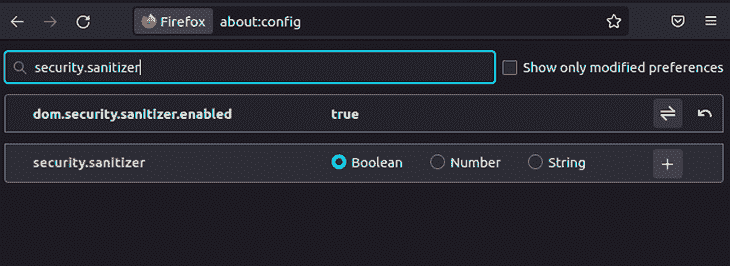
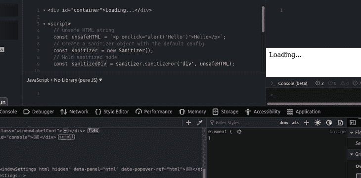

# 关于内置浏览器你需要知道什么

> 原文：<https://blog.logrocket.com/what-you-need-know-inbuilt-browser-html-sanitization/>

应用程序安全性是每个 web 应用程序的一个重要因素。Web 开发人员使用各种策略来改进他们的 web 应用程序的安全层，例如实现漏洞防御技术。

当您开始处理原始 HTML 并使用不可信的内容操作 DOM 时，Web 应用程序的安全风险通常会增加。如果您直接从第三方来源呈现 HTML，并且该来源受到基于互联网的威胁的影响，攻击者可以在未经您同意的情况下在您的应用程序用户的计算机上执行 JavaScript 代码。这些安全攻击被称为 XSS(跨站点脚本)攻击。

HTML 清理是 OWASP 推荐的防止 web 应用程序中 XSS 漏洞的策略。HTML 清理提供了一种安全机制，在将不安全(和潜在恶意)的内容呈现给用户之前，从不可信的原始 HTML 字符串中删除这些内容。

实验性的内置浏览器净化 API 帮助您以安全的方式将不受信任的 HTML 字符串插入到 web 应用程序的 DOM 中。在本文中，我将讨论:

## 什么是 HTML 清理？

HTML 清理通常是指从原始 HTML 字符串中删除潜在的恶意 JavaScript 内容。有两种不同的 HTML 清理实现:

*   客户端净化:从 DOM 级别阻止不安全的内容
*   服务器端净化:防止恶意 HTML 内容存储在数据库中

我们确实需要使用两个净化层来防止 XSS 漏洞。如果您的数据库受到恶意 XSS 负载的影响，客户端净化层将保护所有应用程序用户，但如果攻击者直接从 RESTful API 发送恶意 HTML，服务器端净化将保护系统。

Web 开发人员倾向于使用以下库进行客户端/DOM 级别的清理:

*   [DOMPurity](https://github.com/cure53/DOMPurify) :用于 JavaScript 的 HTML 消毒库
    *   还通过 [jsdom](https://github.com/jsdom/jsdom) 包在服务器端 Node.js 上工作
*   js-xss :一个 HTML 杀毒库，可以在浏览器、服务器端 Node.js 上运行，并作为一个命令行工具
*   [sanitize-html](https://github.com/apostrophecms/sanitize-html) :基于 [`htmlparser2`的](https://github.com/fb55/htmlparser2)sanitize 库，用于 Node.js 和浏览器，在 React 开发人员中非常流行，因为有一个专门用于 React 的[包装库](https://www.npmjs.com/package/sanitize-html-react)

这些库通常使用浏览器的内置 DOM 迭代器或自定义 HTML 解析器来解析不安全的 HTML，在使用`innerHTML`之前，自定义 HTML 解析器会排除不安全的 HTML 内容。

## 为什么我们需要一个浏览器本地的净化 API？

HTML 清理 API 是一种浏览器功能，有助于安全地将不安全的 HTML 字符串或文档添加到网页中。它提供了净化现有 DOM 元素和从原始 HTML 字符串中获取新的净化的 DOM 元素的方法。

上面讨论的解决方案为防止 XSS 攻击提供了非常好的安全解决方案，但是仍然存在几个问题。随着浏览器标准的变化，这些库需要保持净化规范的更新。例如，如果标准 HTML 规范引入了潜在的不安全 HTML 属性，那么这些库的净化策略就会变得不稳定。

基于库的清理也可能很慢，因为解析会发生两次——第一次是在库清理过程中，第二次是在浏览器 DOM 解析过程中——当我们向网页注入安全的 HTML 时。

### 关键目标

HTML 清理 API 的目标是通过以下功能缓解 DOM 级别的 XSS 攻击:

*   为开发人员提供功能全面、完整且稳定的本机净化接口
*   通过映射现代标准 HTML 规范来维护最新的净化定义
*   保护 DOM 而不是提供一个净化的原始 HTML 字符串，不像我们上面提到的净化库

本机清理的一个很大的好处是它给了我们`setHTML`函数，这个函数[根据清理规则直接解析和操作 DOM](https://developer.mozilla.org/en-US/docs/Web/API/Element/setHTML) 。

## 了解 HTML 消毒 API 规范

既然我们已经知道了 sanitizer API 的背景、特性和当前的开发状态，那么让我们来看看暴露在 JavaScript 环境中的 API 规范。

Sanitizer API 带有两个主要的开发人员接口:`Sanitizer`类和`Element.setHTML`方法。

### `Sanitizer`等级和配置

`Sanitizer`类帮助创建一个新的 HTML `sanitizer`对象来满足净化需求。它带有以下语法:

```
new Sanitizer()
new Sanitizer(config)

```

我们可以通过使用非参数化构造函数，使用以下语法和默认配置创建一个新的 sanitizer 对象。[默认配置](https://wicg.github.io/sanitizer-api/#default-configuration-object)使用基于安全列表的技术创建一个`Sanitizer`对象，以减少已知的 XSS 漏洞。

```
const sanitizer = new Sanitizer();

```

但是，我们可以通过传递一个配置对象来定制`Sanitizer`对象，如下所示。

```
const sanitizer = new Sanitizer(config);

```

`configuration`对象的定义如下:注意，这个配置定义将来可能会改变，因为 API 提议仍然在 web 孵化器中。

```
{
  allowElements: <string Array>,
  blockElements: <string Array>,
  dropElements: <string Array>,
  allowAttributes: <Object>,
  dropAttributes: <Object>,
  allowCustomElements: <Boolean>,
  allowComments: <Boolean>
}

```

*   `allowElements`:消毒剂应包括的元素列表
*   `blockElements`:杀毒器应该通过保留它们的子元素来排除的元素列表
*   `dropElements`:排除类似于`blockElements`属性的元素，但也删除属于被排除节点的整个子元素树
*   `allowAttributes`:作为键数组对象的允许属性
    *   例如，`'class': ['div']`允许所有`div`元素的`class`属性——我们可以使用星号(`*`)来允许任何 HTML 元素的特定属性
*   `dropAttributes`:`allowAttributes`属性的相反版本
*   `allowCustomElements`:允许或不允许自定义元素的布尔值(默认为`false`)
*   `allowComments`:允许或不允许评论的布尔值(默认为`false`)

例如，我们可以初始化一个定制的`Sanitizer`对象，只允许基本的 HTML 标签和内嵌样式，如下所示。

```
{
  'allowElements': [
    'div',
    'span',
    'p',
    'em',
    'b'
  ],
  'allowAttributes': {
    'style': ['*']
  }
}

```

## 消毒剂 API 方法:`sanitize`、`sanitizeFor,`和`setHTML`

`Sanitizer`类帮助我们初始化一个 HTML `Sanitizer`对象，但是我们需要使用一些其他的方法在 web 应用程序中使用 sanitizer 实例。在我们学习了下面的 API 规范之后，我将在教程部分解释如何使用 sanitizer API。

### `Sanitizer.sanitize`方法

```
sanitize(input)

```

我们可以使用`sanitize`方法将杀毒规则应用于预先存在的 DOM 节点。这个函数接受一个`Document`或`DocumentFragment`对象，并返回一个经过净化的`DocumentFragment`作为输出。

### `Sanitizer.sanitizeFor`方法

```
sanitizeFor(element, input)

```

我们可以使用这个方法通过发送一个不安全的 HTML 字符串来获得一个净化的元素节点。换句话说，在根据清理规则解析了`input`字符串之后，它返回一个`element`类型的 DOM 节点。

### `Element.setHTML`方法

```
setHTML(input, sanitizer)

```

这个方法是`Element.innerHTML`属性的一个更安全、更固定的版本。属性允许任何 HTML 字符串，并且倾向于 XSS 有效负载。因此，`setHTML`方法接受一个杀毒器实例，并在将新节点注入 DOM 之前对可能有害的 HTML 内容进行杀毒。

## 试用消毒 API

您可以在 Google Chrome/Chromium ≥ 93 和 Firefox ≥ 83 web 浏览器上使用 Sanitizer API 的早期实现。默认情况下，这些早期的实现在任何一个 web 浏览器上都是不启用的，所以首先我们必须通过修改浏览器配置来启用它们。

如果您使用 Chrome/Chromium，您可以通过导航到`chrome://flags` URL 来启用`#sanitizer-api`开关，如下所示。


如果您使用的是 Mozilla Firefox，您可以通过`about:config`启用这个特性，如下所示。



在本教程中，我将使用 Mozilla Firefox 96 来试验即将推出的 Sanitizer API 示例。

让我们用实际例子来尝试一下 sanitizer API。我将使用 [JsFiddle](https://jsfiddle.net/) 在线编辑器来演示这些例子，但是您也可以通过创建一个 HTML 文件来使用您的本地开发环境进行测试。

### 净化不安全的 HTML 字符串并插入到 DOM 中

让我们从基础开始。我们如何用 Sanitizer API 从不安全的 HTML 字符串中呈现一个更安全的 DOM 节点？请看下面的示例代码。

```
<div id="container"></div>
<script>
  // unsafe HTML string
  const unsafeHTML = `<p onclick="alert('Hello')">Hello</p>`;
  // Find the container node
  const container = document.getElementById('container');
  // Create a sanitizer object with the default config
  const sanitizer = new Sanitizer();
  // Inject new DOM nodes in a safer way
  container.setHTML(unsafeHTML, sanitizer);
</script>

```

这里，我们使用了`setHTML` setter 而不是`innerHTML`属性。如果在运行上述代码后检查 DOM，可以看到在将子元素呈现给`container`节点之前，`setHTML`方法自动排除了`onclick`。


您可以使用下面的代码来验证`innerHTML`属性的不安全性。

```
<div id="container"></div>
<script>
  // unsafe HTML string
  const unsafeHTML = `<p onclick="alert('Hello')">Hello</p>`;
  // Find the container node
  const container = document.getElementById('container');

  // Inject new DOM nodes
  container.innerHTML = unsafeHTML;
</script>

```

上面的代码用不安全的事件处理程序注入了新的 DOM 节点，如下所示。


Demonstration of security issues in the `innerHTML` property

您可以通过读取经过净化的 DOM 元素的`innerHTML`属性来获得经过净化的原始 HTML 字符串，但这多少违背了 sanitizer API 背后的主要目标，即安全地注入 DOM——而不是将 Sanitizer API 用作另一个净化库。

### 使用`sanitizeFor`进行惰性净化

之前，我们使用了`setHTML`方法在清理过程中立即呈现一个不安全的 HTML 字符串，但是在某些情况下，我们仍然需要在清理过程之后的某个时候呈现新元素。

例如，web 开发人员经常需要在渲染过程之后将来自互联网的不安全 HTML 字符串渲染到 WYSIWYG 编辑器中。作为一个优化的、无错误的解决方案，我们可以首先获取内容，应用净化，然后在编辑器组件完全呈现时呈现净化后的节点。

我们可以用`sanitizeFor`方法将结果整理并临时保存为一个特定的 DOM 节点。看下面这个例子。

```
<div id="container">Loading...</div>
<script>
  // unsafe HTML string
  const unsafeHTML = `<p onclick="alert('Hello')">Hello</p>`;
  // Create a sanitizer object with the default config
  const sanitizer = new Sanitizer();
  // Hold sanitized node
  const sanitizedDiv = sanitizer.sanitizeFor('div', unsafeHTML);
  // Inject nodes after sometime
  setTimeout(() => {
    // Find the container node
    const container = document.getElementById('container');
    // Inject the sanitized DOM node
    container.replaceChildren(sanitizedDiv);  
  }, 1000);
</script>

```

上面的代码清理了一个不安全的 HTML 字符串，并将清理后的 DOM 节点保存到一个常量中。稍后，它使用`replaceChildren`方法将净化后的 DOM 节点注入相关的容器节点。请注意，我们特意使用了一秒钟的延迟来模拟网络和渲染延迟。



Demonstrating how to use the `sanitizeFor` function

## 消毒 iframe

iframes 有助于将小部件和第三方网页添加到我们的 web 应用程序中，但通常会带来一些安全问题，因为我们从其他来源(通常是第三方来源)加载 web 内容。因此，净化通过 iframes 加载的 web 内容无疑是最安全的。

之前，我们使用一个字符串作为清理 API 方法的输入，但是现在，我们需要清理预先存在的 DOM 节点。为此，我们需要一个接受 HTML 文档片段或文档的函数。

还记得`sanitize`法吗？看下面这个例子。

```
<iframe id="webpage"></iframe> <!-- Use a URL with cross-origin policy -->
<br/>
<button onclick="sanitize()">Sanitize</button>

<script>
function sanitize() {
  // Create a sanitizer object with the default config
  const sanitizer = new Sanitizer();
  // Find the iframe node
  const iframe = document.getElementById('webpage');
  // Sanitize the iframe's document node
  const sanitizedFrameNodes = sanitizer.sanitize(iframe.contentWindow.document);
  iframe.replaceChildren(sanitizeFrameNodes);
}
</script>

```

### 定制消毒剂配置

如果我们创建一个新的`Sanitizer`类实例而不发送配置对象，API 将使用默认配置来减少已知的 XSS 漏洞。但是您可以通过发送配置对象来自定义清理逻辑。

假设您需要允许动态`div`元素的基本 HTML 标签和内联样式。我们可以通过使用自定义配置来实现一个杀毒器来满足这一需求，如下所示。

```
<div id="container"></div>
<script>
  // unsafe HTML string
  const unsafeHTML = `<div onclick="alert('Hello')">
   <p><b>Hello Sanitizer API</b></p>
    <p><em onmovemove="window.location.reload()">Test</em></p>
    
  </div>`;
  // Find the container node
  const container = document.getElementById('container');
  // Create a sanitizer object with a custom config
  const sanitizer = new Sanitizer(
    {
      'allowElements': [
        'div',
        'span',
        'p',
        'em',
        'b'
      ],
      'allowAttributes': {
        'style': ['*']
      }
    });
  // Inject new DOM nodes in a safer way
  const sanitizedDiv = sanitizer.sanitizeFor('div', unsafeHTML);
  container.replaceChildren(sanitizedDiv);
</script>

```

注意，我们也可以使用`setHTML`函数获得相同的输出，但是我使用了`replaceChildren`来代替，因为 Firefox 的实验性`setHTML`函数包括了`img`标签，即使在杀毒之后。

使用定制消毒剂配置时要小心。在定制配置时，您可以完全控制允许任何元素和属性——例如，下面的 sanitizer 配置使您的 web 应用程序易于 XSS，因为它允许使用`onclick`事件处理程序。

```
{
  'allowElements': ['div', 'p', 'em'],
  'allowAttributes': {
    'onclick': ['*']
  }
}

```

当心消毒剂 API 错误配置！

## 浏览器支持和 API 状态

浏览器开发人员和安全工程师通常会向 W3C 组织提交新的浏览器 API 提案，以获得普遍批准。经过酝酿期和批准后，W3C 将特定规范添加到官方 web 标准中。

几个贡献者在 2016 年开始在一个 [GitHub 存储库](https://github.com/WICG/sanitizer-api)中编写净化 API 提案。2021 年末，API 提案[在官方网站孵化器](https://wicg.github.io/sanitizer-api/)进入草案阶段。如今，web 开发人员社区通过提出各种想法来改进该规范，并努力使其成为官方的 web 标准。

此外，Google Chrome/Chromium ≥ 93 和 Firefox ≥ 83 为现在有兴趣测试它们的 web 开发人员提供了 Sanitizer API 的早期实现。这些早期的实现并不稳定，将来仍会发生变化。您可以在[can use](https://caniuse.com/mdn-api_sanitizer)查看完整的浏览器支持详情。

然而，这一浏览器功能将在[安全环境](https://developer.mozilla.org/en-US/docs/Web/Security/Secure_Contexts)下工作。换句话说，您只能通过 HTTPS 连接使用此浏览器功能。但是您也可以在本地开发环境中使用 Sanitizer API，因为标准的安全上下文策略将 localhost(或`127.0.0.1`)标识为安全上下文。

## 结论

在本教程中，我们通过一些示例学习了如何使用实验性杀毒软件 API，并从浏览器的实验性功能列表中启用它开始。尽管 Google Chrome/Chromium 和 Mozilla Firefox 提供了这个 API 规范的早期实现，但它仍然在 W3C 孵化器项目中。换句话说，提案的编辑可能会根据社区的建议和已知的安全漏洞来更改 API 规范。如果你有改进 Sanitizer API 结构的建议，你可以[向 GitHub 上的 Sanitizer API 孵化器库提交问题](https://github.com/WICG/sanitizer-api)。

Sanitizer API 承诺帮助前端和框架开发人员。例如，React 开发人员经常倾向于使用 [sanitize-html](https://github.com/apostrophecms/sanitize-html) 库和 React 的`dangerouslySetInnerHTML` prop 来将不安全的 html 字符串呈现给 DOM。

然而，如果实验性的杀毒 API 成为浏览器标准，React 将能够提供一种开发人员友好的方法(如`setHTML`)来杀毒和注入任意 HTML 字符串，而不会影响包的大小。

使用定制 HTML 杀毒实现的框架，如 [Angular](https://github.com/angular/angular/blob/master/packages/core/src/sanitization/html_sanitizer.ts) 可以通过使用本地杀毒 API 来减小框架包的大小。然而，如前所述，Sanitizer API 仍然是试验性的，所以在它变得稳定并得到 W3C 批准之前，不要在生产系统中使用它。

你可以通过在线的[HTML Sanitizer API playground](https://sanitizer-api.dev/)进一步试验 Sanitizer API。

## 使用 [LogRocket](https://lp.logrocket.com/blg/signup) 消除传统错误报告的干扰

[](https://lp.logrocket.com/blg/signup)

[LogRocket](https://lp.logrocket.com/blg/signup) 是一个数字体验分析解决方案，它可以保护您免受数百个假阳性错误警报的影响，只针对几个真正重要的项目。LogRocket 会告诉您应用程序中实际影响用户的最具影响力的 bug 和 UX 问题。

然后，使用具有深层技术遥测的会话重放来确切地查看用户看到了什么以及是什么导致了问题，就像你在他们身后看一样。

LogRocket 自动聚合客户端错误、JS 异常、前端性能指标和用户交互。然后 LogRocket 使用机器学习来告诉你哪些问题正在影响大多数用户，并提供你需要修复它的上下文。

关注重要的 bug—[今天就试试 LogRocket】。](https://lp.logrocket.com/blg/signup-issue-free)