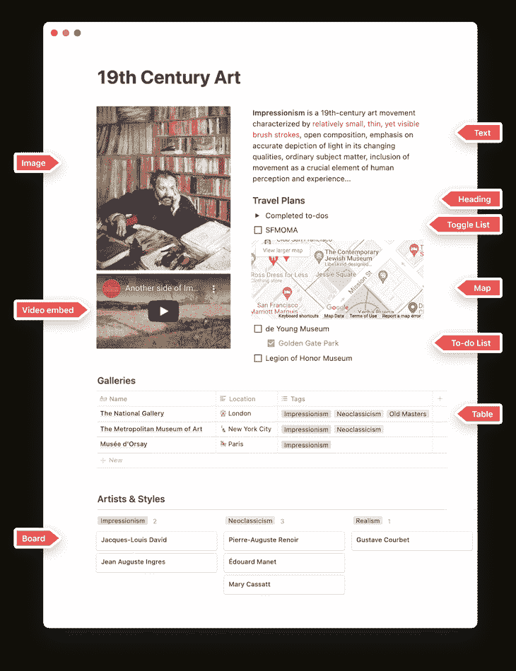
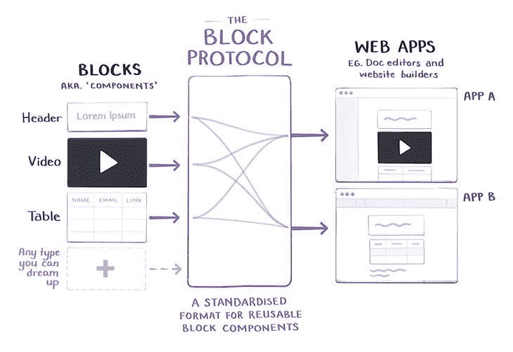
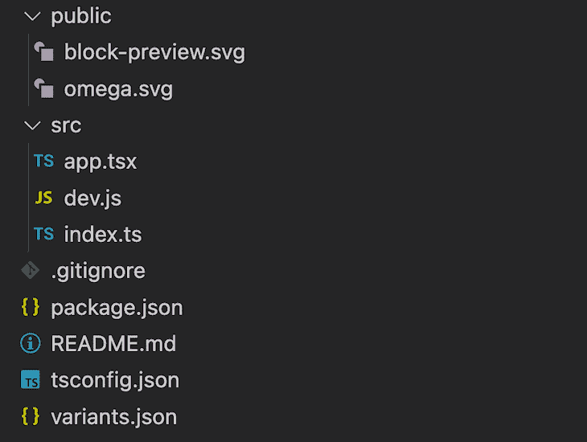
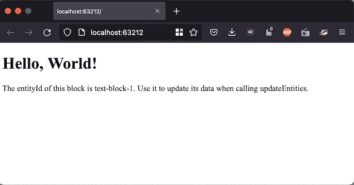
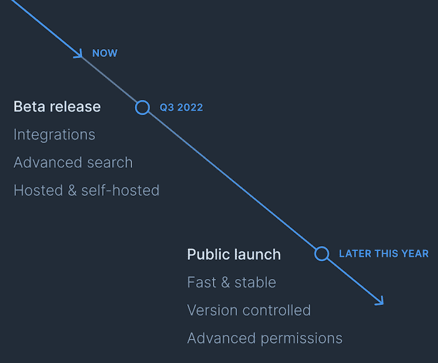

# 关于块协议你需要知道什么

> 原文：<https://blog.logrocket.com/what-you-need-to-know-block-protocol/>

现代 web 应用程序越来越多地使用“块”，这是具有明确目的或功能的高级 JavaScript 组件。当[使用概念](https://www.notion.so/help/what-is-a-block)时，我们会遇到块，其中我们添加到页面的每一段内容(无论是图像、文本段落、引用、列表、表格或任何其他内容)都是块:



在这些应用程序中，生成的页面是特定顺序的块、每个块的特定配置以及注入到块中的用户特定数据的组合。

随着块逐渐成为这些应用程序的主干，一个新的考虑出现了:有没有可能抓取一个为一个应用程序编码的块，并在另一个应用程序中使用它？

显而易见的答案是“不”,因为块很可能是针对它们被编码的特定应用而固执己见的。块定制问题包括样式、数据源、与底层引擎交互的 API、配置和用户权限等。

例如，如果块需要从某个源获取数据，它可能会从具有特定形状的 REST 端点或者具有特定模式的 GraphQL 端点获取数据，这些端点是应用程序公开的端点；在没有兼容的 REST 端点或 GraphQL 模式的不同应用程序上嵌入相同的块将不起作用。

但是，即使自然的答案是“不”，这并不意味着它不能做到。

## 输入块协议

应用程序也可以通过 props 将数据注入到块中，而不是让块自己从端点获取数据。通过在任何地方这样做(即，对于所有定制区域，包括样式、配置、API、数据源、用户权限等。)，该块可以跨应用程序重用。

换句话说，我们可以让程序块跨应用程序互操作，方法是以这样一种方式构建程序块:它们需要的所有数据都由应用程序提供，它们可以从底层引擎访问的所有功能都由应用程序注入到它们之中。

块和应用程序需要相互通信——块表达它的需求，而应用程序满足它们——所以它们必须使用共同的语言。如果这种语言是标准化的，那么社区内不同人编写的块和应用程序也可以相互通信，这将允许我们轻松地将第三方块嵌入到我们的应用程序中。

为了达到这个目标，最近启动了一个新的开源项目:块协议

> 用于构建和使用数据驱动块的开放标准，允许开发人员在 web 上的任何位置嵌入任何块，使用来自任何来源的数据，提供一组关于如何编写块的指导原则，以可预测的方式呈现、创建、更新和删除数据，从而使在遵守协议的应用程序之间轻松移动块和数据成为可能。



让我们来分析这个新协议，仔细研究它的既定目标和可察觉的缺点，回顾它当前的开发状态，并评估它是否足够好，足以让社区从中受益。以下是我们将要介绍的内容:

## 块协议的优势

这些是让我们的块和应用程序遵守块协议的主要好处。

### 跨不同应用程序重用块

这是最明显的好处，也是创建 Block 协议的主要原因:能够抓取我们为某个应用程序编码的块，并以即插即用的方式在不同的应用程序中使用它，而不需要额外的配置，这对于开发人员的体验有明显的影响。

### 使用第三方块

由于规范是标准化的，每个兼容的块将在任何兼容的应用程序上工作，而与它的作者无关。这意味着一个块市场将会崛起，允许我们轻松地将第三方块嵌入到我们的应用程序中，从而减少开发它们所需的时间和精力。

多亏了 GraphQL，开源规范产生深远影响的熟悉先例已经存在。

在脸书(现在叫做 Meta)发布 GraphQL 之后，它立即被社区所采用。随后创建了大量的工具，包括模式浏览和可视化、静态文档生成、静态代码生成、模式拼接、遥测等领域。

这不能被认为是理所当然的(它可能真的永远不会发生)，但是我们可以希望 block 协议也能发生类似的情况，产生一个工具生态系统，任何兼容的 Block 或应用程序都可以立即从中受益。

## 块协议入门

为了开始使用块协议，我们必须首先阅读[规范](https://blockprotocol.org/spec)，然后按照[以下步骤](https://blockprotocol.org/docs):

1.  开发街区
2.  将块发布到[块中枢](https://blockprotocol.org/hub)(可选)
3.  将块嵌入到应用程序中

让我们更详细地探讨这些。

### 选择我们的堆栈

虽然块协议是技术不可知的，但最安全的做法是使用 React 和 TypeScript 来[开发我们的块](https://blockprotocol.org/docs/developing-blocks)，因为这是用于 Hub 中所有现有块的堆栈。因此，我们对它的工作有了一些保证，我们也可以很容易地研究现有代码块的源代码并从中学习(比如[代码块](https://github.com/hashintel/hash/tree/main/packages/blocks/code))。

目的是使用其他堆栈添加[块的示例:](https://blockprotocol.org/docs/developing-blocks#other-approaches)

> 在不久的将来，我们将发布如何使用不同的 web 技术和前端库编写代码块的例子。

然而，不久的将来会持续多久还不清楚:可能是一个月，三个月，一年甚至更久。因为这个声明是一个愿望而不是一个计划——而且，因为这个项目是开源的，这意味着它依赖于来自社区的不总是可预测的参与——我建议坚持我们已经知道的工作:React 和 TypeScript。

### 搭建、编辑和释放块

该项目包括一个包，可以轻松地[搭建一个新的块](https://blockprotocol.org/docs/developing-blocks#install)(基于 React/TypeScript):

```
yarn create block-app [your-block-name]

```

生成的块包结构如下所示:



我们的`src/app.tsx`文件是块的起点:

```
import { BlockComponent } from "blockprotocol/react";
import * as React from "react";

type AppProps = {
  name: string;
};

export const App: BlockComponent<AppProps> = ({ entityId, name }) => (
  <>
    <h1>Hello, {name}!</h1>
    <p>
      The entityId of this block is {entityId}. Use it to update its data when
      calling updateEntities.
    </p>
  </>
);

```

运行`yarn install && yarn dev`，在浏览器中打开`[http://localhost:63212](http://localhost:63212)`，我们可以看到我们的脚手架:



然后我们可以[编辑我们的块](https://github.com/blockprotocol/blockprotocol/tree/main/packages/block-template)，确保块协议所需的`block-schema.json`，即记录块属性的 JSON 模式，已经可以添加到项目的根中(作为未发布的倒计时块中的[，或者它也可以作为工件从 TypeScript 中生成(作为带有表块](https://github.com/hashintel/hash/blob/main/packages/blocks/countdown/block-schema.json)的[)。](https://github.com/hashintel/hash/tree/main/packages/blocks/table)

要捆绑组件，运行`yarn build`生成一个包含所有块依赖关系的发布文件，减去公共依赖关系(如 React)，它必须由应用程序而不是块加载。(这些公共依赖关系必须在块的`package.json`的`peerDependencies`条目下声明。)

### 发布块(可选)

[Block Hub](https://blockprotocol.org/hub) 是一个开源块的存储库，由 Block 协议 HASH 背后的公司管理。如果我们希望其他人使用它们，我们可以[将我们的块发布到这个注册表](https://blockprotocol.org/docs/publishing-blocks)；如果我们的目的只是为我们自己的应用程序创建块，那么我们可以完全跳过这一步。

### 在应用程序中嵌入块

为了将模块嵌入到应用程序中，我们必须首先让应用程序[向模块](https://blockprotocol.org/docs/embedding-blocks#building-the-block's-properties)提供所有需要的数据，包括:

*   块将允许用户查看或编辑的实体数据
*   实体之间的链接
*   更新实体时使用的函数和 id

一旦完成，我们必须[渲染块](https://blockprotocol.org/docs/embedding-blocks#rendering-blocks)，但是在发布时，这个过程并不简单，我们将在下一节学习。

## 数据块协议的当前状态是什么？

不幸的是，应用程序中用于渲染块的[文档目前仍不完整:](https://blockprotocol.org/docs/embedding-blocks#rendering-blocks)

> 我们将在 2022 年 1 月发布源代码，演示如何实现这一切。

HASH 正在[基于 Block 协议](https://github.com/hashintel/hash/tree/main/packages/hash)构建它的网站，所以我们可以用这个 web 应用作为例子来跟随。但是，我们还不能完全依赖它，[因为](https://github.com/hashintel/hash/tree/42ed1c67239713c2bed720feb4f123cf4be8e6b4/packages/hash#hash):

> 此应用尚未准备好投入生产使用。目前，它旨在被用作开发人员构建块协议兼容块的[测试工具](https://github.com/hashintel/hash/tree/42ed1c67239713c2bed720feb4f123cf4be8e6b4/packages/hash#integration-with-the-block-protocol)。它目前不安全，没有优化，并且缺少关键功能。

这款网络应用的测试版本应在 2022 年 4 月完成，但它没有按时完成，其路线图被提前到“2022 年第三季度”:



此外，块协议仍然是一个草案，需要做大量的工作，直到它变得稳定。规范中的一些部分需要从根本上改进(包括一些重要的部分，如块样式)，并且可能需要添加新的部分(如“配置”部分，指示应用程序可以显示哪些选项来编辑和配置块)。因此，该规范还不能为生产应用提供动力。我们将在下一节更详细地讨论这些未完成的项目。

在拥有功能齐全、兼容的应用程序之前，我们不应指望 Block 协议会达到 1.0 版，因为在使用实际应用程序时，开发人员会发现规范中的问题，必须加以纠正。大多数情况下，在项目的初始阶段，这会产生一个自我依赖的循环:应用程序将有助于改进规范，而升级规范将有助于定义如何使应用程序符合规范。兼容的应用程序没有准备好的事实有效地证明了规范没有准备好。

总之，现在还不应该使用块协议。我们已经可以开始使用它了，但是如果我们的目标是为生产开发符合协议的块和应用程序，那么我们应该等到最低要求得到满足。

## 有哪些弊端？

尽管块协议的好处值得追求，但我们也必须探索与项目相关的成本和缺点。

### 样式块的功能减弱

关于[样式块](https://blockprotocol.org/spec/embedding-applications#styling)的部分并不是 100%合适的，因为它限制了我们可以对块进行多少样式化。这是因为块被当作一个黑盒，并且只支持通过 props 注入到块中的少量 CSS 属性。

有一个[讨论请求反馈](https://github.com/blockprotocol/blockprotocol/discussions/180)来改进解决方案，但是问题可能是棘手的:由于 Block 协议不会接受每一个 CSS 属性，可能总是有一些我们需要使用的不支持的属性——甚至基本的属性，如边距和填充，目前都不支持。

因此，设计我们的积木可能最终不得不“足够好”而不是“完美”，这可能会使我们无法在积木中反映我们的品牌身份。

* * *

### 更多来自 LogRocket 的精彩文章:

* * *

### 通用块可能会变得臃肿

当使用集线器中可用的块时，我们将使用不是专门为我们的应用程序设计的通用块。如果代码块包含我们不需要的功能，那么我们的应用程序将会遭受性能损失，因为该功能的代码仍然会被发布，并且仍然必须由 JavaScript 引擎解析。

### 将不支持自定义功能

如果应用程序支持自定义功能，而这些功能在通用上下文中不适用，那么通用块将不会支持这些功能。

一个例子是动态令牌，一个为 WordPress 编辑器提出的定制特性[，它需要在块的 JSON 模式中有一个定制的`"tokenSupport"`部分:](https://github.com/WordPress/gutenberg/discussions/39831)

```
{
  "attributes": {
    "url": {
      "type": "string",
      "source": "attribute",
      "selector": "img",
      "attribute": "src"
    }
  },
  "tokenSupport": {
    "core/featured-image": {
      "selector": "img",
      "attribute": "src"
    }
  }
}

```

由于`"tokenSupport"`不是普通块中预期的属性，块协议不支持它。然后，通过使用通用块，WordPress 站点在使用块协议时将不如在依赖本机块时强大。

### 这种努力可能有些过头了

对块进行抽象，使它们可以在任何地方工作，这是一个宏伟的目标，但在实践中，这需要付出大量的努力才能实现。这是因为有几十个元素必须被考虑用于抽象，其中一个不能被满足的元素可能足以使该方法不可用。

我过去曾经为 WordPress 转换过我的 GraphQL 服务器，使其与底层 CMS 无关(事实上，这与 PHP 而不是 JavaScript 无关，因为抽象的功能在任何应用程序中都是标准的，与它们的栈无关)。这个开发花了三个月的时间才完成，范围如此之广，以至于需要两篇文章来记录(一篇给[描述策略](https://www.smashingmagazine.com/2019/11/abstracting-wordpress-code-cms-concepts/)，另一篇给[解释实现](https://www.smashingmagazine.com/2019/11/abstracting-wordpress-code-reuse-with-other-cms-implementation/))。抽象甚至没有完成，因为某些特性仍然是 CMS 特有的。

现在，我并不是说创建通用块不值得追求，因为我确实对我的 GraphQL 服务器的抽象非常满意，并且我确实相信这是值得努力的。(例如，服务器现在可以作为独立的应用程序执行，这对运行单元测试特别有用。)然而，由于进行抽象的成本可能很高，我们应该评估这种成本是否值得潜在的收益。

## 我们应该使用块协议吗？

块协议是一个很好的想法，但是它还没有准备好。该协议在发布时没有全功能的符合协议的应用程序来演示其用途，这严重限制了社区的块开发，并阻碍了我们正确评估在我们的应用程序中采用该协议的好处。

在 2022 年 1 月[向世界](https://www.joelonsoftware.com/2022/01/27/making-the-web-better-with-blocks/)介绍之后，Block 协议得到了开发社区的关注，并设法在 GitHub 上获得了几百颗星[。然而，该项目似乎从那时起就停止了，没有来自 HASH 团队以外的重要贡献。](https://github.com/blockprotocol/blockprotocol/)

由于向 Hub 发布块需要向块协议 repo 提交 pull 请求，因此缺少贡献表明社区没有创建块，这进一步表明块协议还没有准备好投入使用——当没有可供我们使用的块市场时，它的价值是什么？

## 结论

总之，块协议有很大的潜力，但它还没有成为现实。随着时间表的推进，规范需要重大升级，尚不清楚 Block 协议何时可以投入生产。在那之前，我们可以开始探索规格并熟悉它，并考虑将块从应用中分离出来的潜在好处是否值得付出额外的努力。

## 使用 [LogRocket](https://lp.logrocket.com/blg/signup) 消除传统错误报告的干扰

[](https://lp.logrocket.com/blg/signup)

[LogRocket](https://lp.logrocket.com/blg/signup) 是一个数字体验分析解决方案，它可以保护您免受数百个假阳性错误警报的影响，只针对几个真正重要的项目。LogRocket 会告诉您应用程序中实际影响用户的最具影响力的 bug 和 UX 问题。

然后，使用具有深层技术遥测的会话重放来确切地查看用户看到了什么以及是什么导致了问题，就像你在他们身后看一样。

LogRocket 自动聚合客户端错误、JS 异常、前端性能指标和用户交互。然后 LogRocket 使用机器学习来告诉你哪些问题正在影响大多数用户，并提供你需要修复它的上下文。

关注重要的 bug—[今天就试试 LogRocket】。](https://lp.logrocket.com/blg/signup-issue-free)