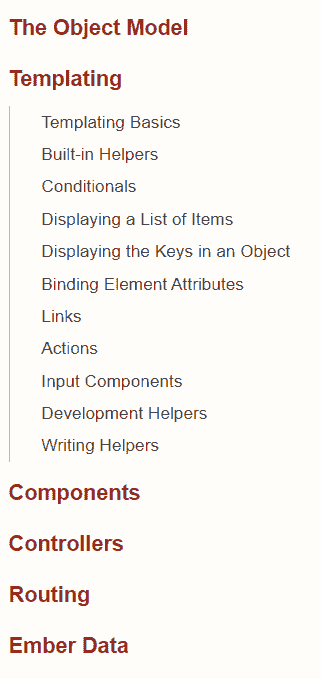
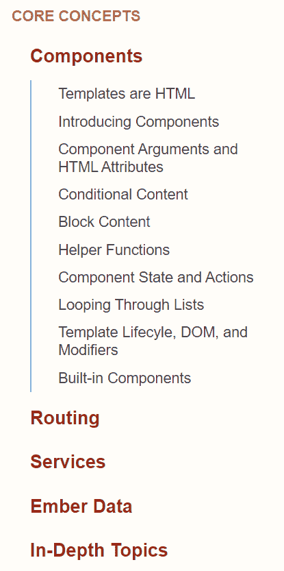
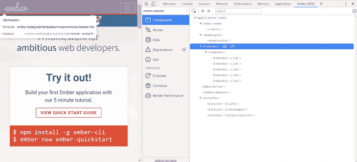
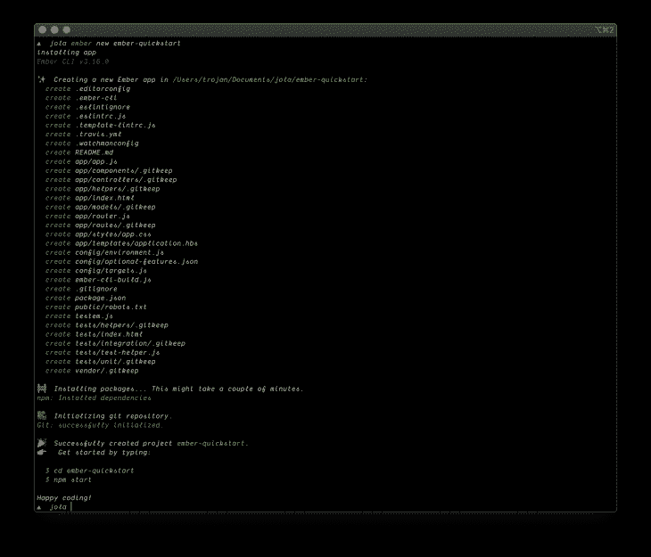

# Ember Octane 有什么新内容

> 原文：<https://blog.logrocket.com/whats-new-in-ember-octane/>

Ember.js 是一个开源的基于 MVC 的 JavaScript 框架，适合构建大规模的客户端应用。它有助于开发人员提高开箱即用的工作效率，并且预配置了启动和运行应用程序所需的几乎所有功能。

官方网站将 Ember.js 描述为:

> 一个用于构建现代 web 应用程序的经过实战检验的高效 JavaScript 框架。它包含了构建可以在任何设备上工作的丰富 ui 所需的一切。

Ember.js 的好处之一是它的向后兼容性。这使得将框架的最新特性集成到你的应用程序中变得容易，而不需要处理突破性的改变。

在其最新发布的 Ember Octane(作为 Ember 3.15 推出)中，提供了许多功能，并对 Ember 的组件和反应系统进行了更新，这些变化包括:

*   微光元件
*   微光反应性
*   带修饰符的可重用 DOM 行为
*   全面更新的教程和组件指南
*   改进的工具

## 什么是余烬辛烷？

根据其[文档](https://emberjs.com/editions/octane/):

> Ember Octane 描述了一组新功能，这些功能结合在一起，代表了对 Ember.js 使用方式的根本性改进。它具有现代化的简化组件和状态管理，使构建 web 应用程序变得有趣。借助现有应用的无缝互操作性，团队可以按照自己的节奏进行迁移，而开发人员构建新应用时，可以从 Ember 提供的最佳功能开始。

让我们来看看最新版本的框架中包含的一些最新特性。

## 微光元件

Ember 曾经有一个[单组件系统](https://guides.emberjs.com/v1.10.0/components/)，在那里你必须使用 JavaScript 微语法配置一个“根元素”:

```
import Component from '@ember/component';

export default Component.extend({
  tagName: 'p',
  classNames: ["tooltip"],
  classNameBindings: ["isEnabled:enabled", "isActive:active"],
})
```

使用 Glimmer 组件，您可以告别这种情况，因为它允许您创建一个完全没有根元素的组件。这使得创建根组件更加容易，并且消除了使用第二个 API 来处理组件的根元素的特殊情况。

您的组件现在可以像这样重写:

```
<p class="tooltip {{if @isEnabled 'enabled'}} {{if @isActive 'active'}}">
  {{yield}}
</p>
```

您也可以创建一个完全没有根元素的组件来提高性能，这样它就可以工作了:

```
<p>{{yield}}</p>
<hr>
```

## 微光反应性

反应性是现代 JavaScript 框架检测状态变化的方式，以及它们如何在系统中有效地传播变化。一个很好的例子是，每当应用程序中的数据发生变化时，DOM 是如何自动更新的。

反应性，根据[维基百科](https://en.wikipedia.org/wiki/Reactive_programming):

> 是一个面向[数据流](https://en.wikipedia.org/wiki/Dataflow_programming)和变化传播的[编程范例](https://en.wikipedia.org/wiki/Programming_paradigm)。这意味着，使用这种范例，可以轻松地表达静态或动态数据流，还可以传达相关执行模型内存在推断的依赖关系，这有助于自动传播已更改的数据流

Ember Octane 提供了一个更简单的反应性模型，称为“跟踪属性”，用`@tracked`注释表示。将`@tracked`添加到一个类的属性中使其具有反应性，这样如果属性有任何变化，使用该属性的 DOM 的任何部分都会自动更新。

## 带修饰符的可重用 DOM 行为

Ember 组件模型的另一个更新是元素修饰符，这是一个允许您构建不连接到任何特定组件的可重用 DOM 行为的功能，修饰符类似于 mixin 的工作方式，应该可以取代经典的 mixin，因为您不必处理命名冲突等问题。

例如，假设我们有一个第三方库，它公开了`activateTabs`和`deactivateTabs`函数，这两个函数都采用一个元素。在经典的 Ember 中，你可以这样写一个 mixin:

```
import Mixin from '@ember/object/mixin';

export default Mixin.create({
  didInsertElement() {
    this._super();
    activateTabs(this.element);
  }

  willDestroyElement() {
    this._super();
    deactivateTabs(this.element);
  }
})
```

然后你可以在这样的组件中使用它:

```
import Component from '@ember/component';

export default Component.extend(Tabs, {
  // ...
});
```

使用元素修饰符，可以重新实现这个代码块。这是我们的`Tabs` mixin 作为修饰符重新实现时的样子:

```
import { modifier } from 'ember-modifier';
export default modifier(element => {
  activateTabs(element);
  return () => deactivateTabs(element);
});
```

使用元素修饰符语法，可以在任何元素上使用修饰符:

```
<div {{tabs}}></div>
```

元素修饰符使用起来非常简单。我们简单地创建了一个函数，它接受元素，激活它，并返回一个析构函数，当 Ember 分解元素时，这个函数就会运行。

## 完全更新的教程和组件指南

Ember 团队还彻底修改了文档，将超级租赁教程作为指导，教授 Octane 构建 Ember 应用程序的方法。

指南也经历了重大的更新，提升了组件并消除了混乱的组织(比如模板和组件之间的分离)。新指南降低了控制器的重要性，因为它在辛烷中不那么重要。

辛烷之前:



Before Octane

辛烷后:



After Octane

## 改进的工具

对于 Octane，Ember inspector 已经更新，以一流的方式支持 Octane 功能，包括跟踪属性和微光组件。

刷新后的检查器消除了重复的概念和过时的语言(如“视图树”)。它也有许多视觉上的改进，包括一个新的组件工具提示，可以更好地反映 Octane 习惯用法。它还更新了组件工具提示，修复了物理上很小的组件的一个长期问题。



## 基本用法

让我们看看如何开始使用 Ember Octane。

本教程假设读者具备以下条件:

安装 [Ember-CLI](https://ember-cli.com/) 工具，这个工具包是为 Ember.js 准备的，可以帮助你快速启动 Ember 项目。

使用以下命令安装 CLI 工具:

```
npm install -g ember-cli
```

全局安装 Ember CLI 包使我们能够在终端中访问`ember`命令，`ember new`命令帮助我们创建一个新的应用程序。

接下来，用`new`命令创建一个 ember 项目:

```
ember new ember-quickstart
```

该命令将创建一个名为`ember-quickstart`的新目录，并设置一个新的 Ember 应用程序，其中包含引导项目所需的所有文件和配置:



将目录更改为应用程序目录:

```
cd ember-quickstart
```

启动开发服务器:

```
ember serve
```

在运行了`ember serve`命令之后，您应该会在`[http://localhost:4200](http://localhost:8080/)`上看到类似这样的内容:


## 结论

Ember Octane 带来了更新，帮助您构建更强大的应用程序。好消息——你不需要改变整个应用程序来使用 Octane 的功能！所有的功能都可供你选择，一次一件。

还有更多惊人的特性没有在本文中介绍。有关更新的完整列表，请阅读[发行说明](https://blog.emberjs.com/2019/12/20/octane-is-here.html)。

哪些新功能让你印象深刻？请在评论区告诉我。