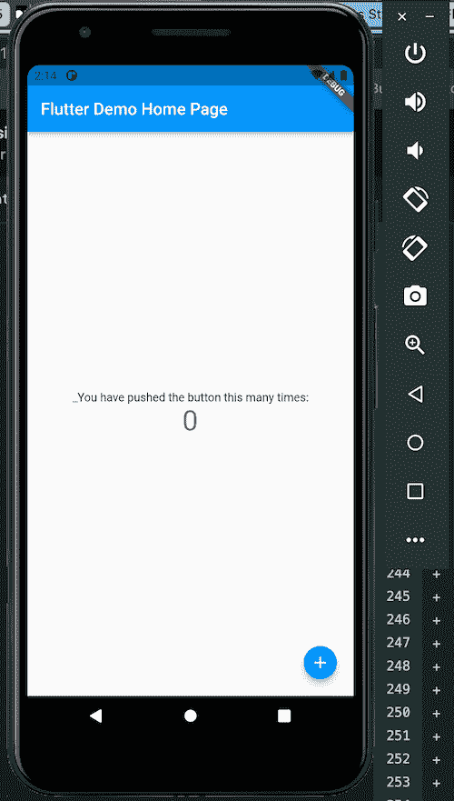
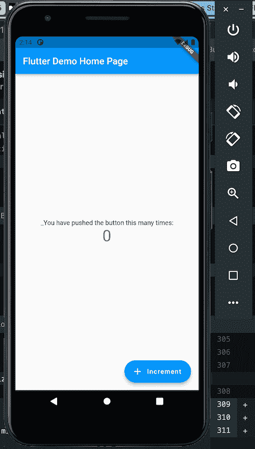
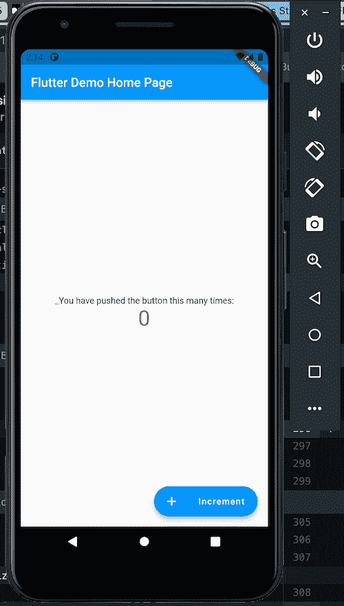
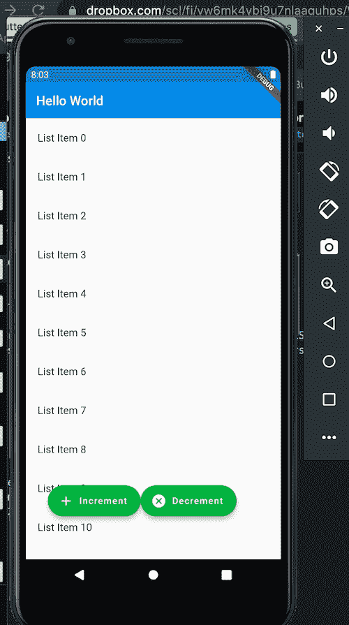
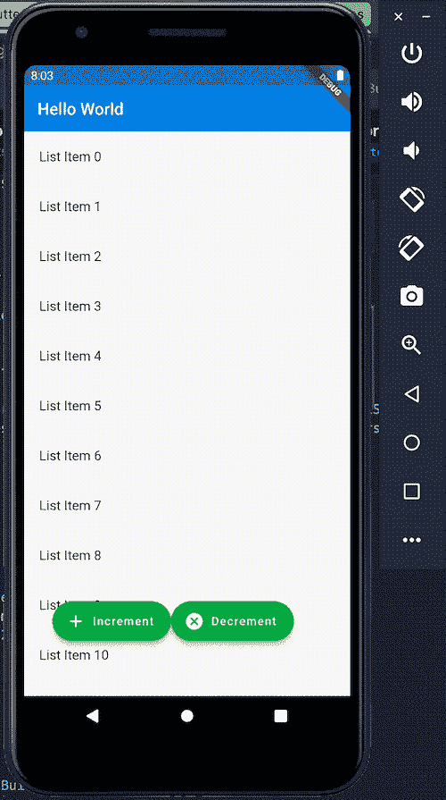
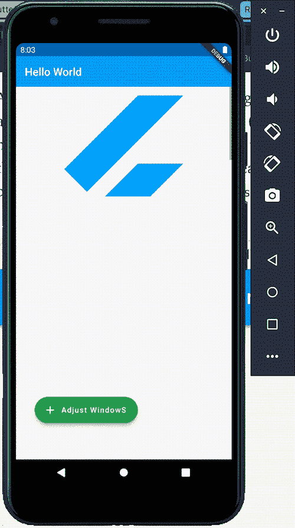
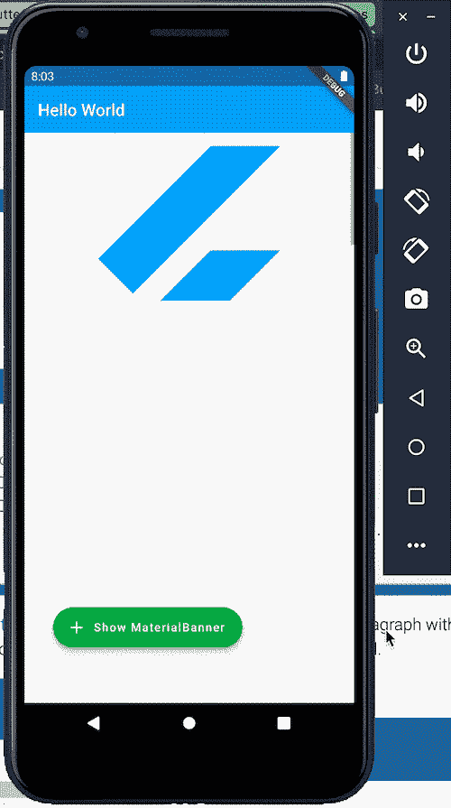

# Flutter 2.5 - LogRocket 博客中的新内容

> 原文：<https://blog.logrocket.com/whats-new-in-flutter-2-5/>

2017 年 Flutter 的首次发布标志着跨平台应用混合开发新时代的开始。Flutter 风靡全球，几年之内，无数公司和开发人员将 Flutter 作为开发跨平台应用程序的平台和框架选择。

Flutter 使你能够开发移动(Android 和 iOS)，桌面，以及自 [Flutter 2.0](https://blog.logrocket.com/how-to-migrate-a-flutter-mobile-app-to-the-web/) 发布以来，甚至 web 应用，而无需改变他们的代码库或从头重写应用。

这个快速发展的框架的最新版本是 [Flutter 2.5](https://medium.com/flutter/whats-new-in-flutter-2-5-6f080c3f3dc) ，它包含了一个全新的、更加强大的功能。在本指南中，我们将帮助您熟悉 Flutter 2.5 中引入的最值得注意的新功能和改进，包括:

## 如何升级到 Flutter 2.5

您可以通过运行以下命令将 Flutter 版本升级到 v2.5:

```
flutter upgrade

```

Flutter CLI 工具会将您的 Flutter SDK 升级到最新的 2.5 版本。

要验证升级是否成功，请运行以下命令:

```
flutter --version

Flutter 2.5.0 • channel stable • https://github.com/flutter/flutter.git
Framework • revision 4cc385b4b8 (5 days ago) • 2021-09-07 23:01:49 -0700
Engine • revision f0826da7ef
Tools • Dart 2.14.0

```

确保颤振版本为`2.5.0`。以上输出是我的系统的结果。

## 对 Android 的全屏支持

Flutter 对其在 Android 中的全屏模式做了相当多的改变。全屏模式会影响系统 UI 覆盖的可见性，如状态和底部导航栏。

这一变化为 Android 和 iOS 引入了新的模式配置,分别称为向后倾斜、沉浸式、沉浸式粘性和边对边。

*   当轻按屏幕上的任意位置时，后倾模式会将系统 UI 覆盖(状态栏和导航栏)显示在视图中。此操作生成的事件不会传递给应用程序。这种全屏体验类似于 iOS 设备
*   沉浸式模式会在屏幕边缘滑动时显示系统 UI 覆盖图(状态栏和导航栏)。与向后倾斜模式一样，此操作生成的事件不会传递给应用程序
*   沉浸式粘性模式类似于沉浸式模式；当滑动屏幕边缘时，会显示系统 UI 覆盖图。这里的区别是应用程序将被通知事件
*   边到边模式使得系统 UI 覆盖在应用上显示/呈现。应用程序 UI 位于系统(状态栏和导航栏)覆盖图的后面

## 您(v3)支持的材料

[材质你](https://material.io/blog/announcing-material-you)是新谷歌版的材质设计。随之而来的是大量的支持，Flutter 2.5 支持`FloatingActionButton`尺寸和主题。

`FloatingActionButton`尺寸可以配置为四种尺寸:`small`、`regular`、`large`、`extended`。

### `small`

晶圆厂看起来很小。参见下面的代码:

```
floatingActionButton: FloatingActionButton.small(
onPressed: _incrementCounter,
tooltip: 'Increment',
child: const Icon(Icons.add),
),

```

上面的代码将创建并呈现一个小 FAB 小部件:



名为`small`、`large`、`extended`的方法被添加到`FloatingActionButton`类中，因此我们可以很容易地调用它们来创建不同大小的 FAB。

### `regular`

`regular`尺寸是工厂的正常尺寸。我们可以像平常使用`FloatingActionButton`一样使用它:

```
      floatingActionButton: FloatingActionButton(
        onPressed: _incrementCounter,
        tooltip: 'Increment',
        child: const Icon(Icons.add),
      ), // This trailing comma makes auto-formatting nicer for build methods.

```

### `large`

渲染一个非常大的工厂。

要使用这个大小，调用`FloatingActionButton`类中的`large`方法:

```
      floatingActionButton: FloatingActionButton.large(
        onPressed: _incrementCounter,
        tooltip: 'Increment',
        child: const Icon(Icons.add),
      ), // This trailing comma makes auto-formatting nicer for build methods.

```


### `extended`

`extended`结合 FAB 上的文本和图标。

在`FloatingActionButton`类上调用`extended`方法。一个`label`参数被传递给`extended`方法。该参数将是 FAB 将显示的文本。然后，一个`icon`参数也被传递给该方法，这个`icon`参数是将显示在 FAB 标签旁边的图标。

```
      floatingActionButton: FloatingActionButton.extended(
        onPressed: _incrementCounter,
        tooltip: 'Increment',
        label: Text("Increment"),
        icon: const Icon(Icons.add),
      )

```



在这个扩展的 FAB 中，我们可以自定义标签和图标之间的间距。为此，向`extended`方法传递一个`extendedIconLabelSpacing`参数:

```
      floatingActionButton: FloatingActionButton.extended(
        onPressed: _incrementCounter,
        tooltip: 'Increment',
        label: Text("Increment"),
        icon: const Icon(Icons.add),
        extendedIconLabelSpacing: 30
      )

```

我们将`extendedIconLabelSpacing`设置为`30`的值。



### Flutter 2.5 中浮动动作按钮的主题化

在我们的应用程序中，我们可以对各种规模的晶圆厂进行主题化。这是通过`FloatingActionButtonThemeData`类完成的。

首先，创建一个`FloatingActionButtonThemeData`实例，并将设置传递给它:

```
const BoxConstraints constraints = BoxConstraints.tightFor(width: 100.0, height: 100.0);

const FloatingActionButtonThemeData(
    largeSizeConstraints: constraints,
    backgroundColor: Colors.green,
),

```

在上面的例子中，我们将工厂的盒子模型的高度和宽度都设置为`100.0`单位，背景颜色设置为`green`。

让我们在`MaterialApp`小部件中将`FloatingActionButtonThemeData`的实例设置为`ThemeData`调用:

```
  @override
  Widget build(BuildContext context) {
    const BoxConstraints constraints = BoxConstraints.tightFor(width: 100.0, height: 100.0);
    return MaterialApp(
      title: 'Flutter Demo',
      theme: ThemeData(
        floatingActionButtonTheme: const FloatingActionButtonThemeData(
          largeSizeConstraints: constraints,
          backgroundColor: Colors.green,
        ),
        primarySwatch: Colors.blue,
      ),
      home: const MyHomePage(title: 'Flutter Demo Home Page'),
    );
  }

```

这个主题将影响我们在应用程序中创建的 fab。我们应用程序中的所有晶圆厂的宽度和高度都是`100.0`单位，背景颜色是绿色。

让我们添加两个晶圆厂:

```
floatingActionButton: Container(
    padding: const EdgeInsets.all(50.0),
    child:Row(
    children: [
        FloatingActionButton.extended(
            onPressed: _incrementCounter,
            tooltip: 'Increment',
            label: Text("Increment"),
            icon: const Icon(Icons.add),
        ),
        FloatingActionButton.extended(
            onPressed: ()=>{},
            tooltip: 'Decrement',
            label: Text("Decrement"),
            icon: const Icon(Icons.cancel_sharp),
        ),
     ],
    ),
)

```

我们的两个晶圆厂没有颜色设置，但是我们在`ThemeData`中设置的主题会影响它们。它们将有一个`100.0`单位的框约束和绿色背景。



该功能是一种应用于[应用栏](https://blog.logrocket.com/flutter-appbar-tutorial/)或[滑动应用栏](https://blog.logrocket.com/how-to-add-sliverappbar-to-your-flutter-app/)的背景颜色的效果。

颤振团队在`MaterialState`中增加了一个 [`MaterialState.scrolledUnder`](https://github.com/flutter/flutter/pull/79999) 状态。当小部件覆盖了下面可滚动的内容时，就会设置这个`scrollUnder`状态。AppBar 设置这个状态来指示一块可滚动的内容已经向上滚动到它的后面。

通过在 AppBar 或 SliverAppBar 的背景色属性中设置一个监听器，您可以更改触发`scrollUnder`事件时的颜色:

```
class _MyHomePageState extends State<MyHomePage> {

static Widget buildListItem(BuildContext context, int index) {
    final Color color = Colors.primaries[index % Colors.primaries.length];
    return Padding(
      padding: EdgeInsets.all(2),
      child: ListTile(
        title: Text('List Item $index'),
      ),
    );
  }

  @override
  Widget build(BuildContext context) {
    return Scaffold(
      appBar: AppBar(
        backwardsCompatibility: false,
        elevation: 0,
        backgroundColor: MaterialStateColor.resolveWith((Set<MaterialState> states) {
          return states.contains(MaterialState.scrolledUnder) ? Colors.red : Colors.blue;
        }),
        title: Text('Hello World'),
      ),
      body: ListView.builder(
        itemCount: 200,
        itemBuilder: buildListItem,
      ),
    );
  }
}

```

我们设置 AppBar 的`backgroundColor`来解析当前状态的颜色。我们调用了`MaterialStateColor.resolveWith(...)`，并在其中设置了一个回调函数。这个回调函数接收 AppBa 中的所有状态。

然后我们检查状态是否包含`MaterialState.scrolledUnder`。这告诉我们 AppBar 已经向下滚动，所以我们返回靛蓝颜色。如果不是，则返回蓝色。



[`ScrollMetricsNotification`](https://github.com/flutter/flutter/pull/85221) 功能使您能够监听可滚动的内容，以检测可滚动内容何时被更改。如果窗口或可滚动区的父窗口的大小发生变化，也将通知可滚动区。

这里有一个例子:

```
class _MyHomePageState extends State<MyHomePage> {
  double windowSize = 200.0;

  @override
  Widget build(BuildContext context) {
    return Scaffold(
        appBar: AppBar(
          backwardsCompatibility: false,
          elevation: 0,
          title: Text('Hello World'),
        ),
        body: NotificationListener<ScrollMetricsNotification>(
          onNotification: (ScrollMetricsNotification notification) {
            ScaffoldMessenger.of(notification.context).showSnackBar(
              const SnackBar(
                content: Text('Scroll metrics changed!'),
              ),
            );
            return false;
          },
          child: Scrollbar(
            isAlwaysShown: true,
            child: SizedBox(
              height: windowSize,
              width: double.infinity,
              child: const SingleChildScrollView(
                child: FlutterLogo(
                  size: 300.0,
                ),
              ),
            ),
          ),
        ),
        floatingActionButton: Container(
          padding: const EdgeInsets.all(50.0),
          child: Row(
            children: [
              FloatingActionButton.extended(
                onPressed: () => {
                  setState(() {
                    windowSize += 10.0;
                  })
                },
                tooltip: 'Adjust WindowSize',
                label: Text("Adjust WindowS"),
                icon: const Icon(Icons.cancel_sharp),
              ),
            ],
          ),
        )
    );
  }
}

```



我们将一个`Scrollbar`封装在一个`NotificationListener`小部件中。这个`ScrollBar`有一个`SizedBox`；`SizedBox`的高度取决于`windowSize`状态。

我们在`NotificationListener`小部件中设置了一个`onNotification`回调函数。当`SizedBox`内容改变时，这个回调函数被调用。注意，回调接收到一个参数，它是`ScrollMetricsNotification`的一个实例。

## 材料横幅

最后， [MaterialBanner](https://api.flutter.dev/flutter/material/MaterialBanner-class.html) 类到了。此功能使您能够在 Flutter 应用程序的顶部添加横幅。这个横幅一直留在那里，直到它被解散。

这个材料设计标志由`ScaffoldMessenger`类处理。这个`ScaffoldMessenger`类有我们可以用来创建和删除 MaterialBanners 的方法。

### `ScaffoldMessenger.of(context).showMaterialBanner`

此方法创建并显示材料横幅。`ScaffoldMessenger.of(context).showMaterialBanner`被传递一个`MaterialBanner`小部件；这是该方法在我们的应用程序顶部显示的 MaterialBanner。

```
ScaffoldMessenger.of(context).showMaterialBanner(
    MaterialBanner(
        content: const Text('Yay!! Do you like me!!'),
        leading: const Icon(Icons.warning),
        backgroundColor: Colors.purple,
        actions: [
            TextButton(
            child: const Text('Dismiss', style: const TextStyle(color: Colors.white)),
            onPressed: () => ScaffoldMessenger.of(context)
                .hideCurrentMaterialBanner(),
            ),
        ],
    ),
)

```

上面的代码会显示一个 MaterialBanner。看到一个`MaterialBanner`小部件被传递给了`showMaterialBanner`方法。

在`MaterialBanner`小部件中，我们传递了以下属性:

*   这个道具设定了旗帜的主体。
*   `leading`:设置横幅开头的图标。
*   `backgroundColor`:设置横幅小工具的背景颜色。
*   `actions`:设置横幅小工具末尾的按钮。

### `ScaffoldMessenger.of(context).hideCurrentMaterialBanner`

此方法移除现有的 MaterialBanner。

```
actions: [
    TextButton(
    child: const Text('Dismiss', style: const TextStyle(color: Colors.white)),
    onPressed: () => ScaffoldMessenger.of(context)
        .hideCurrentMaterialBanner(),
    ),
],

```

完整代码:

```
class _MyHomePageState extends State<MyHomePage> {

  @override
  Widget build(BuildContext context) {
    return Scaffold(
        appBar: AppBar(
          backwardsCompatibility: false,
          elevation: 0,
          title: Text('Hello World'),
        ),
        body: NotificationListener<ScrollMetricsNotification>(
          onNotification: (ScrollMetricsNotification notification) {
            ScaffoldMessenger.of(notification.context).showSnackBar(
              const SnackBar(
                content: Text('Scroll metrics changed!'),
              ),
            );
            return false;
          },
          child: Scrollbar(
            isAlwaysShown: true,
            child: SizedBox(
              height: 100.0,
              width: double.infinity,
              child: const SingleChildScrollView(
                child: FlutterLogo(
                  size: 300.0,
                ),
              ),
            ),
          ),
        ),
        floatingActionButton: Container(
          padding: const EdgeInsets.all(50.0),
          child: Row(
            children: [
              FloatingActionButton.extended(
                onPressed: () => {
                  ScaffoldMessenger.of(context).showMaterialBanner(
                      MaterialBanner(
                        content: const Text('Yay!! Do you like me!!'),
                        leading: const Icon(Icons.warning),
                        backgroundColor: Colors.purple,
                        actions: [
                          TextButton(
                            child: const Text('Dismiss', style: const TextStyle(color: Colors.white)),
                            onPressed: () => ScaffoldMessenger.of(context)
                                .hideCurrentMaterialBanner(),
                          ),
                        ],
                      ),
                    )
                },
                tooltip: 'Show MaterialBanner',
                label: Text("Show MaterialBanner"),
                icon: const Icon(Icons.add),
              ),
            ],
          ),
        )
    );
  }
}

```



## Flutter 2.5 的其他显著特性

除了上述新的 UI 特性，Flutter 2.5 还引入了对可切换键盘快捷键的支持，一个改进的小部件检查器工具，对在 VS 代码项目中添加依赖关系的支持，以及一个新的应用模板。

让我们仔细看看。

### 可切换键盘快捷键

2.5 版本对 Flutter 的文本编辑键盘快捷键进行了一些更新。最值得注意的变化是快捷方式现在是可覆盖的。Flutter 2.5 中新的可重写键盘快捷键允许你设置快捷键组合来执行自定义操作。

随着 Flutter 2.5 的发布， [Flutter widget inspector](https://flutter.dev/docs/development/tools/devtools/inspector) 有了重大改进。新的和改进的小部件检查器现在提供了对您的小部件更详细的观察，包括深入了解为什么特定帧可能执行 jankily。

在检查器中选取一个帧会显示关于该帧的信息，包括该帧的`Frame Time (UI)`、`Frame Time(Raster)`、`Jank`和`Shader Compilation`。

### 向 VS 代码项目添加依赖项

Flutter 插件对 Visual Studio 代码和 IntelliJ 的支持也随着 Flutter 得到了更新。现在可以从 Flutter 插件中给项目添加新的依赖项了。

这是通过以下命令完成的:

### 新应用程序模板

最初，当你使用`flutter create app`创建一个 Flutter 项目时，Flutter 生成了一个反例应用。计数器模板的问题在于，它没有为构建真实世界的应用程序提供一个良好的起点。

Flutter 2.5 引入了一个新的模板，具有完整的生产级质量特性，包括:

*   主题
*   页面导航
*   直截了当的共享偏好
*   本地化和国际化
*   不同手机像素的示例图像

要在搭建新的 Flutter 项目时使用此新模板，请运行以下命令:

```
flutter create -t skeleton app

```

## 使用 [LogRocket](https://lp.logrocket.com/blg/signup) 消除传统错误报告的干扰

[](https://lp.logrocket.com/blg/signup)

[LogRocket](https://lp.logrocket.com/blg/signup) 是一个数字体验分析解决方案，它可以保护您免受数百个假阳性错误警报的影响，只针对几个真正重要的项目。LogRocket 会告诉您应用程序中实际影响用户的最具影响力的 bug 和 UX 问题。

然后，使用具有深层技术遥测的会话重放来确切地查看用户看到了什么以及是什么导致了问题，就像你在他们身后看一样。

LogRocket 自动聚合客户端错误、JS 异常、前端性能指标和用户交互。然后 LogRocket 使用机器学习来告诉你哪些问题正在影响大多数用户，并提供你需要修复它的上下文。

关注重要的 bug—[今天就试试 LogRocket】。](https://lp.logrocket.com/blg/signup-issue-free)