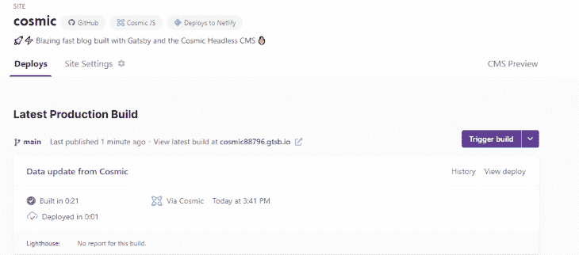
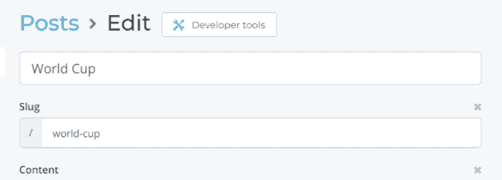
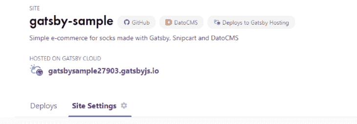
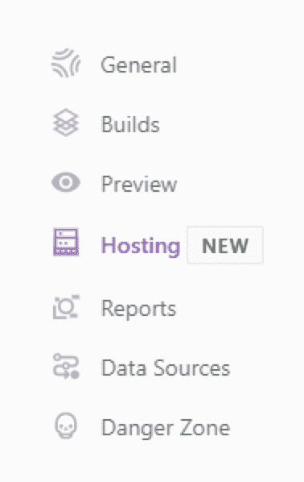
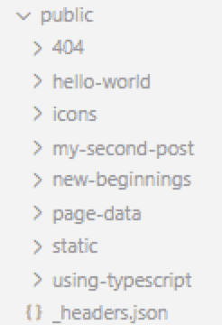

# 盖茨比 3.0 的新功能-日志火箭博客

> 原文：<https://blog.logrocket.com/whats-new-in-gatsby-3-0/>

《盖茨比》自第一次发行以来已经走过了漫长的道路。对于那些可能不熟悉的人来说， [Gatsby](https://www.gatsbyjs.com/) 是一个静态站点生成器，它从服务器提供静态 HTML 内容，而不是为每个请求使用数据库。

Gatsby 减少了数据库延迟，因为它在构建期间生成所需的 HTML 文件，所以加载页面所需的一切都已经存在。以前的每一个版本都专注于 Gatsby 平台的特定增加，但是随着[3.0](https://www.gatsbyjs.com/blog/gatsby-v3/)版本的推出，事情已经进入了一个新的层次。在本帖中，我们将讨论新版本带来的新特性。

## 开发时间的显著速度改进

在以前版本的 Gatsby 中，站点内容在开发会话开始时生成。如果你的网站有很多图片，那么在开发过程中会慢很多。对于复杂的大型项目来说，这是一个巨大的问题。

在新版 Gatsby 中，它将只构建开发服务器所需的页面。默认情况下，此功能处于启用状态，因此您不必手动配置它。

## 开源增量构建

先前在 [Gatsby 云服务](https://www.gatsbyjs.com/products/cloud/)中引入的[增量构建功能](https://www.gatsbyjs.com/blog/2020-04-22-announcing-incremental-builds/)是内容编辑中一个受欢迎的功能[，用于加速对网站内容进行编辑并在网站上即时查看的工作流程。通过在云上启用增量构建，Gatsby 寻找内容中的变化，并且只构建变化的部分，而不是重建整个网站。由于这个特性，网站的构建时间减少到了几秒钟。](https://www.gatsbyjs.com/blog/2020-04-22-announcing-incremental-builds/)

如前所述，增量构建特性仅在 Gatsby Cloud 上可用。[由于社区](https://www.gatsbyjs.com/blog/2020-04-22-announcing-incremental-builds/)的共同要求，这个特性现在也包含在 Gatsby 的开源版本中。现在，每个内容创建者都可以在他们选择的 CI/CD 服务上享受快速构建时间。您不必启用它，因为新的 Gatsby 默认带有此功能！让我们来看看这个特性的实际应用。

我们有以下关于盖茨比的项目，并将其部署在 [Netlify](https://www.netlify.com/) 上。在 Gatsby 版本 3 之前，增量构建只适用于 Gatsby cloud，但是现在，它在任何地方都适用。



现在，如果您更改网站任何部分的任何内容，您可以期待网站的即时更新，而无需完全重建。这就是增量构建的力量，也包含在 Gatsby 版本 3 中。



## 新的盖茨比图像插件

Gatsby 网站的首页加载速度非常快，但是由于图片的处理方式，仍然存在一些性能问题。在之前的版本中，社区成员开始看到他们网站的[灯塔](https://developers.google.com/web/tools/lighthouse)分数降低。这主要是由于 Gatsby image 插件使用了不同的实现，这对于现代网络来说并不理想。

在这个版本的盖茨比中，这个插件被完全重写，以恢复灯塔的分数。这些图片将会以最好的方式提高你网站的速度，并以一种有意义的方式增加灯塔的分数。

`[gatsby-plugin-image](https://www.gatsbyjs.com/docs/reference/built-in-components/gatsby-plugin-image/)`的测试版状态已经被移除，现在它已经可供一般用户使用。因此，这个新插件为您提供了在 Gatsby 项目中提供图像的最佳方式。

### 以前

```
// this is less performant compared to the plugin below
import Img from "gatsby-image"

export function Image() {
 return 
}

```

### 现在

```
// this is more performant compared to the plugin above
import { GatsbyImage } from "gatsby-plugin-image”

export function Image() {
 return <GatsbyImage src="https://image.com /image.png" alt="image" />
}

```

## GraphQL 更改

新版 Gatsby 中移除了 GraphQL 片段，解析器直接接受参数。这是一个更好的代码语法，可以在新版 Gatsby 中使用。

### 以前

```
import { graphql } from "gatsby"
export const query = graphql`
  {
    file(relativePath: { eq: "images/example.jpg" }) {
      childImageSharp {
        fixed {
          ...GatsbyImageSharpFixed
        }
      }
    }
  }

```

### 现在

```
import { graphql } from "gatsby"

export const query = graphql`
  {
    file(relativePath: { eq: "images/example.jpg" }) {
      childImageSharp {
        gatsbyImageData(layout: FIXED)
      }
  }
}

```

## 盖茨比主持

在引入盖茨比云之后，用户发现了一个主要的瓶颈。具有新更新的站点在部署时间上花费了大量时间。[大中型站点的部署时间增加了 30 分钟](https://www.gatsbyjs.com/blog/gatsbyconf-product-announcements/)。为了解决这个问题，该团队推出了新的 Gatsby hosting，使使用 Gatsby 云的网站能够以最快的速度生存。目前使用新 Gatsby 主机的用户看到部署时间增加了高达 [50%](https://www.gatsbyjs.com/blog/gatsbyconf-product-announcements/) 。在 Gatsby cloud 上部署网站后，您将看到如下托管选项:





## 《盖茨比》与《网络生活》的比较

为了检查 Gatsby 托管的性能，为了进行比较，在 it 和 Netlify 上部署了一个示例项目:


结果显示，在部署项目方面，Gatsby 比 T4 快了 5 倍！除此之外，Gatsby 还发布了一个新的插件`[gatsby-plugin-gatsby-cloud](https://www.gatsbyjs.com/plugins/gatsby-plugin-gatsby-cloud/)`,帮助将 Gatsby 项目直接重定向到云中。它自动生成完成所需工作的`_header.json`和`_redirect.json`。

对于没有使用新更新的用户，建议他们使用`[[email protected]^1.0.0](https://www.gatsbyjs.com/plugins/gatsby-plugin-gatsby-cloud/)`，而 Gatsby 3.0 项目将使用 2.0 版本的插件。插件可以这样安装:

```
npm install --save gatsby-plugin-gatsby-cloud

```

在`gatsby.config.js`中增加以下一行:

```
plugins: [`gatsby-plugin-gatsby-cloud`]

```

现在运行 Gatsby build，您将在您的公共文件夹的根目录中看到头文件:



## 更新的依赖关系

在较新的 Gatsby 版本中，核心依赖项已经更新到最新的稳定版本，因此在迁移到新的 Gatsby 3.0 时，您不必手动更新它们。以下是更新的依赖关系:

其中一些插件可能与新版 Gatsby 不兼容。如果你发现了兼容性问题，你可以在 [GitHub 页面](https://github.com/gatsbyjs/gatsby)上报告这个插件。

Gatsby 的 WordPress 插件现在已经从版本 v4 重写到版本 v5。为了使用新的 [WordPress](https://wordpress.org/) 插件，你不必遵循迁移指南。你只需要更新并开始使用新的插件。它不会打碎任何东西。这个新插件的特点包括从 WordPress 获取数据的速度更快，安全性更好，等等。

类似地，这个版本中的[内容丰富的](https://www.contentful.com/)插件也有重大更新。该插件支持最新的内容丰富的 SDK。此外，`[gatsby-plugin-image](https://www.gatsbyjs.com/docs/reference/built-in-components/gatsby-plugin-image/)`的兼容性也在更新中。最后但同样重要的是，网络错误和资产下载将触发重试。

## 结论

Gatsby 的理念很简单，实现快速和高端的开发体验。每次更新都会引入新的功能，使事情变得比以前更好。对于静态站点的生成，盖茨比想都没想就想到了。