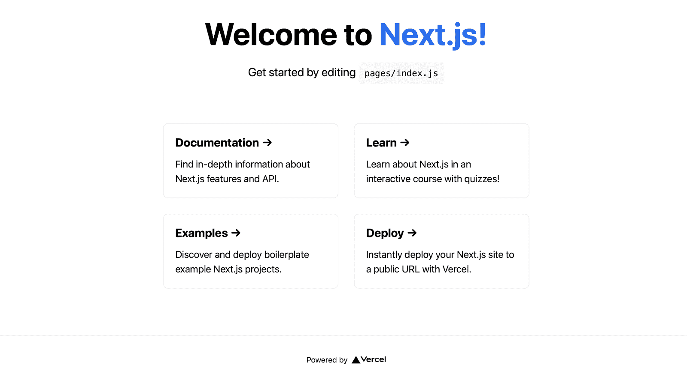
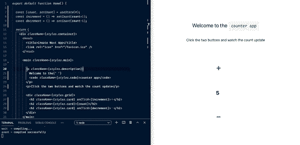
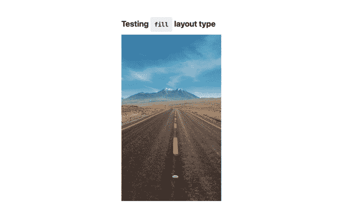
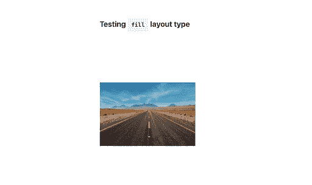
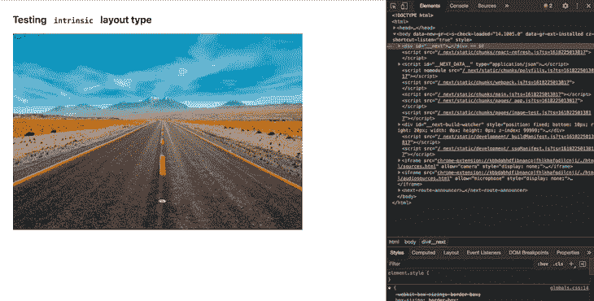
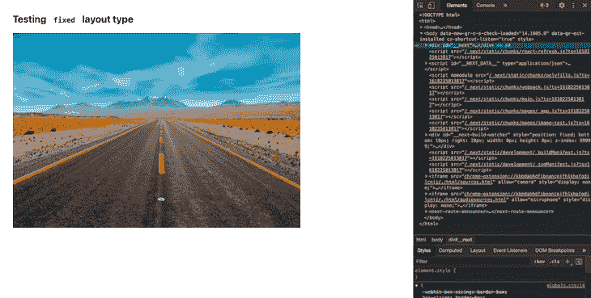

# Next.js 10.1 的新特性

> 原文：<https://blog.logrocket.com/whats-new-in-next-js-10-1/>

## 介绍

在壮观的第 10 版本[发布后，几个高影响力的功能，如自定义图像组件、Next.js 分析、Next.js 商务、快速刷新等。我们现在有了一个新的更新，Next.js 版。作为该版本的一部分，其中许多功能都进行了优化，同时引入了一些新功能，如自定义 500 错误页面、预览模式检测和 typescript 配置扩展等。在本文中，我们将更详细地探讨这些问题。](https://nextjs.org/blog/next-10)

## 3 倍的更新速度

这是一个旨在使开发人员的生活更容易的特性。快速刷新是[反应热加载器](https://blog.logrocket.com/setup-react-hotloader-in-10-minutes-3175dfdbf38a/)的继任者，由脸书不久前推出。基本上，快速刷新允许开发人员对任何组件进行代码更改，并以最小的摩擦在 UI 上预览结果。它通过仅重新加载受代码更改影响的组件/文件来实现这一点，而无需刷新整个页面，同时还保留了状态。

Next.js 在 9.4 版本中引入了快速刷新，在最新版本中，据称优化了 3 倍，这意味着更快的刷新和更短的开发周期。

我们可以通过创建一个启动项目，然后更改几行代码来触发快速刷新，从而感受一下这个特性。为此，我们使用`create-next-app`命令创建一个新项目:

```
npx create-next-app test-10-1
```

一旦命令运行完毕，就会为我们创建一个名为`test-10-1`的文件夹。然后我们`cd`进入它，用命令运行应用程序:

```
yarn dev
```

这将在 localhost:3000 上启动默认的 Next.js 主页，如下所示:



现在，让我们将它更改为一个简单的计数器应用程序，以便我们可以验证快速刷新不会影响状态。将此代码粘贴到呈现此页面的 pages/index.js 文件夹中:

```
import { useState } from 'react';
import Head from 'next/head'
import styles from '../styles/Home.module.css'

export default function Home() {

  const [count, setCount] = useState(0);
  const increment = () => setCount(count+1);
  const decrement = () => setCount(count-1);

  return (
    <div className={styles.container}>
      <Head>
        <title>Create Next App</title>
        <link rel="icon" href="/favicon.ico" />
      </Head>

      <main className={styles.main}>

        <p className={styles.description}>
          Welcome to the{' '}
          <code className={styles.code}>counter app</code>
        </p>
      <p>Click the two buttons and watch the count update</p>

        <div className={styles.grid}>
          <h2 className={styles.card} onClick={increment}>➕</h2>
          <h2 className={styles.card}>{count}</h2>
          <h2 className={styles.card} onClick={decrement}>➖</h2>
        </div>
      </main>
    </div>
  )
}

```

我们使用`useState`来创建一个状态变量，使用两个函数`increment`和`decrement`来修改这个状态变量。这给了我们一个实用的应用程序:


现在，让我们更改页面上的一些文本，并测试它在页面上的反映速度。打开 index.js，进行更改，然后保存:



我们看到代码的变化会立即反映在用户界面上。还要注意，为 5 的计数没有被重置，这意味着状态也被保留。

使用快速刷新时，需要记住以下几点:

*   如果文件仅导出 React 组件，则快速刷新仅重新渲染该文件中的组件
*   如果文件导出 React 组件以外的内容，则快速刷新会重新运行该文件以及导入该文件的所有其他文件

当开发一个包含数百个组件的大型应用程序时，在保留状态的同时只重新呈现所需组件的能力对提高开发人员的工作效率大有帮助。

## `next/image`的改进

为了使图像的渲染更加优化，Next.js 在 10.0 版本中发布了自己的自定义图像组件。图像组件可以用来代替`img`标签，如下所示:

```
// import from next/image
import Image from 'next/image'

// usage in the component
<Image
  src="/me.png"
  alt="Picture of the author"
  width={500}
  height={500}
/>
```

其中`me.png`是项目根目录下公共文件夹中的图像。

下面是一些由`Image`组件提供的对`img`标签的优化:

*   图像会自动转换为现代图像。webp 格式
*   图像在进入视图时被延迟加载(这意味着只有当页面滚动到图像的位置时才加载图像)
*   图像大小会自动压缩，而不会丢失太多细节

## 新优化

在 Next.js 版本中，除了那些已经很棒的特性之外，还做了一些增强。之前由原生依赖项支持的映像优化现在运行在使用 [WebAssembly](https://webassembly.org/) 的 [Squoosh](https://web.dev/squoosh-v2/) 上。这样做也使得图像优化与使用苹果芯片的新的 [M1 系列 macbook](https://www.apple.com/mac/)兼容。

## 附加布局

直到最近，`Image`组件还必须提供一个高度和宽度属性，这样渲染才能按预期进行。但是现在，该组件接受了一个名为 layout 的附加属性，该属性接受值`fixed`、`intrinsic`、`responsive`和`fill`。我们将通过一个图像的例子来详细研究这些问题。我们将使用来自 unsplash.com 的免费图片。下载它，并将其保存在项目根目录下的 public 文件夹中(如果该文件夹不存在，则创建它)。

我们将创建一个名为 image-test 的新路径，它在 Next.js 中是通过在`pages`文件夹中创建一个名为`image-test.js`的文件来完成的。

让我们在该文件中粘贴一些代码，首先测试一下`fill`布局类型:

```
import Head from 'next/head'
import styles from '../styles/Home.module.css'
import Image from 'next/image'

export default function Home() {

  return (
    <div className={styles.container}>
      <Head>
        <title>Image test</title>
        <link rel="icon" href="/favicon.ico" />
      </Head>

      <main>

        <h2>
          Testing <code className={styles.code}>fill</code> layout type
        </h2>

        <div style={{ position: 'relative', width: '300px', height: '500px' }}>
          <Image
            alt="Scenery"
            src="/scenery.jpg"
            layout="fill"
            objectFit="cover"
          />
        </div>
      </main>
    </div>
  )
}

```

这给了我们这个结果:


我们将图像放在一个宽 300 高 500 的 div 中，因此图像占据了整个区域并填充了它。同样，使用 [objectFit](https://developer.mozilla.org/en-US/docs/Web/CSS/object-fit) 道具，我们可以控制图像填充区域的方式。例如，将道具作为`objectFit: contain`传递给我们的结果是:



图像组件试图包含整个图像，因此缩小图像。

`intrinsic`和`responsive`布局相似，都允许相应地缩放图像。它们之间的唯一区别是，responsive 允许在更大的设备上扩展，而 intrinsic 则不允许。

以下是内在布局处理响应的方式:



这就是`responsive`布局如何处理同样的问题:


最后一个是`fixed`布局，它提供了与普通`img`标签相似的体验，因为它不缩放:



还支持为您的图像定制加载器，这只是一个用`src`、`width`和`quality`调用的函数，我们可以从中返回一个字符串。如果我们从不同来源提供不同质量的图像，这将很有帮助:

```
const myLoader = ({ src, width, quality }) => {
  return `https://my-custom-loader.com/${src}?w=${width}&q=${quality || 90}`
}

```

然后，这个加载器函数需要作为图像组件的加载器属性进行传递，我们需要为图像组件定制一个自定义组件。如果没有提供，图像加载器将从`next.config.js`中的[图像对象](https://nextjs.org/docs/basic-features/image-optimization#loader)中选取，否则它将默认为我们讨论过的优化的内置 Next.js 加载器。

## 缩短安装时间

如前所述，Next.js 映像优化是由原生依赖项驱动的，这导致了较大的安装规模，进而增加了安装时间。根据 Next.js 官方[文档](https://nextjs.org/blog/next-10-1#improved-installation-time)，这个问题已经通过*优化依赖图*得到了纠正，现在安装速度提高了 3 倍。以下是官方博客文章中记录改进的图表:


## 自定义 500 页

正如我们已经知道的，Next.js 为我们提供了在找不到任何路由时显示自定义页面的功能，这可以通过在 pages 文件夹中创建一个 404.js 文件并在其中放置我们的自定义代码来轻松完成。同样的功能现在已经扩展到 500 页，我们可以通过在 pages 目录中创建一个`500.js`文件并将我们的自定义代码放在那里，轻松地向最终用户显示自定义错误页面。

这开启了各种可能性。我们现在可以通过从 [undraw](https://undraw.co/) 中获取一个相关的插图，并将这段代码添加到`500.js`文件中，使我们的错误页面看起来像这样:

```
<main className={styles.main} style={{padding: 100}}>
  <h1>We're Sorry!</h1>
  <p>There seems to be something wrong on our end, please be patient while we try to resolve this.</p>
  <Image
    alt="Fixing"
    src="/fixing.png"
    layout="intrinsic"
    width={700}
    height={475}
  />
</main>

```


## 购物化集成

当 Next.js commerce 作为 10.0 版本的一部分推出时，它提供了一个分步指南，可以在几分钟内部署一个成熟的电子商务市场。但是，当时 Next.js commerce 只支持 BigCommerce 作为后端服务提供商。

根据最新的 10.1 版本，除了早期的 BigCommerce 选项之外，还添加了对使用 Shopify 作为电子商务解决方案提供商的支持。可以通过更新`.env.local`文件中的`COMMERCE_PROVIDER`标志的值来选择提供者。

## 扩展`tsconfig`文件

Next.js 为开发人员提供了一个使用 tsconfig 文件从不同的基本 typescript 配置文件进行扩展的选项。为此，需要将下面几行代码放在`tsconfig.json`文件中:

```
{
  "extends": "./tsconfig.base.json"
}
```

## 预览模式检测

在开发阶段，从 headless CMS 获取内容时，我们可能会遇到这样的需求，即修改 headless CMS 中的草稿数据，并期望看到更改实时流向我们的页面，而不是获取在构建时创建的静态生成的数据。*预览模式*正是为我们做的。打开时，它在*请求时间*呈现页面，而不是在构建时。在 10.1 版本中，添加了对在组件端检测预览模式当前是打开还是关闭的支持。该信息作为一个标志提供，可通过`useRouter`挂钩访问，如下所示:

```
function MyComponent() {
  const { isPreview } = useRouter()
  // isPreview holds the preview mode status inside this component

  if(isPreview) {
    // Put preview mode specific code here
  }

  return (
    <>{isPreview ? 
      <div>Render preview mode specific components here</div> 
      : 
      <div>Render non-preview mode specific components here</div> }
    </>
  )
}
```

## 结论

Next.js 的 10.1 版本发布了所有这些功能，我们可以说每个人都有一些东西。虽然快速刷新和图像优化改善了开发人员的体验，但商业服务提供商的定制为希望使用 Next.js 创建电子商务网站的人开辟了新的途径。

扩展 tsconfig 文件的能力为开发人员的旅程提供了另一个级别的定制，而定制 500 错误页面旨在为最终用户提供更大的清晰度，同时再次将完全控制权交给开发人员。总的来说，最新的增量版本，即使看起来只是一个小增量，也绝对值得更新。

## [LogRocket](https://lp.logrocket.com/blg/nextjs-signup) :全面了解生产 Next.js 应用

调试下一个应用程序可能会很困难，尤其是当用户遇到难以重现的问题时。如果您对监视和跟踪状态、自动显示 JavaScript 错误、跟踪缓慢的网络请求和组件加载时间感兴趣，

[try LogRocket](https://lp.logrocket.com/blg/nextjs-signup)

.

[](https://lp.logrocket.com/blg/nextjs-signup)[](https://lp.logrocket.com/blg/nextjs-signup)

LogRocket 就像是网络和移动应用的 DVR，记录下你的 Next.js 应用上发生的一切。您可以汇总并报告问题发生时应用程序的状态，而不是猜测问题发生的原因。LogRocket 还可以监控应用程序的性能，报告客户端 CPU 负载、客户端内存使用等指标。

LogRocket Redux 中间件包为您的用户会话增加了一层额外的可见性。LogRocket 记录 Redux 存储中的所有操作和状态。

让您调试 Next.js 应用的方式现代化— [开始免费监控](https://lp.logrocket.com/blg/nextjs-signup)。