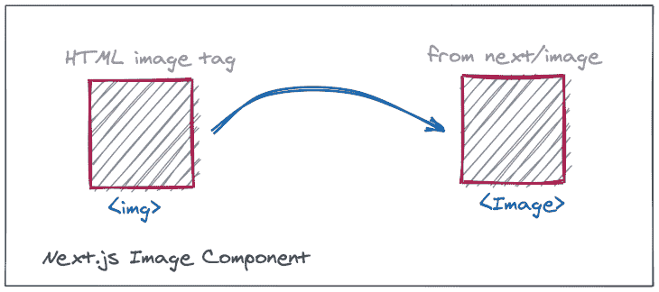
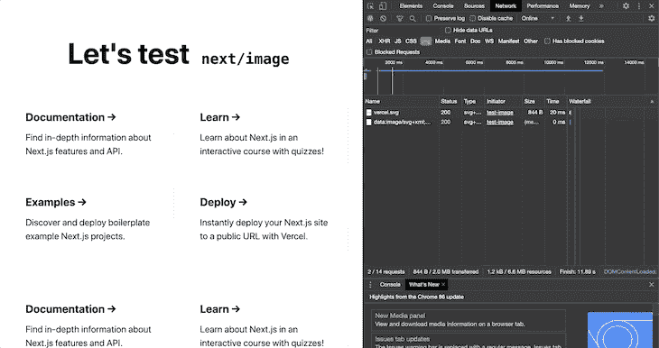
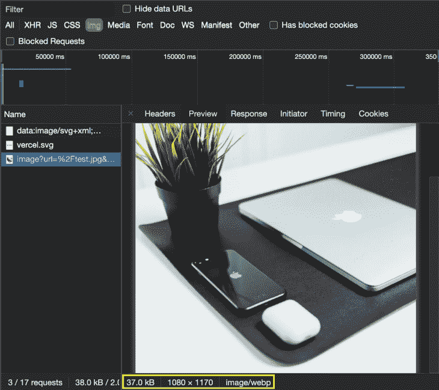
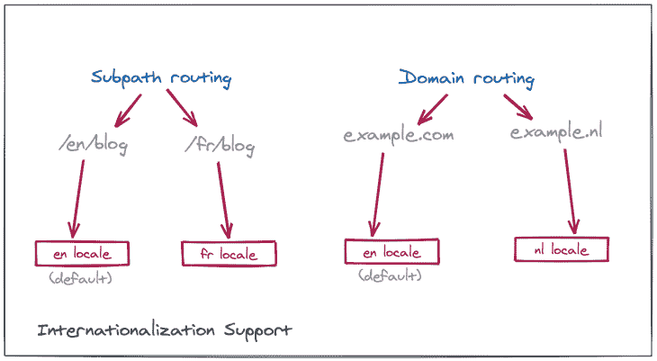
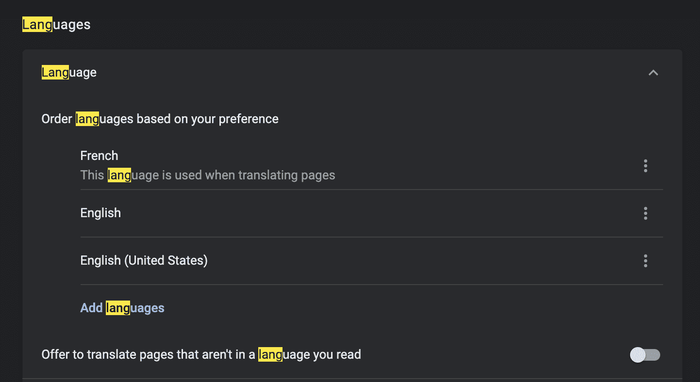
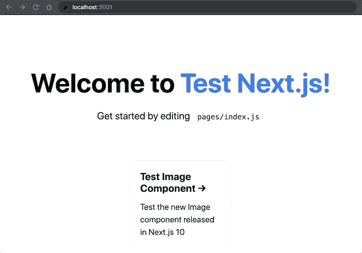
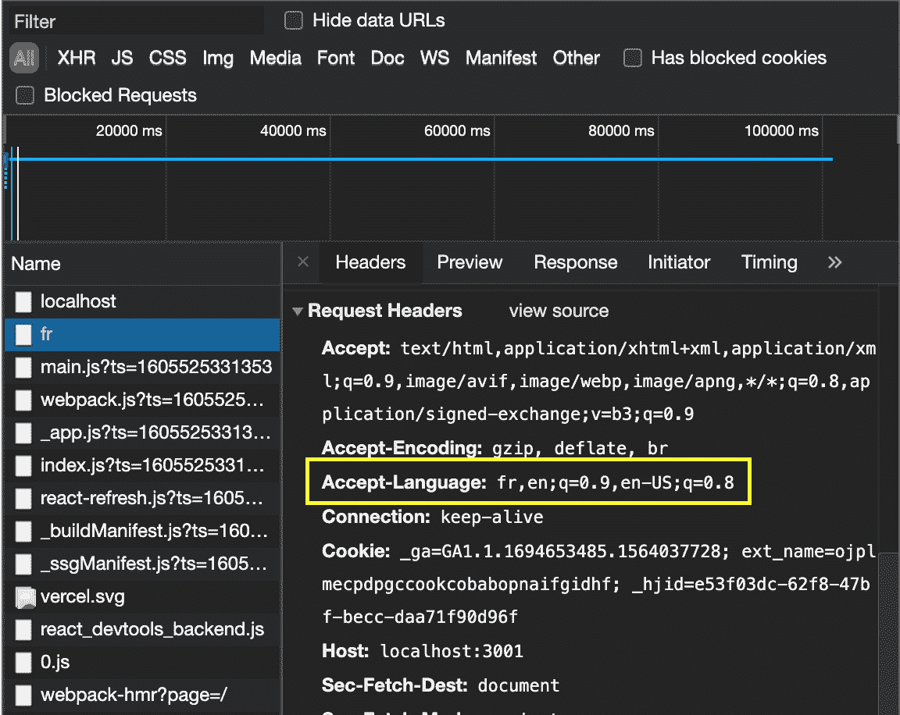
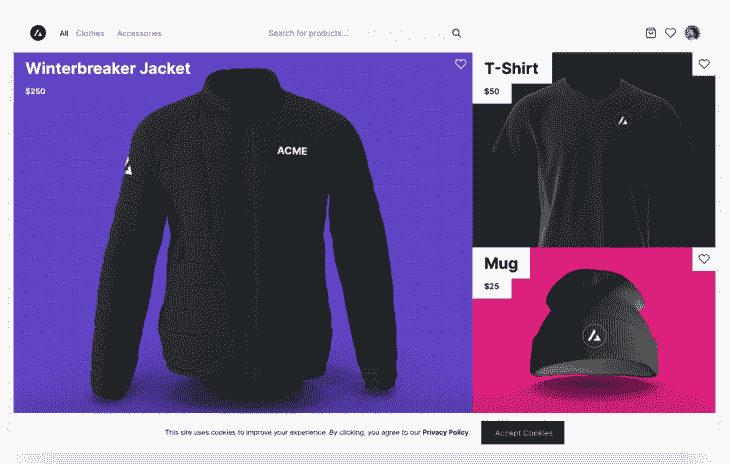

# Next.js 10 中的新内容

> 原文：<https://blog.logrocket.com/whats-new-in-next-js-10/>

## 介绍

[Next.js](http://www.nextjs.org) 最近发布了其期待已久的主要版本之一(版本 10)，作为那个[版本](https://nextjs.org/blog/next-10)的一部分，已经推出了许多令人兴奋的功能。在本文中，我们将逐个分析这些因素，并理解它们将如何影响开发体验和用户体验。您可以通过遵循这个 [GitHub](https://github.com/kokanek/nextjs-10) 资源库中提到的代码来测试下面提到的大多数功能(确保运行`npm install`来安装所有依赖项，然后运行`npm run dev`来运行在 [localhost:3001](http://localhost:3001) 部署我们的网站的 dev 服务器)。

## 全新的`Image`组件



Over the years, the Next.js team has tried to improve the speed of sites built using their platform. Using optimizing strategies like static generation, server-side rendering, and also making the JavaScript bundle size being loaded by the browser more compressed. While that has helped optimize the markup and the JavaScript being delivered to the sites, the images being served as a part of those sites (which form almost 50% of the website size) still remain unoptimized.

正确管理图像对网站性能有着至关重要的影响。这主要是因为:

*   图像没有经过最佳压缩，最终每个图像的大小都超过了 1 兆字节
*   该网站加载图像的原始大小(2000×2000 像素)，而在移动设备上，该图像的一个非常小的版本最终被显示出来
*   这些图像中的大多数最初都在视口之外，浏览器根本不需要加载它们，直到用户滚动到它们

这就是 Next.js image 组件可以提供帮助的地方。这是由 Next.js 团队提供的一个新组件，它将与图像相关的大部分繁重工作从开发人员手中拿走。开发者唯一的任务就是用来自`next/image`的`Image`标签替换`img` HTML 标签。这里有一个例子:

HTML 代码:

```


```

Next.js 等效项:

```
import Image from 'next/image';

<Image src="/profile-picture.jpg" width="400" height="400" alt="Profile Picture">
```

根据发布文档，Next.js 团队与 Google Chrome 团队合作优化了`Image` React 组件，使其支持:

*   开箱[懒装](https://web.dev/browser-level-image-lazy-loading/)和[预压](https://web.dev/preload-responsive-images/)
*   预先渲染图像尺寸可以防止图像加载后布局发生变化

除此之外，通过生成更小的尺寸以及转换为现代图像格式(如 [WebP](https://developers.google.com/speed/webp) )来进一步优化图像。此外，所有这些都是按需发生的，只要图像即将进入视口，而不是在构建时发生，因此构建站点的时间不会受到影响。总的来说，它使处理图像变得更加容易和高效。

## 真实世界的用例

让我们在代码中使用一个真实的例子来测试这一点。测试`Image`组件的代码可以在`pages/test-image.js`找到。这张来自 [Unsplash](https://unsplash.com/photos/jiSz18z9Mjo) 的图片已经被下载到公共文件夹并嵌入到页面的较低位置(这样它就在初始视窗之外)。在代码库中可以注意到，该图像最初是 3648×3951 像素的. jpeg 图像，大小大约为 1 MB。当页面的路由被加载时，我们可以在 network 选项卡中验证图像最初没有被加载，只有当我们向底部滚动并且将要到达图像时才开始加载。这一点在下面的 gif 中可以看得很清楚。



此外，我们可以看到，即使图像没有完全加载，渲染布局也没有改变。接下来预先计算要呈现的图像尺寸，并在 DOM 中为图像维护一个占位符，这样图像下面的元素就不会出现布局变化(这在 gif 中也很明显)。

另一件要注意的事情是，图像本身被进一步优化，我们可以从网络选项卡中验证这一点。



图像格式已更改为优化的`webp`格式，尺寸已从原始图像修改(1080 x 1170 像素)(同时保留宽高比)。由于这些优化，大小已经从原来的只有 37 kB。这有助于在所有设备上处理图像时获得更好的整体性能。

## 国际化支持



根据 Next.js 官方页面:

> 72%的消费者更有可能停留在翻译过的网站上，55%的消费者说他们只从母语的电子商务网站上购买。

因此，支持构成网站消费者基础的大多数公共区域是必要的。在 Next.js 的这个版本中已经考虑到了这一点。

Next.js 现在支持两种最常见的路由策略，即子路径路由(其中语言环境是 URL 的一部分，所有语言都在单个域中受支持)和域路由(其中语言环境被映射到顶级域)。

为了开始国际化，我们需要将这些行添加到 next.config.js 中:

```
module.exports = {
  i18n: {
    locales: ['en', 'nl'],
    defaultLocale: 'en'
  }
}
```

让我们通过在根目录中创建一个`next.config.js`文件来将这个国际化配置添加到我们的示例项目中。为了更具体地支持区域设置，还可以将区域设置定义为 en-US 或 nl-NL。一旦完成并重启 dev 服务器，我们可以看到我们之前创建的页面也可以在 route[localhost:3001/fr/test-image](http://localhost:3001/fr/test-image)(页面的法语版本)中访问。这个页面将提供给浏览器中默认区域设置为`fr`的用户。我们可以在 Google Chrome 中进行同样的测试，方法是从设置页面将默认区域设置改为法语。



Once that change is saved, visiting the home route redirects to the `/fr` version of the site when refreshed, which means that Next.js automatically detects the default locale on the `/` route.



And the reason for that to work so seamlessly is the `accept-language` header that Chrome sends in the initial request to fetch the page (where french is at the front of the list).



Domain routing, unlike subpath routing, requires some additional configuration like:

```
module.exports = {
  i18n: {
    locales: ['en', 'fr'],
    domains: [
      {
        domain: 'example.com',
        defaultLocale: 'en'
      },
      {
        domain: 'example.fr',
        defaultLocale: 'fr'
      }
    ]
  }
}

```

这将特定的域映射到各自的语言环境。因此，每当请求到达本地路由`/`时，就会发生重定向，重定向到与该地区对应的指定域。

但是，如果我们需要检测当前使用的语言环境并基于它做出特定的决定，该怎么办呢？这可以通过`next/router`利用`useRouter`钩来实现。在下面的代码中，我们首先从`useRouter`读取区域设置，然后使用`Link`组件重定向到该区域设置(它接受一个区域设置属性):

```
const router = useRouter();
// store the current locale
const currentLocale = router.locale;

// somewhere in the JSX, pass currentLocale to Link:
<Link
  href="/test-image" 
  locale={currentLocale}
>
...
</Link>

```

通过这样做，我们看到当链接在主页上被点击时，我们被重定向到`localhost:3001/fr/test-image`，而不是像以前一样被重定向到默认页面。在测试图像路径上，可以以类似的方式访问场所，并且可以在屏幕上呈现特定于法语的工件。

在使用`getStaticProps`或`getServerSideProps`时，可以使用 Next.js 文档中所述的上下文对象完成类似的事情:

> 当使用 getStaticProps 或 getServerSideProps 预呈现页面时，区域设置信息在提供给该函数的上下文中提供。

这是 Next.js 10 中引入的端到端地区支持的总结。

## Next.js 商务



Next.js 10 与 BigCommerce 合作发布了 [Next.js Commerce](https://nextjs.org/commerce) ，这是一个多合一的工具包，只需点击几下就可以开始部署电子商务网站。最好的部分是，当我们使用 Next.js Commerce 部署一个电子商务网站时，我们将 Next.js 的所有优秀部分开箱即用。其中一些是:

*   基于文件系统的路由
*   代码拆分和捆绑
*   使用 [SSR 和 SSG](https://vercel.com/blog/nextjs-server-side-rendering-vs-static-generation) 的混合渲染
*   快速刷新

部署 Next.js 商务网站的唯一先决条件是我们需要配置一个 BigCommerce 商店。但是如果你还没有这样做，并且仍然想尝试一下，你可以前往 Next.js commerce [主页](https://nextjs.org/commerce)并点击*克隆&部署*，这将让你部署你自己的站点实例。涉及的步骤如下:

*   在 BigCommerce 上注册。如果您还没有虚拟商店，请建立一个虚拟商店(在 BigCommerce 上注册时会提供此选项)
*   创建一个 GitHub repo，Next.js 将在其中放置与站点相关的代码。推送此回购将重新部署网站
*   用 Next.js 部署站点

就是这样！在不超过 5-7 分钟，我们可以得到一个功能齐全，Next.js 兼容，电子商务网站部署的演示显示这个安装完成屏幕。


从这里点击*访问*会将你带到刚刚部署的全新电子商务网站，点击*打开仪表板*会打开 Vercel 上的部署管理页面。

## 其他显著特征

### React 17 支持

Next.js 现在支持 React 17，这意味着只需将 React 升级到最新版本，就可以使用最新的 React 功能，如 [JSX 变换](https://reactjs.org/blog/2020/09/22/introducing-the-new-jsx-transform.html)。在 React 的早期版本中，在编译步骤中，JSX 代码被编译成等价的`React.createElement()`代码，因此，需要`React`在范围内才能工作。但是从 React 17 开始，JSX 转换器将由编译器自动导入。除了不需要显式地将`React`导入到。jsx 文件移动到最新版本后，开发人员不需要做任何其他事情。要将任何旧项目升级到 Next.js 的最新版本，需要运行以下命令:

```
npm install [email protected] [email protected] [email protected]
```

### 快速刷新

对`getStaticProps`和`getServerSideProps`函数所做的任何更改都将自动重新运行它们，而无需刷新页面。用 [next/mdx](https://github.com/vercel/next.js/tree/canary/packages/next-mdx) 创建的所有降价页面也将支持快速刷新。

### 第三方 CSS

有了这个特性，现在可以对单个组件的 CSS 进行代码拆分，而不需要在`_app.js`中导入 CSS。这些类型的 CSS 导入的用例是那些仅作用于单个组件的样式，并且不需要在代码库中的任何其他地方使用(这是在 _app 文件中导入样式的一个强用例)。

### href 上的自动解析

当使用`next/link`动态路由时，我们只需要提供`href`属性，而不是像以前那样同时提供`href`和`as`属性:

```
<Link href="/books/[bookId]" as={`/books/${bookId}`}>
  Harry Potter
</Link>
```

在早期的场景中，href 是一个静态字符串，在运行时不会改变，它为路由提供了一种格式。另一方面，`as` prop 是执行实际链接的动态计算的路由。从 Next.js 10 开始，代码将如下所示:

```
<Link href={`/book/${bookId}`}>
  Harry Potter
</Link>
```

其中`href`是唯一的强制参数，而`as`仍然是本说明的可选参数:

> 将在浏览器 URL 栏中显示的路径的可选装饰。在 Next.js 9.5.3 之前，这用于动态路由…

### codedom cli

为了使升级到新功能和弃用旧功能变得容易，Next.js 现在提供了`@next/codemod` CLI，它可以通过一个命令帮助更新整个应用程序并使其兼容(通过删除弃用的代码并用最新的更改替换它):

```
npx @next/codemod <transform> <path>
```

### 阻止`getStaticPaths`的回退

在返回`getStaticPaths`的同时设置`fallback: 'blocking'`标志，当没有静态回退被发送到浏览器并且初始请求等待预渲染时，启用阻塞行为。在初始呈现之后，页面将被后续请求重用。

### `Redirect`支持

在使用`getStaticProps`和`getServerSideProps`时，我们现在可以返回一个名为 redirect 的新字段，如下所示:

```
export function getStaticProps() {
  return {
    // returns a redirect to an internal page `/another-page`
    redirect: {
      destination: '/another-page',
      permanent: false
    }
  }
}

export function getServerSideProps() {
  return {
    // returns a redirect to an external domain `example.com`
    redirect: {
      destination: 'https://example.com',
      permanent: false
    }
  }
}

```

重定向配置中指定的目标将用于重定向请求。我们可以通过访问 [localhost/test-redirect](http://localhost:3001/test-redirect) 路由来检查这一点，并看到它将我们带到/fast-refresh 页面，因为那里使用了重定向配置。

### `notFound`支持

类似于`redirect`配置，当响应中的`notFound`标志返回为真时，默认的`404`页面将返回给用户，状态为 404，无需开发人员手动参与。当在`getStaticProps`函数中运行一些业务逻辑时，这通常会很方便，很明显我们不支持这种方式。然后，不用在自定义 UI 中显示该信息或在页面上编写一些重定向逻辑，我们只需从`getStaticProps`返回一个负责重定向的标志，如代码库中的`not-found.js`组件所示:

```
export async function getStaticProps() {
  let notFound = false;

  // perform some business logic here.
  // Got to know that the page need not show up
  notFound = true;

  return {
    notFound: notFound
  }
}
```

## 结论

总而言之，这个版本在开发者和用户体验方面都有大量的改进。所有这些主要的增强，以及它是一个不间断的主要版本的事实，使得 Next.js 10 成为一个必须尝试的版本。因此，如果您仍然在使用 Next.js 的早期版本，现在可能是升级的好时机！

## [LogRocket](https://lp.logrocket.com/blg/nextjs-signup) :全面了解生产 Next.js 应用

调试下一个应用程序可能会很困难，尤其是当用户遇到难以重现的问题时。如果您对监视和跟踪状态、自动显示 JavaScript 错误、跟踪缓慢的网络请求和组件加载时间感兴趣，

[try LogRocket](https://lp.logrocket.com/blg/nextjs-signup)

.

[](https://lp.logrocket.com/blg/nextjs-signup)[](https://lp.logrocket.com/blg/nextjs-signup)

LogRocket 就像是网络和移动应用的 DVR，记录下你的 Next.js 应用上发生的一切。您可以汇总并报告问题发生时应用程序的状态，而不是猜测问题发生的原因。LogRocket 还可以监控应用程序的性能，报告客户端 CPU 负载、客户端内存使用等指标。

LogRocket Redux 中间件包为您的用户会话增加了一层额外的可见性。LogRocket 记录 Redux 存储中的所有操作和状态。

让您调试 Next.js 应用的方式现代化— [开始免费监控](https://lp.logrocket.com/blg/nextjs-signup)。