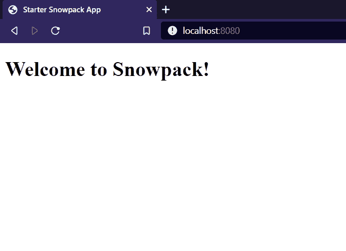
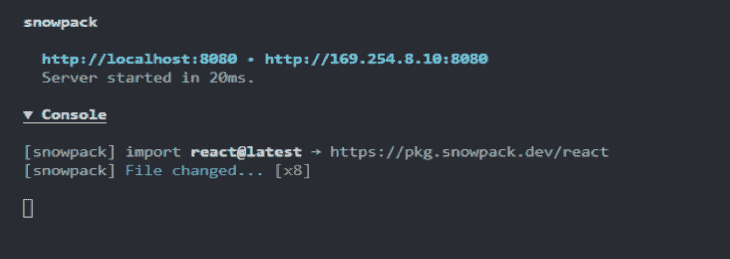
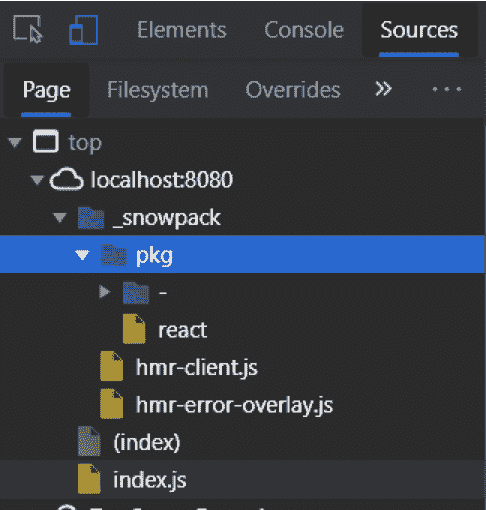
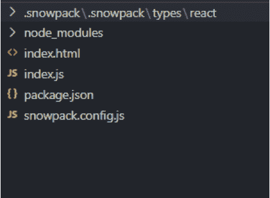

# Snowpack v3 中的新内容

> 原文：<https://blog.logrocket.com/whats-new-in-snowpack-v3/>

Snowpack 一直在推广一种非捆绑的 web 开发方法，这种方法消除了对传统 JavaScript 捆绑器的需求，如 [Webpack](https://webpack.js.org/) 和 [Parcel](https://parceljs.org/) 。今天，几乎所有的主流浏览器都支持 ESM，不像过去我们严重依赖 Webpack 这样的捆绑软件。尽管今天的情况已经发生了一定程度的变化，但是开发人员社区的很大一部分并没有脱离简单而陈旧的 JavaScript bundlers。

Snowpack 做事的方式非常高效和快速。Snowpack 只在发生变化的地方重建文件，不像传统的构建器那样，应用程序的所有部分都要重建和重新打包。拥有数千个组件的大型前端项目的捆绑时间过去需要 30 秒，但有了 Snowpack，这一时间减少到了 50 毫秒以下。今年 1 月， [Snowpack 第 3 版](https://www.snowpack.dev/posts/2020-12-03-snowpack-3-release-candidate)发布，将事情推向了一个新的高度。

先前版本的实验性特征现在是正式的，并准备在产品中使用。在这篇博客中，你将看到新的功能在发挥作用。所以让我们开始吧！

## 入门指南

首先，我们必须在一个新目录中建立一个项目。打开您最喜欢的命令行工具来创建一个新目录，并输入以下 npm 命令来安装新的 Snowpack v3:

```
$ npm init
$ npm install  --save-dev [email protected]^3.0.0

```

`npm init`将创建我们的`package.json`文件，我们将在其中添加运行 Snowpack 的脚本。打开 package.json 文件，并在其中输入以下脚本:

```
"scripts": {
    "start": "snowpack dev",
    "init": "snowpack init"
}

```

使用`snowpack init`，我们将创建我们的`snowpack.config`文件。由于 Snowpack 需要一个`index.html`作为入口点，我们在同一个目录中创建`index.html`文件，然后运行下面的命令:

```
$ npm run start

```

## 输出

您应该会在浏览器中看到以下屏幕:



在我们安装并运行了新的 Snowpack v3 之后，让我们更深入地了解它带来的新变化。

## 流式导入

这是这个版本最大也是最重要的变化之一。流式导入将彻底改变前端开发实践。这个特性利用了 es 模块中现代 JavaScript 的强大功能。默认情况下，Snowpack 提取本地安装的 npm 包并缓存它们，因此我们不再需要捆绑器。

但是在这个版本中，事情变得超前了，不需要为前端开发安装 npm 包了！现在，你只需要用标准的 ESM 方式导入任何包，Snowpack 会完成剩下的工作。

## 这是如何工作的？

以前，您必须从 [CDN](https://www.cloudflare.com/learning/cdn/what-is-a-cdn/) URL 导入包。但是现在，当你导入一个特定的 JavaScript 包时，Snowpack 会在后台从它的 ESM 包 CDN 中取出准备运行的包。包在本地缓存，这使得支持离线开发。下面的例子会让事情变得更清楚。

### 没有积雪和 npm

假设您必须在没有 npm 的项目中使用 React，您可能会编写如下内容:

```
import * as React from 'https://cdn.skypack.dev/[email protected]';

```

这种方法并不理想，但 Snowpack 解决了这个问题。

### 有积雪而没有 npm

只需使用 React 和 Snowpack 的标准 ESM 导入，它将获取包并缓存以供离线使用:

```
import React from react;

```

上面的语句看起来会像这样:

```
import "https://pkg.snowpack.dev/react"

```

要使用这个特性，我们必须首先通过在我们的`snowpack.config`文件中做一些更改来启用它:

```
packageOptions: {
  source: "remote",
},

```

将`packageOptions.source`设置为 remote 将为我们的项目启用流导入。现在让我们尝试在没有 npm 的情况下导入 React。创建一个新的`index.js`文件并像这样导入 React:

```
import React from "react";

```

当 Snowpack 在`index.html`中寻找引用的文件时，我们在`index.html`中添加了下面一行代码:

```
<script type="module" src="/index.js"></script>

```

现在重新构建 Snowpack 项目，并在控制台中检查输出。如果一切顺利，您将获得以下输出:



下面是我们的浏览器源代码和项目文件结构的截图，我们可以在浏览器和本地缓存中看到 React:





## 利用`ESbuild`进行更好的优化

是 Snowpack 的 JavaScript、TypeScript 和 JSX 文件的默认捆绑器，但在这个版本中，该团队已经领先一步。有了这个新的更新，由于新的内置构建生产管道，捆绑、缩小和传输站点以用于生产的时间更快了。`ESbuild`是用 Golang 编写的，这使得它比用 JavaScript 编写的 bundlers 快得多。但是作为一个较新的特性，最好在较小的非关键项目中使用它。为了启用它，在`snowpack.config.js`中输入以下行:

```
optimize: {
    bundle: true,
    minify: true,
    target: "es2018",
},

```

## 新的 API

在 Snowpack 之前，可以通过具有不同命令和标志的命令行与开发服务器和构建管道进行交互。但是现在，Snowpack 背后的团队给了你一个 API，可以用来对构建管道和 Snowpack 开发服务器进行更高级的控制。有了这个 API，可能性是无限的，它已经产生了一个奇妙的服务器端渲染解决方案，名为 [SvelteKit](https://svelte.dev/blog/whats-the-deal-with-sveltekit) 。让我们用新的 JavaScript API 创建一个简单的 Snowpack 服务器。

首先，我们必须创建一个名为`server.js`的新文件，我们的服务器将驻留在这个文件中。你的服务器的整个逻辑必须在`server.js`里面。创建文件后，我们开始从我们的 Snowpack API 导入不同的函数。关于 API 的完整细节在[主网站](https://www.snowpack.dev/reference/javascript-interface)上:

```
const { startServer, createConfiguration } = require("snowpack");

```

`startServer`函数接受一个类似于我们之前创建的`snowpack.config.js`文件的配置对象。`createConfiguration`的功能是为服务器创建所需的对象。如果你需要加载一个`snowpack.config.js`文件，API 也有一个单独的`loadConfiguration`函数，其工作方式类似:

```
const con = {
  packageOptions: {
    source: "remote",
    polyfillNode: true,
  },
  buildOptions: {
    htmlFragments: true,
  },
};
const config = createConfiguration(con);
const server = async () => {
  await startServer({ config });
};
server();

```

像这样更改 package.json 中的脚本:

```
"scripts": {
    "start": "node server.js"
  },

```

现在运行以下命令:

```
npm run start

```

如果一切顺利，你将有 Snowpack 服务器运行。确保您有`index.html`文件，因为服务器将在同一目录中查找它。


## 新的 Node.js 运行时

这项功能的实现要归功于 Snowpack 和 Svelte 团队的合作。v3 版本中的新服务器端运行时为 SvelteKit 提供了支持，允许开发人员将任何 Snowpack 构建的文件直接导入 Node.js。借助该功能，团队成功创建了跨前端和后端的统一构建流。由于这种工作模式，真正的服务器端渲染已经解锁，目前正在 SvelteKit 中使用。运行时还为 Jest、Mocha 等测试框架提供测试集成。使用 Snowpack 的服务器端渲染有点复杂，这就是为什么推荐使用像 SvelteKit 这样的库。

## 结论

有了像 Snowpack 这样的项目，我们可以看到 web 开发的未来走向。Snowpack 所遵循的方法是现代的，类似的方法也出现在其他项目中，例如， [Deno](https://deno.land/) 。当前的斗争是走出 npm 包的地狱，Snowpack 已经为前端开发人员做了很好的工作。随着时间的推移，事情肯定会随着新功能的出现而改善。在此之前，请确保您从 Snowpack 团队的这个新版本中获得最大收益。

## 使用 [LogRocket](https://lp.logrocket.com/blg/signup) 消除传统错误报告的干扰

[](https://lp.logrocket.com/blg/signup)

[LogRocket](https://lp.logrocket.com/blg/signup) 是一个数字体验分析解决方案，它可以保护您免受数百个假阳性错误警报的影响，只针对几个真正重要的项目。LogRocket 会告诉您应用程序中实际影响用户的最具影响力的 bug 和 UX 问题。

然后，使用具有深层技术遥测的会话重放来确切地查看用户看到了什么以及是什么导致了问题，就像你在他们身后看一样。

LogRocket 自动聚合客户端错误、JS 异常、前端性能指标和用户交互。然后 LogRocket 使用机器学习来告诉你哪些问题正在影响大多数用户，并提供你需要修复它的上下文。

关注重要的 bug—[今天就试试 LogRocket】。](https://lp.logrocket.com/blg/signup-issue-free)