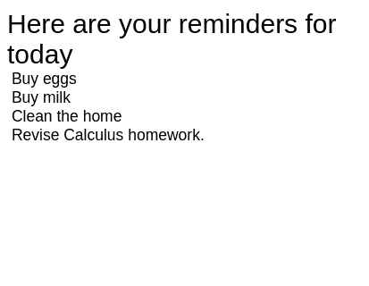
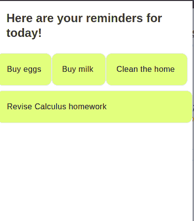
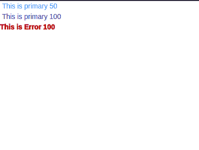
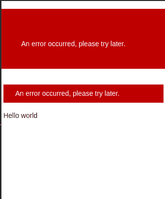
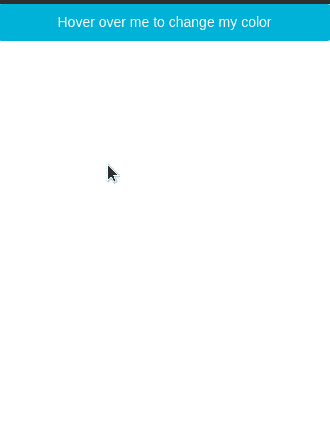
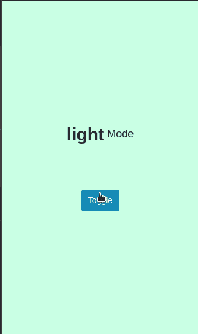
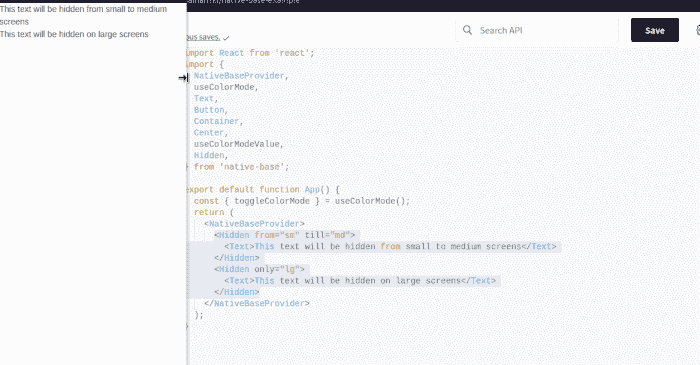
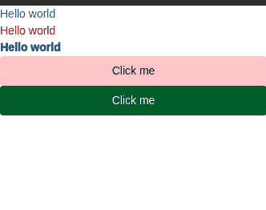

# NativeBase 3.0 中的新功能

> 原文：<https://blog.logrocket.com/whats-new-nativebase-3/>

假设您在 React Native 中构建了一个成功的移动应用程序。然而，根据您的用户，即使项目完成了工作，它也不“看起来很好”换句话说，你的应用程序的用户界面缺乏光泽，需要重新粉刷。

比如你觉得什么比较好看？由`Text`部分组成的无聊列表:



或者更好看的带有`Cards`和布局的列表:



要在 React Native 中创建 UI，您需要做的是:

*   编写大量复杂的 CSS 代码来设计您的`Button`、`Text`和其他组件
*   键入 JavaScript 代码，这样你的用户界面在小型手机和大型平板电脑上都很棒
*   确保您的定制组件与 React Aria 兼容。这允许更多的可访问性
*   可选地，广泛地测试你的程序，以确保它在 Android、iOS 和浏览器上完美地运行

当然，这个解决方案可能行得通。然而，有一个小缺陷:开发一个优秀的界面需要时间和技巧。因此，这个解决方案对小团队来说是不可行的。那么，我们如何缓解这个问题呢？

这就是 NativeBase 的用武之地。这是 React Native 的一个易于使用的开源组件库。GitHub 上大约有 17k 颗星，NativeBase 向用户保证它是开发人员中一个受欢迎和可靠的选择。

最近，开发团队发布了 3.0 版本，引入了大量的特性和错误修复。在本文中，我们将介绍 NativeBase 最新版本中的新增功能。

## NativeBase 的新功能

### 主题定制

主题化是这项技术的核心基础之一。现在，您可以使用几行代码来改变项目的默认样式属性。
为此，首先在您的应用中使用`extendTheme`:

```
import {extendTheme } from 'native-base';

const theme = extendTheme({
  //add colors
  colors: {
    primary: {
      50: '#179def',
      100: '#005489',
    },
    error: {
      50: '#000000',
      100: '#af0808',
    },
  },
  //add font weights.
  fontWeights: {
    hairline: 100,
    extrathick: 950,
  },
});

```

从这段代码中可以得出一些推论:

*   首先，我们使用`colors`对象来创建我们的`primary`和`error`颜色。它们分别有不同深浅的蓝色和红色
*   后来，我们定制了`fontWeights`属性。这将改变我们排版的厚度

让我们来测试一下！将我们的新主题付诸实践:

```
import { NativeBaseProvider, Text } from "native-base";

export default function App() {
  return (
    <NativeBaseProvider theme={theme}>
      {/* Apply our custom theme on this component */}
      <Text color="primary.50"> This is primary 50</Text>
      <Text color="primary.100"> This is primary 100</Text>
      <Text color="error.100" fontWeight="extrathick">
        This is Error 100
      </Text>
    </NativeBaseProvider>
  );
}

```

这里，我们将新创建的样式应用于我们的`Text`元素。



### 实用道具

此功能允许您使用基于约束的工具属性来构建 UI。这允许对你的主题和风格进行更精细的控制。此外，您不必记住样式名称的事实是一大优势:

```
<NativeBaseProvider>
  {/* Verical and horizontal paddding 10 units, and vertical margin of 4 units */}
  <Box bg="danger.700" px={10} py={10} my={4}>
    An error occurred, please try later.
  </Box>
  {/* Horizontal and vertical padding of 6 and 2 units. Vertical margin of 4 units and horizontal margin of 1 unit*/}
  <Box bg="danger.700" px={6} py={2} my={4} mx={1}>
    An error occurred, please try later.
  </Box>
  <Text> Hello world</Text>
</NativeBaseProvider>

```



### 伪道具

基于 Chakra 和其他实用优先的替代品，NativeBase 的团队也提供了对伪道具的支持。这允许各种条件域上的样式，如平台、颜色模式、交互状态等。

下面是伪道具的一个简单例子:

```
<Button
  _hover={{
    _text: { color: "danger.400" },
    backgroundColor: "tertiary.900",
  }}
>
  Hover over me to change my color
</Button>

```

这里，我们指示 React Native 在用户将鼠标悬停在组件上时更改`Button`的`text.color`和`backgroundColor`属性。



### 回应型风格

从版本 3 开始，您现在可以将响应样式合并到您的组件中。这可以确保您的界面在各种尺寸的屏幕上都非常美观:

```
import * as React from "react";
import { Text } from "native-base";

export default function App() {
  return (
    <NativeBaseProvider>
      <Text fontSize={{ base: 10, sm: 48, md: 72 }}>
        This text should change
      </Text>
    </NativeBaseProvider>
  );
}

```

注意，在我们的`fontSize`属性中，我们传入了一个由`base`、`sm`和`md`属性组成的对象。这意味着，如果用户在窄屏幕上运行我们的应用程序，字体大小应该是`10`单位。否则应该是`48`或`72`单位。


### 颜色模式

NativeBase 现在允许开发人员开箱即用地配置主题。该库捆绑了一个名为`useColorMode`的挂钩，允许用户轻松地在暗主题和亮主题之间切换:

```
import React from "react";
import { Text, Button, Center, useColorMode } from "native-base";

function ColorChanger() {
  const { colorMode, toggleColorMode } = useColorMode();
  return (
    <Center flex="1" bg={colorMode === "light" ? "success.100" : "success.900"}>
      {/*If the theme is light, set background to success.100, otherwise set it to success.900*/}
      <Text fontSize="lg" display="flex" mb={20}>
        <Text bold fontSize="30px">
          {colorMode}
        </Text>
        <Text> Mode</Text>
      </Text>
      <Button onPress={toggleColorMode}>Toggle</Button>
    </Center>
  );
}

```

在这段代码中，我们使用`useColorMode`钩子来自定义`ColorChanger`组件的样式。后来，我们也使用了一个`Button`元素。点击时，应用程序将翻转当前主题。

最后一步，让我们向用户界面显示`ColorChanger`:

```
import { NativeBaseProvider } from "native-base";
export default function App() {
  return (
    <NativeBaseProvider>
      <ColorChanger />
    </NativeBaseProvider>
  );
}

```



### `Hidden`组件

`Hidden`用于根据`colorMode`或平台相应地切换子组件的可见性值:

```
<NativeBaseProvider>
  <Hidden from="sm" till="md">
    <Text>This text will be hidden from small to medium screens</Text>
  </Hidden>
  <Hidden only="lg">
    <Text>This text will be hidden on large screens</Text>
  </Hidden>
</NativeBaseProvider>

```

在这段代码中，我们根据断点显示或隐藏`Text`组件。在第一部分中，我们使用`from`和`till`道具来告诉 React 如果用户在一个小的或中等的屏幕上就隐藏组件。在第二部分，如果用户在大屏幕上观看，我们使用`only`道具隐藏`Text`。



## NativeBase 的改进

### 主题性

基于风格化的系统主题规范，NativeBase 3.0 捆绑了可主题化的核心组件。这允许你非常容易地定制应用的调色板、字体粗细和其他属性。



### 易接近

结合 React ARIA 和 React Native ARIA，该特性使您能够在短时间内构建可访问的 ui。

## 结论

NativeBase 是一个非常强大的组件库，可以帮助程序员构建漂亮的用户界面。它已经过彻底的测试和优化，从而带来了安全性和性能。说到个人项目，NativeBase 是我寻找组件的首选库。

非常感谢您的阅读！

## [LogRocket](https://lp.logrocket.com/blg/react-native-signup) :即时重现 React 原生应用中的问题。

[](https://lp.logrocket.com/blg/react-native-signup)

[LogRocket](https://lp.logrocket.com/blg/react-native-signup) 是一款 React 原生监控解决方案，可帮助您即时重现问题、确定 bug 的优先级并了解 React 原生应用的性能。

LogRocket 还可以向你展示用户是如何与你的应用程序互动的，从而帮助你提高转化率和产品使用率。LogRocket 的产品分析功能揭示了用户不完成特定流程或不采用新功能的原因。

开始主动监控您的 React 原生应用— [免费试用 LogRocket】。](https://lp.logrocket.com/blg/react-native-signup)