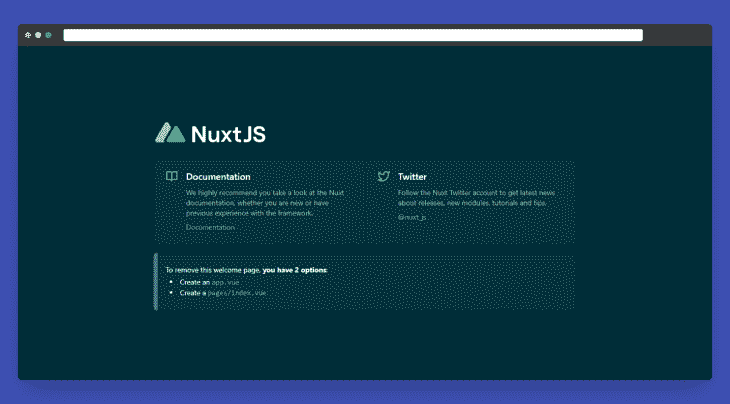

# Nuxt 3 - LogRocket 博客中的新内容

> 原文：<https://blog.logrocket.com/whats-new-nuxt-3/>

期待已久的 Nuxt 3 测试版于 2021 年 10 月 12 日发布，这对于 Nuxt 和 Vue 开发者生态系统来说是一个重要的日子。这是一个更新版本，已经过重新设计，以提高性能和简化版本。在这篇文章中，我们将看看 Nuxt 3 中的新功能，以及安装过程和如何将您现有的 Nuxt 应用程序(Nuxt 2)迁移到这个最新版本。

## 从 Nuxt 2 迁移到 Nuxt 3

*注意，在我们开始之前，请记住 Nuxt 3 目前只支持节点 v14 或 v16。*

虽然目前还没有稳定的迁移技术来实现从 Nuxt 2 到 Nuxt 3 的平稳过渡，但是可以使用 Nuxt Bridge(我们将在后面更详细地讨论)来尝试以前版本中 Nuxt 3 的一些新功能。

为此，首先从您的项目中删除任何`package-lock`文件(`package-lock.json`或`yarn.lock`)，然后移除 Nuxt 依赖项，并在您的`package.json`文件中为 nuxt-edge 的最新版本创建一个新条目:

```
- "nuxt": "^2.15.0"
+ "nuxt-edge": "latest"
```

下一步是重新安装所有依赖项:

```
npm install
# OR
yarn install
```

你已经准备好了！

您也可以选择安装 Nuxt Bridge 作为开发依赖项:

```
npm install -D @nuxt/[email protected]:@nuxt/bridge-edge
# OR
yarn add --dev @nuxt/[email protected]:@nuxt/bridge-edge
```

然而，这样做还需要更新您的`package.json`文件，以反映 Nuxt 现在将生成 Nitro 服务器作为构建结果的事实。

## 开始一个新项目

在 Nuxt 3 中创建新应用程序的过程与早期版本有很大不同。因为 Nuxt 3 仍处于测试阶段，你必须从初始化一个新的应用程序开始:

```
npx nuxi init project-name
```

下一步是安装包含在生成的`package.json`文件中的依赖项:

```
cd project-name
npm install
# OR 
yarn install
```

完成这些步骤后，我们就可以开始应用程序了:

```
npm run dev
# OR 
yarn dev
```

如果一切正常，浏览器窗口应该会自动为 [http://localhost:3000](http://localhost:3000) 打开，输出如下图:



## v3 中的新功能

### 硝基发动机

Nuxt 3 有一个新的跨平台服务器引擎，为 Nuxt 应用程序添加了全栈功能。Nitro engine 还包括开箱即用的无服务器功能，被认为是第一个与当前广泛的云托管服务一起工作的 JavaScript 应用服务器。这使得将 API 集成到 Nuxt 应用程序中变得轻而易举。

要使用这个功能，只需在项目根文件夹中创建一个新的`/server`目录。这个目录将保存项目的 API 端点和服务器中间件，Nuxt 将自动读取`/server/api`目录中的任何文件来创建 API 端点:

```
// server/api/hello.js
export default async (req, res) => {
  return {
    foo: "bar",
  };
};
```

这将生成一个新的 API 端点，可以在[http://localhost:3000/API/hello](http://localhost:3000/api/hello)访问。

#### 服务器中间件

Nitro Engine 还支持向 API 端点添加中间件。类似于 API 的工作方式，Nuxt 将读取`/server/middleware`目录中的任何文件，为您的项目生成服务器中间件。但是与映射到自己的路由的 API 路由不同，这些文件将在每次请求时执行。这样做通常是为了向所有响应添加一个公共头，记录响应，或者改变一个传入的请求对象。

下面是一个将`someValue`添加到每个 API 请求的示例:

```
// server/middleware/addValue.js
export default async (req, res) => {
  req.someValue = true
}
```

### Nuxt 桥

Nuxt 3 现在包括 Nuxt Bridge，这是一个向前兼容层，使您只需安装和激活一个 Nuxt 模块，就可以访问许多新的 Nuxt 3 特性。

您可以使用 Nuxt Bridge 来确保您的项目(几乎)为 Nuxt 3 做好了准备，并且您的开发人员可以获得最大的体验，而不必进行大量的重写或冒险进行修改。

虽然我们已经讨论了使用 Nuxt Bridge 进行迁移的工作原理，但是您可以在这里了解关于 [Nuxt Bridge 的更多信息。](https://v3.nuxtjs.org/getting-started/bridge/)

### netapp

Nuxt Context 提供了从组件、组件和插件中访问运行时应用上下文的能力，在 Nuxt 3 中已经被重命名为 NuxtApp。

在组件和插件中，我们可以使用`useNuxtApp`访问 NuxtApp:

```
import { useNuxtApp } from "#app";

function useMyComposable() {
  const nuxtApp = useNuxtApp();
  // access runtime nuxt app instance
  console.log(nuxtApp);
}
```

此外，`inject`函数使函数和/或值在您的 Nuxt 应用程序中可用，现在称为`provide`。

例如，创建一个插件，将提供的名称记录到 Nuxt 2:

```
// plugins/hello.js
export default ({ app }, inject) => {
  inject("hello", (name) => console.log(`Hello ${name}!`));
};

// Can be accessed using
this.$hello('Elijah')
```

在 Nuxt 3 中，它变成了这样:

```
const nuxtApp = useNuxtApp()
nuxtApp.provide('hello', (name) => console.log(`Hello ${name}!`))

// Can be accessed using
nuxtApp.$hello('Elijah');
```

### 新文件结构

在 Nuxt 3 中,`pages/`目录现在是可选的，如果它不在那里，Nuxt 将不会包含 vue-router 依赖项。相反，新的`app.vue`充当 Nuxt 应用程序的核心组件；你添加到它的一切(JS 和 CSS)将是全球性的，并包括在所有网页上。

这在处理单页应用程序(如登录页面)或不需要路由的应用程序时非常有利。

### 组件目录

Nuxt 3 还支持一个新的`composables/`目录，用于将 Vue 组件自动导入到您的应用程序中。

如果你还不熟悉 Vue 中有哪些组件，这是在 Vue 3 中介绍的，你可以在这里了解更多关于组件的信息。

使用 Nuxt composable 目录，我们可以很容易地创建命名的和默认的 composable。

示例:

```
// composables/useFoo.js
import { useState } from '#app'

export const useFoo = () => {
  return useState('foo', () => 'bar')
}
```

在这种情况下，我们的可组合组件被导出为`useFoo`;如果没有提供导出名称，可组合文件将作为不带扩展名的文件名的`pascalCase`被访问。

它们也是自动导入的，我们可以在任何页面或组件中访问它们:

```
<template>
  <div>
    {{ foo }}
  </div>
</template>

<script setup>
const foo = useFoo()
</script>
```

### Vue 3 和 Vite 支持

Nuxt 3 是为 Vue 3 设计的。因为 Nuxt 3 是在 Vue 3 中开发的，你可以使用像 Composition API、增强的模块导入和更好的整体应用速度这样的特性。Nuxt 3 中包含了 Vite 支持，它向后兼容 Nuxt 2。

## 结论

在这篇文章中，我们介绍了 Nuxt 3 的新功能，以及如何将现有的 Nuxt 应用程序转换到这个最新版本。

你应该记住，Nuxt 3 仍处于测试阶段，所以要做好准备。还建议您在第一个稳定版本发布之前不要在生产中使用它。

## 使用 [LogRocket](https://lp.logrocket.com/blg/signup) 消除传统错误报告的干扰

[](https://lp.logrocket.com/blg/signup)

[LogRocket](https://lp.logrocket.com/blg/signup) 是一个数字体验分析解决方案，它可以保护您免受数百个假阳性错误警报的影响，只针对几个真正重要的项目。LogRocket 会告诉您应用程序中实际影响用户的最具影响力的 bug 和 UX 问题。

然后，使用具有深层技术遥测的会话重放来确切地查看用户看到了什么以及是什么导致了问题，就像你在他们身后看一样。

LogRocket 自动聚合客户端错误、JS 异常、前端性能指标和用户交互。然后 LogRocket 使用机器学习来告诉你哪些问题正在影响大多数用户，并提供你需要修复它的上下文。

关注重要的 bug—[今天就试试 LogRocket】。](https://lp.logrocket.com/blg/signup-issue-free)