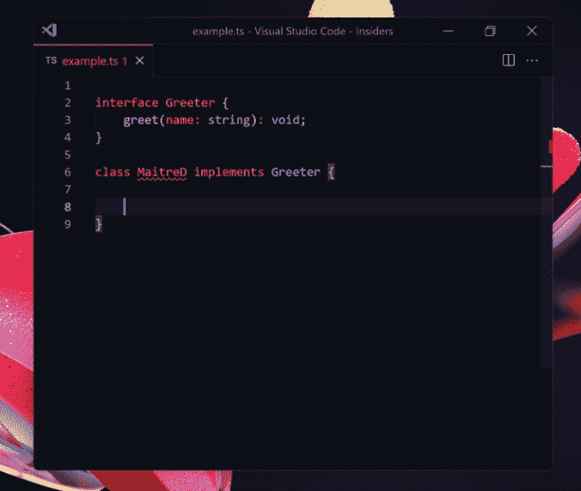

# TypeScript 4.5 中的新特性

> 原文：<https://blog.logrocket.com/whats-new-typescript-4-5/>

## 介绍

TypeScript 4.5 附带了一些开箱即用的惊人特性。这些包括改进异步编程的增强的`Awaited`类型，用于无痛升级的 node_modules 支持的 lib，以及通过使用`realpathSync.native`函数的性能优化。

此外，在测试版中，TypeScript 增加了对 Node 12 的 ES 模块支持。然而，微软认为这项功能需要更多的“烘烤时间”因此，这个特性只能通过 TypeScript 的夜间版本中的一个`--experimental`标志来使用。

在本文中，我们将研究特性打包的 TypeScript 4.5 的新增功能。

让我们开始下一部分。

## 新功能

### `Awaited`型和`Promise`型的改进

受使用像`promise.all`这样的 JavaScript 内置方法时所经历的挑战的启发，这个特性引入了一个新的`Awaited`类型，用于建模操作，比如`async`函数中的`await`，或者`Promise`上的`.then()`方法。

这个特性增加了对`promise.all`、`promise.race`、`promise.allSettled`和`promise.any`的重载，以支持新的`Awaited`类型。

这种新型实用程序增加了以下功能:

1.  递归展开
    1.  不需要`PromiseLike`解决类似承诺的“问题”
    2.  非承诺的“可得物”解析为`never`
    3.  最后，一些不同的使用案例是:

来自`node_modules`的支持库

```
// basic type = string 
type basic = Awaited<Promise<string>>;

// recursive type = number 
type recursive = Awaited<Promise<Promise<number>>>;

// union type = boolean | number 
type union = Awaited<string | Promise<number>>;

```

### TypeScript 附带了一系列声明文件——以`.d.ts`结尾的文件。这些文件不会编译到`.js`；它们仅用于类型检查。

这些类型声明文件代表了标准的浏览器 DOM APIs 和所有标准化的内置 API，例如 JavaScript 语言中可用的内置类型的方法和属性，如`string`或`function`。

Typescript 用模式`lib.[something].d.ts`命名这些声明文件，它们使 TypeScript 能够很好地与运行我们代码的 JavaScript 版本一起工作。

我们可用的属性、方法和函数取决于我们的代码运行的 JavaScript 版本(例如,`startsWith` string 方法在 ES6 和更高版本上可用)。

目标编译器设置告诉我们代码运行在哪个版本的 JavaScript 上，并使我们能够通过改变`target`值来改变加载哪个 lib 文件。

考虑以下代码:

在上面的代码中，`target`的值是`es5`。因此，像`startsWith`和`arrow`函数这样的 ES6 特性不能在我们的代码中使用。为了使用 ES6 的特性，我们可以通过将`es5`改为`es6`来改变加载的 lib 文件。

```
{
  "compilerOptions": {
    "target": "es5",
    "module": "commonjs",
  }
}

```

这种方法的一个缺点是，当我们升级 TypeScript 时，我们被迫处理对 TypeScript 内置声明文件的更改。对于像 DOM APIs 这样经常变化的东西来说，这是一个挑战。

TypeScript 4.5 引入了一种改变内置`lib`的新方法。这个方法通过查看`node_modules`中的一个限定了作用域的`@typescript/lib-*`包来工作:

在上面的代码中，`@types/web`表示 TypeScript 发布的 DOM APIs 版本。通过将上面的代码添加到我们的`package.json`文件中，我们将项目锁定到特定版本的 DOM APIs。

```
{
 "dependencies": {
    "@typescript/lib-dom": "npm:@types/web"
  }
}

```

因此，当 TypeScript 被更新时，我们的依赖项管理器的 lockfile 将维护 DOM 类型的一个版本。

条件类型的尾递归消除

### TypeScript 附带了试探法，使它能够在编译具有无限递归或非终止类型的程序时正常失败。这是防止堆栈溢出所必需的。

在较低版本中，类型实例化深度限制为 50；这意味着在 50 次迭代之后，TypeScript 会将该程序视为非终止类型，并且会正常失败。

更多来自 LogRocket 的精彩文章:

* * *

### 考虑下面的代码:

* * *

在上面的代码中，`TrimLeft`类型消除了字符串类型中的前导空格，但是如果该前导空格超过 50(如上例所示)，TypeScript 将抛出以下错误:

```
type TrimLeft<T extends string> = T extends ` ${infer Rest}` ? TrimLeft<Rest> : T;

type Test = TrimLeft<"                                                  fifty spaces">;

```

然而，在 4.5 版中，实例化限制增加到了 100，所以上面的代码可以工作。此外，由于在某些情况下递归条件类型的计算可能需要 100 次以上的迭代，TypeScript 4.5 实现了条件类型的尾递归计算。

```
// error: Type instantiation is excessively deep and possibly infinite.

```

这样做的结果是，当一个条件类型在同一条件类型的另一个实例化中结束时，编译器将在一个不消耗额外调用堆栈的循环中计算该类型。但是，经过一千次迭代后，TypeScript 会认为该类型没有终止，并引发错误。

禁用导入 elysion

### 在较低版本中，默认情况下，在 TypeScript 无法检测到您正在使用导入的情况下，TypeScript 会移除它解释为未使用的导入。这可能会导致不必要的行为。

这种情况的一个例子是使用 Svelte 或 Vue 这样的框架。

考虑下面的代码:

在上面的代码中，我们有一个样本 Svelte 和 Vue 文件。这些框架的工作方式类似，因为它们基于它们的`script`标签之外的标记生成代码。相反，TypeScript 只能看到`script`标记中的代码，因此它不能检测到导入的`someFunc`模块的使用。所以在上面的例子中，TypeScript 会丢弃`someFunc`导入，导致不必要的行为。

```
<!-- A .svelte File -->
<script>
import { someFunc } from "./some-module.js";
</script>

<button on:click={someFunc}>Click me!</button>

<!-- A .vue File -->
<script setup>
import { someFunc } from "./some-module.js";
</script>

<button @click="someFunc">Click me!</button>

```

在 4.5 版本中，我们可以通过使用新的`--preserveValueImports`标志来防止这种行为。这个标志防止 TypeScript 删除我们输出的 JavaScript 中的任何导入。

`type`导入名称上的修饰符

### 虽然`--preserveValueImports`防止 TypeScript 编译器移除有用的导入，但是当使用类型导入时，我们需要一种方法来告诉 TypeScript 编译器移除它们。类型导入是只包含 TypeScript 类型的导入，因此在我们的 JavaScript 输出中不需要。

考虑下面的代码:

在上面的代码中，`FC`是一个类型导入，但是从语法上来说，没有办法告诉 TypeScript 编译器或者构建工具丢弃`FC`并保留`useState`。

```
// Which of these is a value that should be preserved? tsc knows, but `ts.transpileModule`,
// ts-loader, esbuild, etc. don't, so `isolatedModules` issues an error.
import { FC, useState } from "react";
const App: FC<{ message: string }> = ({ message }) => (<div>{message}</div>);

```

在早期版本的 TypeScript 中，TS 通过将类型导入标记为仅类型来消除这种模糊性:

但是 TypeScript 4.5 为我们提供了一种更简洁的方法:

```
import type { FC } from "react";
import { useState } from "react";

```

模板字符串类型作为判别式

```
import {type FC, useState} from "react";

```

### 此功能使 sTypeScript 能够识别并成功地对具有模板字符串类型的值进行类型检查。

考虑下面的代码:

在上面的代码中，TypeScript 无法缩小`Types`的范围，因为它是模板字符串类型。因此访问`data.response`会抛出一个错误:

```
type Types =
    {
      type: `${string}_REQUEST`;
    }
  | {
      type: `${string}_SUCCESS`;
      response: string;
    };

function reducer2(data: Types) {
    if(data.type === 'FOO_REQUEST') {
        console.log("Fetcing data...")
    }
   if (data.type === 'FOO_SUCCESS') {
     console.log(data.response);
   }
}
console.log(reducer2({type: 'FOO_SUCCESS', response: "John Doe"}))

```

但是，在 TypeScript 4.5 中，此问题已得到修复，TypeScript 现在可以成功地缩小模板字符串类型的值。

```
- Property 'response' does not exist on type 'Types'.
- Property 'response' does not exist on type '{ type: `${string}_REQUEST`; }'.

```

私有现场存在检查

### 有了这个特性，TypeScript 支持 JS 建议的对私有字段进行符合人体工程学的品牌检查。这个建议使我们能够通过使用下面的语法来检查一个对象是否有私有字段:

在上面的代码中，`hasPassword`静态方法使用`in`操作符检查`obj`是否有私有字段并返回它。

```
class Person {
  #password = 12345;
  static hasPassword(obj: Object) {
     if(#password in obj){
         // 'obj' is narrowed from 'object' to 'Person'
        return obj.#password;
     }

     return "does not have password";
  }
}

```

问题是早期版本的 TypeScript 会返回强收缩提示:

但是，TypeScript 4.5 提供了对此功能的支持。

```
  - Property '#password' does not exist on type 'Object'.

```

导入断言

### TypeScript 4.5 增加了对导入断言 JavaScript 提议的支持。这个导入断言特性使我们能够在模块导入语句中传递额外的内联信息。这在指定模块类型时很有用。

该功能适用于普通`import`和动态`import`，如下所示:

Node.js 中实验性的仅夜间 ECMAScript 模块支持

```
// normal import
import json from "./myModule.json" assert { type: "json" }; 

// dynamic import
import("myModule1.json", { assert: { type: "json" } });

```

### 随着 [ES 模块](https://blog.logrocket.com/es-modules-in-node-today/)的发布，JavaScript 给了我们一个标准的模块定义。因此，像 Node.js 这样使用不同模块定义构建的框架(如 CommonJS)需要提供对 ES 模块的支持。这很难完全实现，因为 Node.js 生态系统的基础是建立在 CommonJS 而不是 ES 模块上的。

通过此功能，TypeScript 在使用 Node.js 时提供了对 es 模块的支持，但此功能在 TypeScript 4.5 中不直接可用。您目前只能在 TypeScript 的[夜间版本](https://www.typescriptlang.org/docs/handbook/nightly-builds.html)上使用这个特性。

新代码片段完成

### TypeScript 4.5 通过这些代码片段增强了开发人员的体验:

类中方法的代码片段完成

#### 使用 TypeScript 4.5，当在类中实现或重写方法时，您会得到代码段自动完成。

根据文档，当实现接口的方法或在子类中重写方法时，TypeScript 不仅完成方法名，还完成方法体的完整签名和大括号。当你完成你的完成时，你的光标会跳到方法的主体中。

JSX 属性的代码片段完成



Source: [TS DevBlog](https://devblogs.microsoft.com/typescript/announcing-typescript-4-5/#subclass-method-snippets)

#### 通过此功能，TypeScript 通过添加初始值设定项和智能光标定位来改善开发人员编写 JSX 属性的体验，如下所示:

对未解析类型的更好的编辑器支持


Source: [TS DevBlog](https://devblogs.microsoft.com/typescript/announcing-typescript-4-5/#jsx-attribute-snippets)

### 这是另一个旨在改善开发者体验的特性。有了这个特性，即使没有完整的程序可用，TypeScript 也能保留我们的代码。

在旧版本中，当 TypeScript 找不到类型时，它会用`any`替换它:

然而，有了这个特性，TypeScript 将保留我们的代码(`Buffer`)，并在我们将鼠标悬停在它上面时给我们一个警告，如下所示:


Source: [TS DevBlog](https://devblogs.microsoft.com/typescript/announcing-typescript-4-5/#display-unresolved-types)

`--module es2022`


Source: [TS DevBlog](https://devblogs.microsoft.com/typescript/announcing-typescript-4-5/#display-unresolved-types)

### 这个新的模块设置使我们能够在 TypeScript 中使用顶级的`await`。这意味着我们可以在异步函数之外使用`await`。

在旧版本中，模块选项可以是`none`、`commonjs`、`amd`、`system`、`umd`、`es6`、`es2015`、`esnext`。

将`--module`选项设置为`esnext`或`nodenext`使我们能够使用顶级 await，但是`es2022`选项是该特性的第一个稳定目标。

使用`realpathSync.native`加快加载速度

### 根据文档，这是一个性能优化变化，在 Windows 上的某些代码库上，项目加载速度提高了 5-13%。

这是因为 TypeScript 编译器现在在所有操作系统上都使用 Node.js 中的`realpathSync.native`函数。形式上，这是在 Linux 上使用的，但是如果您运行的是最新版本的 Node.js，那么现在将使用这个函数。

JSDoc 中的断言和默认类型参数

### 有了这个特性，TypeScript 增强了对 [JSDoc](https://jsdoc.app) 的支持。

JSDoc 是 JavaScript 的 API 文档生成器，通过`@type`标签，我们可以在代码中提供类型提示。

有了这个特性，TypeScript 通过类型断言增强了这个工具的表达能力，还为 JSDoc 添加了默认的类型参数。

考虑下面的代码:

在上面的代码中，我们通过在文字后面写`as const`得到了一个更干净、更精简的不可变类型——这是`const`断言。

```
// type is { readonly name: "John Doe" }
let developer = { name: "John Doe" } as const;

```

在 4.5 版本中，我们可以通过使用 JSDoc 在 JavaScript 中实现同样的表达能力:

结论

```
// type is { readonly prop: "hello" }
let developer = /** @type {const} */ ({ name: "John Doe" }); 

```

## TypeScript 4.5 包含了语言和开发人员体验方面的功能和增强。你可以[在这里](https://devblogs.microsoft.com/typescript/announcing-typescript-4-5/)获得更多关于 TS 4.5 的信息。

我希望在这篇文章之后，您已经准备好开始使用 TypeScript 4.5 了。

[LogRocket](https://lp.logrocket.com/blg/typescript-signup) :全面了解您的网络和移动应用

## LogRocket 是一个前端应用程序监控解决方案，可以让您回放问题，就像问题发生在您自己的浏览器中一样。LogRocket 不需要猜测错误发生的原因，也不需要向用户询问截图和日志转储，而是让您重放会话以快速了解哪里出错了。它可以与任何应用程序完美配合，不管是什么框架，并且有插件可以记录来自 Redux、Vuex 和@ngrx/store 的额外上下文。

[](https://lp.logrocket.com/blg/typescript-signup)

除了记录 Redux 操作和状态，LogRocket 还记录控制台日志、JavaScript 错误、堆栈跟踪、带有头+正文的网络请求/响应、浏览器元数据和自定义日志。它还使用 DOM 来记录页面上的 HTML 和 CSS，甚至为最复杂的单页面和移动应用程序重新创建像素级完美视频。

.

[Try it for free](https://lp.logrocket.com/blg/typescript-signup)

.