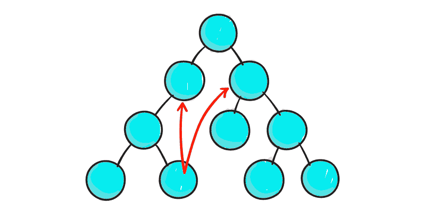
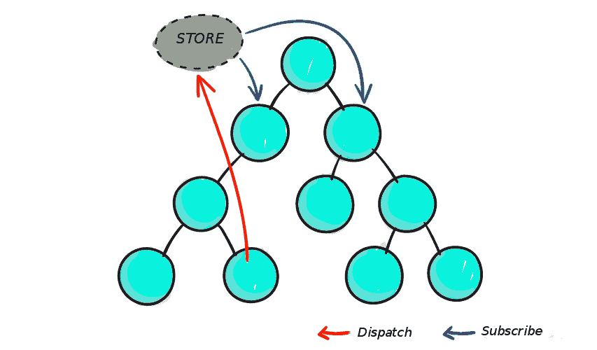
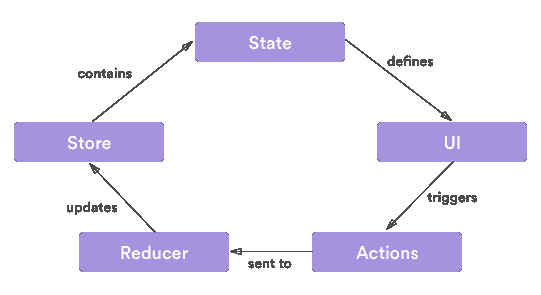

# 何时(何时)使用 Redux - LogRocket 博客

> 原文：<https://blog.logrocket.com/when-and-when-not-to-use-redux-41807f29a7fb/>

### “那么我为什么需要 Redux 呢？”

不要跳到每一个新的闪亮的工具上，并把它包含在你的项目中，这只是常识。毕竟组件不是有它们的状态吗？为什么您需要一个工具来帮助您管理这种状态？

不要误会我；React 一个人很棒。是的，只用一个框架就可以编写一个完整的应用程序。但是随着你的应用变得越来越复杂，组件越来越多，仅仅使用一个框架来管理它会变得非常棘手。

那就是 Redux 为你化险为夷的地方；它简化了此类应用中出现的复杂性。如果你有一些 React 的经验，你会知道 React 的数据流是这样的，父组件传递道具给子组件。在一个庞大的应用程序中，数据通过状态和道具流经如此多的组件，通信往往会变得容易出错，相信我——您的代码将变得非常难以阅读，甚至难以改进。

看看下面的图表，看看我在说什么:



[https://css-tricks.com/learning-react-redux/](https://css-tricks.com/learning-react-redux/)

在 React(以及其他框架)中，不鼓励没有父子关系的两个组件之间的通信。React 建议，如果您必须这样做，您可以按照 Flux 的模式构建您的全球事件系统——这就是 Redux 的用武之地。

有了 Redux，您就有了一个可以保存所有应用程序状态存储库。如果组件 A 中发生了状态更改，则它会被中继到存储，需要知道组件 A 中状态更改的其他组件 B 和 C 可以订阅存储:



[https://css-tricks.com/learning-react-redux/](https://css-tricks.com/learning-react-redux/)

看到了吗？比我们想象的要好得多。如果我们让我们的组件相互通信，我们就会创建一个容易出错和不可读的代码库。Redux 让故事变得不一样。

组件 A 将其状态更改发送到存储，如果组件 B 和 C 需要此状态更改，它们可以从存储中获取。因此，我们的数据流逻辑是无缝的。

除了它的主要任务之外，使用 Redux 还有很多好处，我只想提出我认为最重要的三个,它们是:

1.  **结果的可预测性**

由于只有一个真实的来源(商店)，您在将当前状态与应用程序的动作和其他部分同步时会遇到一些问题。

**2。可维护性**

Redux 对代码应该如何组织有严格的指导方针；这进一步确保了可预测的结果，使代码更容易维护。

**3。易于测试**

在 Redux 中编写代码涉及到被隔离的纯函数，这与编写可测试代码的黄金法则相关:编写只做一件事并且独立的小函数。

### 嘿…你可能根本不需要 Redux

这对你来说似乎是显而易见的，但我还是要提一下。不一定*有*才能用 Redux。有时候不这么做更有意义。如果这些场景中的任何一个对你来说是真的，你可能根本不需要 Redux:

*   您和您的伙伴(或者同事，如果你们不是真正的朋友)已经有了一种预定义的方式来共享和安排组件间的状态
*   您仍在体验 React 或任何其他框架
*   如果你的应用程序主要由简单的动作组成，比如用户界面的改变，那么这些并不一定是 Redux store 的一部分，可以在组件层次上处理
*   您不需要管理服务器端事件(SSE)或 websockets
*   您可以从每个视图的单个数据源获取数据

### Redux:一部分接一部分

对于一个方法可能会让初学者感到困惑的工具来说，Redux 的库只有 2KB，工具本身由三部分组成:动作、存储和 reducers。



[https://stackoverflow.com/questions/45416237/axios-calls-in-actions-redux](https://stackoverflow.com/questions/45416237/axios-calls-in-actions-redux)

### 行动

动作只是使用函数创建的事件，将数据从应用程序发送到存储。数据可以通过不同的方式发送，例如提交表单、调用 API 或基本的用户交互。Redux 中的每个动作都有一个`type`属性，它描述了动作的类型以及发送到存储的信息的“有效载荷”。让我们来看一个最基本的工作实例:

```
// The action
  {
    type: ADD_USER,
    payload: {
      username: ‘Chris’,
      email: ‘redux @frameworks.io’
    }
  }
  // The function that creates the action
  function signUpUser(data) {
    return {
      type: ADD_USER,
      payload: data
    }
  }
```

为了在你的应用中调用一个动作，Redux 使用了`dispatch()`方法，该方法将动作发送到 Redux store 来指示状态的改变:

```
dispatch(signUpUser(data));
```

### 还原剂

因为 Redux 不允许您的应用程序更改状态，而是使用`dispatch()`来完成。仅仅表示改变状态的意图，它实际上并没有改变状态…这就是 Reducers 的用武之地。

Reducers 是通过调度的动作获取应用程序的当前状态，然后返回新状态的函数。看看下面的 reducer，它将当前状态和一个动作作为参数，然后返回下一个状态:

```
function handleAuth(state, action) {
    return _.assign({}, state, {
      auth: action.payload
    });
  }
```

构建更复杂的 app 时，推荐使用 Redux 的`combineReducers()`方法。此方法将应用程序中的所有 reducer 合并到一个 reducer 列表中，其中每个 reducer 处理其应用程序状态的一部分，并且每个 reducer 的状态参数都不同:

```
const indexReducer = combineReducers({
    signUp: signUp,
    editProfile: editProfile,
    makePayment: makePayment
  });
```

这里还值得注意的是，Reducers 应该用纯函数编写。下面我列出了这些函数的一些特征:

*   他们不进行外部网络或数据库调用。
*   它们的返回值只取决于它们的参数值。
*   他们的论点应该被看作是不可改变的，也就是说他们不应该被改变。

### 商店

商店就像 Redux 的心脏。它是保存应用程序所有状态的唯一来源，并通过一些方法、调度操作和注册侦听器提供对状态的访问。任何调度的动作都通过 reducers 向存储返回一个新状态。看看这个 Redux 商店的基本例子:

```
import { createStore } from‘ redux’;
  let store = createStore(indexReducer);
  let signUpInfo = {
    username: ‘Chris’,
    email: ‘redux @frameworks.io’
  };
  store.dispatch(signUpUser(signUpInfo));
```

### 函数式编程和 Redux

如果你打算使用 Redux，你应该知道函数式编程是如何工作的。Redux 是建立在函数式编程的原则之上的，理解函数式编程的概念会让你了解 Redux 是如何工作的。

让我们浏览一下函数式编程的关键准则:

*   它可以使用纯函数、递归函数、高阶函数、闭包函数和匿名函数
*   它可以使用辅助功能，如映射、过滤和减少
*   它可以将功能链接在一起
*   它可以将函数视为一级对象
*   它可以将函数作为参数传递
*   它可以使用函数、递归和数组来控制流程
*   状态不会改变(即，它是不可变的)
*   代码执行的顺序并不重要

函数式编程包括编写更简单、更小和孤立的函数。通过遵循这种模式，代码维护、测试和调试变得更加容易。由于这些函数很小并且是孤立的，这使得它们可以重复使用，因此它们可以被复制并粘贴到任何需要的地方。

这也消除了编写更多代码的需要，在我看来这很棒。使用函数式编程时，理解纯函数、匿名函数、闭包和高阶函数等概念非常重要。

## 我们不只是写 Redux，我们也谈论它。现在听着:

或者以后订阅

### 摘要

### 诚然，Redux 是管理应用程序状态的一个很好的库，同样，Redux 也获得了很大的吸引力。那么你还需要知道什么？

除了被优步和 Twitter 这样的公司广泛使用，Redux 也已经在 WordPress 这样的项目中成功实现。当然，Redux 并不适合所有应用程序的观点是存在的，这是事实。

主要执行简单动作，不需要服务器端渲染的应用大概不需要 Redux 它们的动作可以在组件级别处理。

无论哪种方式，Redux 都是一个很棒的工具，我认为您应该去看看，尤其是如果您正在使用 React 的话。

使用 LogRocket 消除传统反应错误报告的噪音

## 是一款 React analytics 解决方案，可保护您免受数百个误报错误警报的影响，只针对少数真正重要的项目。LogRocket 告诉您 React 应用程序中实际影响用户的最具影响力的 bug 和 UX 问题。

[LogRocket](https://lp.logrocket.com/blg/react-signup-issue-free)

自动聚合客户端错误、反应错误边界、还原状态、缓慢的组件加载时间、JS 异常、前端性能指标和用户交互。然后，LogRocket 使用机器学习来通知您影响大多数用户的最具影响力的问题，并提供您修复它所需的上下文。

[ ](https://lp.logrocket.com/blg/react-signup-general) [  ](https://lp.logrocket.com/blg/react-signup-general) [LogRocket](https://lp.logrocket.com/blg/react-signup-issue-free)

关注重要的 React bug—[今天就试试 LogRocket】。](https://lp.logrocket.com/blg/react-signup-issue-free)

Focus on the React bugs that matter — [try LogRocket today](https://lp.logrocket.com/blg/react-signup-issue-free).