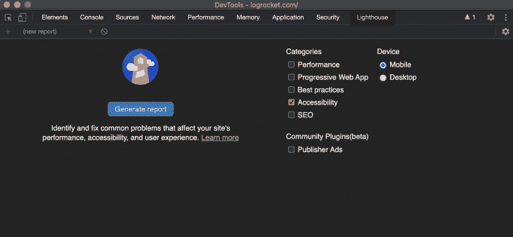
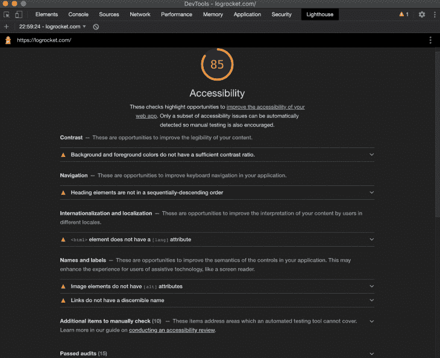
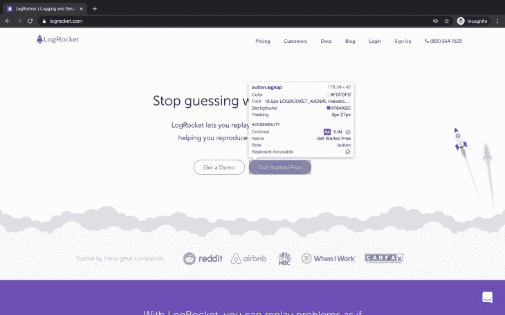
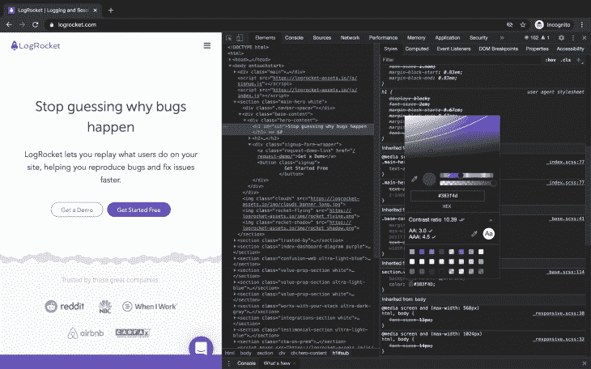
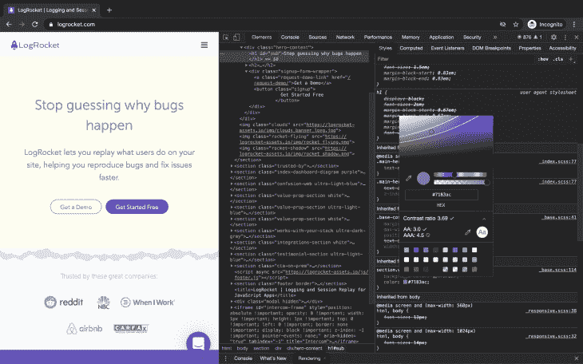
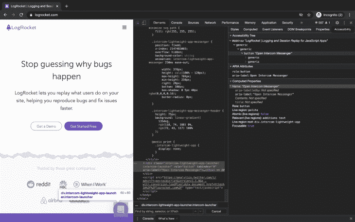
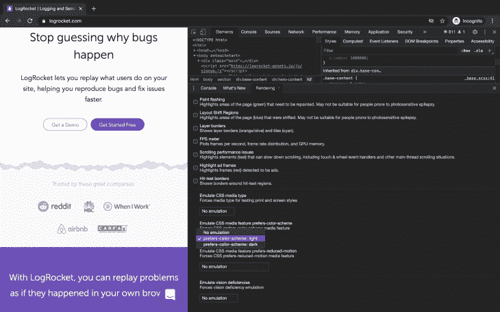
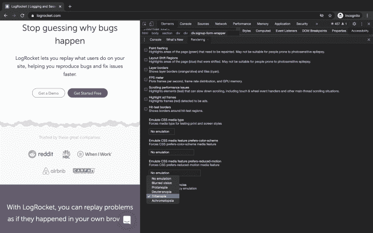

# 哪些 Chrome DevTools 提高了可访问性？- LogRocket 博客

> 原文：<https://blog.logrocket.com/which-chrome-devtools-improve-accessibility/>

许多设计人员和开发人员将可访问性视为事后的想法。然而，遵循可访问性最佳实践会导致更高的客户保持率，并增加创收。浏览器已经发展出更多支持可访问性的特性。

在本文中，您将了解如何利用 Chrome 开发工具(DevTools)来识别和修复您构建的网页的可访问性瓶颈。

本文面向熟悉可访问性最佳实践的人。您还需要对 DevTools 有一个基本的了解。

## 概观

作为一名关心我构建的软件解决方案如何改善用户体验的前端工程师，我经常使用 Chrome DevTools。

Chrome DevTools 是谷歌 Chrome 浏览器内置的一套网络开发工具。它分为一系列面板，这些面板又进一步组织成窗格。

尝试使用键盘或辅助技术浏览网页。体验是否顺畅？这些元素符合标准吗？你能做些什么来改善它的现状？使用 DevTools，您可以识别并修复这些问题。

要访问 DevTools 面板，您需要使用 Google Chrome 审计的网页。然后，在 Mac 上使用快捷键 **Command + Shift + C** 或者在 Windows 和 Linux 上使用 **Control + Shift + C** 来查看 DevTools。

我们将在 Chrome DevTools 中探索以下与可访问性相关的特性:

*   灯塔审计小组
*   元素检查器
*   对比率
*   辅助功能窗格
*   模仿颜色偏好
*   模仿视力缺陷

## 灯塔审计小组

由 [aXe](https://www.deque.com/axe/) 驱动的 [Lighthouse](https://developers.google.com/web/tools/lighthouse/) 审计面板是审计可访问性的好工具。审计报告信息丰富。它陈述了失败的原因，并提供了帮助您了解更多信息的资源链接。

要审计网页，首先打开 DevTools 并单击 Lighthouse 面板。取消选中其他选项，仅选中辅助功能选项。

然后，选择您想要执行审计的设备，并点击`Generate Report`。



点击所生成报告的各个部分，获取关于提高[可访问性得分](https://web.dev/accessibility-scoring)的提示。关于已通过审核的详细信息也非常有用。



标题订单有详细的[审计文件，作为失败标题订单的资源。](https://web.dev/heading-order)

它指定了失败元素的重要性，灯塔标题级别审计失败的原因，以及如何修复结构不良的标题等信息。

## 元素检查器

DevTools 中的 Inspect Element 特性使您可以快速访问带有辅助功能的工具提示。每当您检查网页上的元素时，它就会显示出来。



它显示以下属性:

*   对比度:测量文本前景色和背景色之间的亮度差异。
*   名称:可见文本
*   角色:元素(区域、标题、按钮等)的功能。).对于像`<div>`和`<span>`这样没有语义含义的元素，它显示“generic”
*   显示你是否可以使用键盘聚焦在一个元素上。灰色表示该元素不是键盘焦点。绿色表示该元素可通过键盘访问

## 对比率

对比度功能测量网页内容的前景色和背景色之间的亮度差异。这将有助于在设计阶段选择网页的配色方案。经常问问自己，你将要选择的颜色是否符合可及性标准。

高对比度是用户观看的任何内容的期望值。如果您不保持高对比度，弱视用户或受环境因素影响的用户可能无法看到您网页上的内容。

想象一下，用户在阳光的影响下以低对比度查看网页。用户的体验会很糟糕。

> WCAG 要求“至少 4.5:1”的对比度，因此不能将对比度四舍五入到 4.5:1。例如，#777777 是一种常用的灰色阴影，对比度为 4.48:1。它不符合 WCAG 对比度阈值。
> [对比度和色彩可达性](https://webaim.org/articles/contrast/)


拾色器的对比度部分显示 2 个复选标记和`10.39`的值。

您可以使用颜色选择器来选择符合标准的颜色。要使用此功能，请使用元素检查器工具检查文本。然后，在“样式”窗格上找到“颜色”属性。

单击元素颜色预览，它是值左侧的一个小方块。找到当前对比度部分，并单击向下箭头查看更多详细信息。



单个复选标记表示该元素符合[最小建议值](https://www.w3.org/WAI/WCAG21/Understanding/contrast-minimum.html) (AA)。努力满足由两个复选标记表示的[增强建议](https://www.w3.org/WAI/WCAG21/Understanding/contrast-enhanced) (AAA)。

调色板上会出现一两条线条。点击该区域稍高一点会将其减少到最小推荐值。任何超出这一范围的都不符合最低建议。



拾色器的对比度部分显示 1 个勾号和值 3 `.69`。

## 辅助功能窗格

可访问性窗格提供了对可访问性树、ARIA 属性和 DOM 节点的计算可访问性属性的深入了解。

你可能已经很熟悉 ARIA 了，但是这里有一个简短的描述给那些不知道它是什么的人。

无障碍丰富互联网应用程序(ARIA)，简称为网络无障碍倡议无障碍丰富互联网应用程序(WAI-ARIA)，由 WAI 定义为一种使网络内容和网络应用程序(特别是动态内容和高级用户界面)更便于残疾人使用的方法。

查看以下模式的代码片段:

```
<div aria-modal=true>
  Add modal content
</div>
```

属性为 div 增加了语义。盲文或屏幕阅读器等辅助技术会将 div 视为模态，这是预期的行为。

如果使用不当，ARIA 可能会损害网页的可访问性。注意 ARIA 使用的第一条规则:

> 如果您可以使用一个原生 HTML 元素[HTML5.1]或带有您已经要求的内置语义和行为的属性，而不是重新使用一个元素并添加一个 ARIA 角色、状态或属性来使其可访问，那么就这样做。-** [使用 ARIA](https://www.w3.org/TR/using-aria/#rule1)

若要使用“辅助功能”窗格，请打开 DevTools。然后，检查页面上的任何元素。单击位于“元素”面板下的“辅助功能”窗格。

辅助功能窗格通常是隐藏的，所以打开 DevTools，在 Mac 上按 Command+Shift+P，或者在 Windows 和 Linux 上按 Control+Shift+P，打开命令菜单。命令菜单是一个自动完成的搜索字段。搜索“显示辅助功能”，然后按 Enter 键运行打开窗格的命令。



**可访问性树**上的信息显示了来自 DOM 树的元素，这些元素有助于通过辅助技术理解页面内容。

**ARIA 属性**列出了这些元素的属性。**计算属性**部分显示浏览器计算的属性。

如果被检查的元素没有为这些 ARIA 属性指定值，也没关系。语义元素不需要它们，因为它们已经有了意义。

仔细阅读这些细节将有助于你检查你是在为更广泛的受众构建还是在限制你的范围。

## 模拟颜色偏好

黑暗模式通过减少光线照射来帮助眼睛。你可以使用 DevTools 来模拟用户如何看待你的网页。可用选项包括无偏好、亮和暗。

**注意**:此功能仅适用于实施[媒体查询第 5 级](https://drafts.csswg.org/mediaqueries-5/#prefers-color-scheme)用户偏好媒体功能的网站。



要访问该功能，打开 DevTools，在 Mac 上按 **Command+Shift+P** 或者在 Windows 和 Linux 上按 **Control+Shift+P** 打开命令菜单。然后，搜索并选择**显示渲染**以启用渲染选项卡。

最后，导航到**仿真 CSS 媒体功能首选项-配色方案**部分，并从可用选项中选择一个选项。

## 模仿视力缺陷

模拟视力缺陷是关键的辅助功能之一，用于确保您[不会让任何用户落下](https://www.w3.org/WAI/GL/low-vision-a11y-tf/wiki/Overview_of_Low_Vision#Color_Perception)。考虑不要单独使用颜色或图像来传达信息。Chrome DevTools 内置了这个功能。

要访问此功能，请打开 DevTools，在 Mac 上按 Command+Shift+P，在 Windows 和 Linux 上按 Control+Shift+P，打开命令菜单。然后，搜索并选择“显示渲染”以启用“渲染”选项卡。导航至模拟视力缺陷窗格，并从可用选项中选择一个选项。



可用选项包括:

*   没有模仿:没有视力缺陷
*   视力模糊:视力清晰度下降
*   Protanopia:无法感知红光
*   弱视:无法感知绿光
*   近视:无法感知蓝光
*   色盲:色觉缺失。只能看到黑色、白色和灰色阴影

知道访问你的网站的人并不总是像你一样理解它，这将有助于你在构建每个功能时都考虑到可访问性。

## 结论

DevTools 已经发展出更多特性来支持开发人员不一定熟知的可访问性。在本文中，您探索了可以用来提高网站可访问性的特性。

我们使用 Lighthouse Audits 面板来审计网页并修复失败的审计，使用 Elements Inspector 来查看对比度、名称、角色和键盘可聚焦属性。我们使用对比度来确保前景色和背景色符合推荐的对比度。最后，我们使用 Accessibility 窗格来深入了解可访问性树、ARIA 属性和 DOM 节点的计算可访问性属性。

您还模拟了用户可能有的颜色偏好和视觉缺陷。

## 使用 [LogRocket](https://lp.logrocket.com/blg/signup) 消除传统错误报告的干扰

[](https://lp.logrocket.com/blg/signup)

[LogRocket](https://lp.logrocket.com/blg/signup) 是一个数字体验分析解决方案，它可以保护您免受数百个假阳性错误警报的影响，只针对几个真正重要的项目。LogRocket 会告诉您应用程序中实际影响用户的最具影响力的 bug 和 UX 问题。

然后，使用具有深层技术遥测的会话重放来确切地查看用户看到了什么以及是什么导致了问题，就像你在他们身后看一样。

LogRocket 自动聚合客户端错误、JS 异常、前端性能指标和用户交互。然后 LogRocket 使用机器学习来告诉你哪些问题正在影响大多数用户，并提供你需要修复它的上下文。

关注重要的 bug—[今天就试试 LogRocket】。](https://lp.logrocket.com/blg/signup-issue-free)