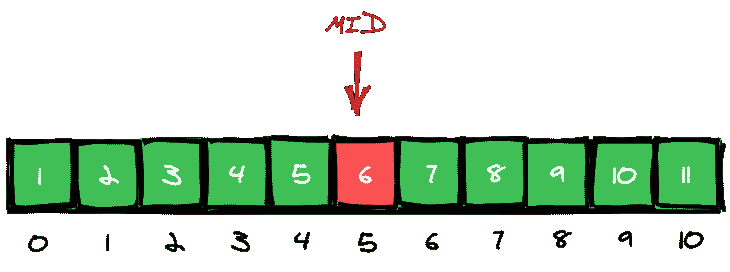
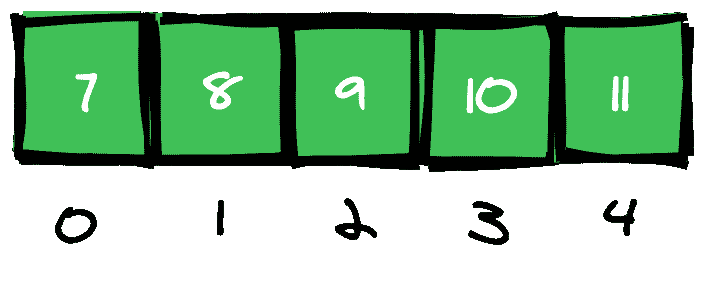
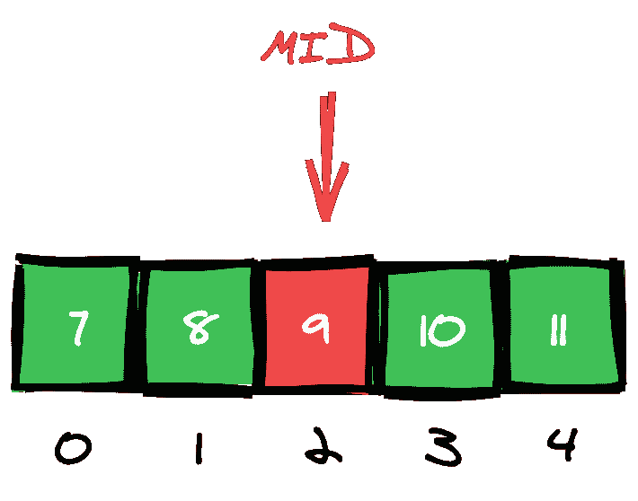
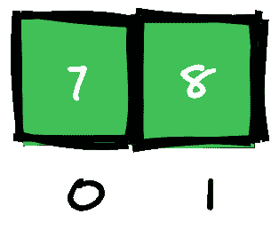

# 为什么二分搜索法是有用的

> 原文：<https://blog.logrocket.com/why-binary-search-is-useful/>

没有算法，计算机编程就不会一样。没有算法，计算机编程甚至可能不存在。计算机只知道做什么，因为有算法。

算法帮助我们构建更高效的代码，解决编程中的特定问题。他们可以在很多不同的情况下帮助我们。

算法非常容易理解，它们不依赖于任何特定的语言，即使不是开发人员的人也可以很容易地学习算法。

## 算法的重要性

正如 [MathVault](https://mathvault.ca/math-glossary/#algo) 所定义的，算法有:

> 有限的一系列定义明确的、计算机可执行的指令，用于解决一组特定的可计算问题。它接受有限数量的初始输入，在每个操作中明确地处理它们，然后在有限的时间内返回输出。

我们在任何事情上都在使用算法。软件、应用程序、框架、库等。都有一些算法运行在引擎盖下，帮助解决问题和提高性能。他们也会在开发人员的访谈中被提及，以了解开发人员如何思考和处理逻辑。

想象一个喜欢弹吉他的人，这个人非常清楚如何弹几首歌，但是他们不知道很多音乐理论。演奏乐器前学习乐理不是强制性的，但一定会帮助你理解几个需要知道的重要概念。它将向这个人展示音乐的另一个世界，音乐是如何工作的，如何演奏正确的音符，等等。

同样适用于算法和开发者。你可以是一个软件开发人员，却不懂算法。现在很多人开始学习如何编程，而不是从算法开始，但是熟悉算法可以帮助你思考代码和解决问题。

## 二分搜索法是如何运作的

我们在日常生活中可能会遇到很多情况，我们可以用二分搜索法来解决。例如，当我们想要在一个元素列表中搜索一个特定的元素时，我们找到的最常见的解决方案是遍历整个列表，如果元素存在就返回它。

但是这可能是一个问题，特别是如果我们想在一个巨大的列表中搜索一个特定的元素，这将导致糟糕的性能和运行时间太长。假设我们有一个包含一百万个元素的列表，我们想要搜索该列表中的一个特定元素，在最坏的情况下，我们会进行一百万次操作。

二分搜索法是一种非常有效和快速的算法，可以在一个有序的元素列表中找到一个元素，这种算法基于[分治](https://en.wikipedia.org/wiki/Divide-and-conquer_algorithm)的原理工作。

二分搜索法算法工作的第一步是对元素列表进行排序。假设我们有一个包含 12 个元素的列表，例如，我们想要查找数字 8。

记住，二分搜索法的工作原则是[分而治之](https://en.wikipedia.org/wiki/Divide-and-conquer_algorithm)。分而治之的方法是将一个问题分解成几个同样大小的小问题，直到它们变成几个简单的问题。

将我们的问题分解成一个或多个子问题，在我们的例子中，意味着将一个问题分解成几个更小的问题。但是首先，我们需要确定元素列表的中间，并将列表一分为二。

找到列表的中间元素后，我们需要进行比较。我们需要比较我们想要的元素的值和列表中间元素的值。

现在有三种可能的方法:

1.  我们正在寻找的值与列表的中间元素完全相同，所以我们返回它
2.  我们要寻找的值小于 mid 元素的值，所以我们将放弃列表的第二部分，继续处理第一部分
3.  我们要寻找的值大于 mid 元素的值，所以我们将放弃列表的第一部分，继续处理第一部分

在我们的例子中，我们要寻找的值大于 mid 元素的值，所以我们将放弃列表的第一部分，继续处理第二部分。

现在我们有了一个新的元素列表，我们需要再次执行相同的过程，找到列表中的中间元素，并将其与我们想要的值进行比较。

我们要寻找的值小于中间元素的值，所以我们可以放弃列表的第二部分，继续第一部分。

我们将在这里执行相同的过程，将列表分为两部分，找到中间的元素，并将该值与我们要寻找的数字进行比较。

因为列表中只有两个元素，所以中间的元素是第一个。我们想要的元素的值比 mid 元素的值大，所以我们在操作结束时返回了想要的元素。

这里需要考虑的一点是，二分搜索法只在一个有序的元素列表中工作，这就是为什么二分搜索法已经假设列表的中间元素包含列表的中值。在元素列表没有排序的情况下，没有办法使用二分搜索法，因为列表的中值可以在任何地方，当列表被分成两部分时，您正在搜索的元素可能会被截断。

* * *

### 更多来自 LogRocket 的精彩文章:

* * *

## 为什么有用？

众所周知，二分搜索法是一个 **O(log n)** ，这意味着我们操作的时间复杂度与其输入大小的对数成正比。

在这个例子中，对于一个包含 12 个元素的列表，我们只做了 3 次操作就返回了想要的元素，这令人印象深刻，非常高效。遍历列表，返回一个特定的元素，在这个例子中，我们至少要做 8 次操作。这种性能将不是快速和有效的，并且我们将以线性时间复杂度的函数结束。

现在想象一下，我们想要在一百万个元素的列表中搜索一个元素，我们仍然能够非常快速有效地运行操作。在这些场景中，我们总是需要考虑最坏的情况，并在元素的排序列表中搜索特定的元素，二分搜索法是理想的选择。

## 结论

算法在我们的生活中有重要的一部分，它们负责传递指令，告诉计算机做什么。算法可以帮助我们理解和改善逻辑思维，针对特定情况考虑不同的方法，并为问题选择正确的解决方案。二分搜索法是一个非常有效和快速的算法来搜索元素排序列表中的元素，它可以是非常有用的。

## 使用 [LogRocket](https://lp.logrocket.com/blg/signup) 消除传统错误报告的干扰

[LogRocket](https://lp.logrocket.com/blg/signup) 是一个数字体验分析解决方案，它可以保护您免受数百个假阳性错误警报的影响，只针对几个真正重要的项目。LogRocket 会告诉您应用程序中实际影响用户的最具影响力的 bug 和 UX 问题。

然后，使用具有深层技术遥测的会话重放来确切地查看用户看到了什么以及是什么导致了问题，就像你在他们身后看一样。

LogRocket 自动聚合客户端错误、JS 异常、前端性能指标和用户交互。然后 LogRocket 使用机器学习来告诉你哪些问题正在影响大多数用户，并提供你需要修复它的上下文。

关注重要的 bug—[今天就试试 LogRocket】。](https://lp.logrocket.com/blg/signup-issue-free)