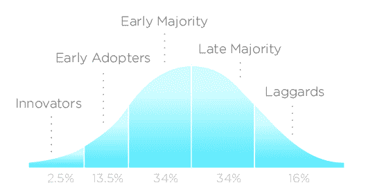

# 为什么产品采用策略在 B2B 场景中至关重要

> 原文：<https://blog.logrocket.com/product-management/why-product-adoption-strategy-crucial-b2b-scenarios/>

在本指南中，我们将定义产品采用，从较高的层面解释产品采用策略的目的，并描述一些真实世界的例子来说明为什么产品采用策略在 B2B 环境中尤其重要。

* * *

## 目录

* * *

## 什么是产品采用？

产品采用指的是这样一个过程，通过这个过程，用户意识到一个产品，确定它能提供的价值，并最终决定是重复使用它还是完全停止使用它。

产品采用生命周期通常被视为由五个阶段组成的钟形曲线:

1.  **创新者**——采用你的产品的第一批用户(通常占总销售额的 2.5%)
2.  早期采用者(占总销售额的 13.5%)
3.  **早期大多数** —一旦你的产品经过市场测试和验证，就会有更多的用户采用你的产品(约占总销售额的 34%)
4.  **后期多数** —在你的产品被广泛提供和采用后决定使用它的用户(约占总销售额的 34%)
5.  **落后者**——在最初的采用浪潮之后很久才采用你的产品的用户(约占总销售额的 16%)

## 什么是产品采用策略？

[产品战略](https://blog.logrocket.com/product-management/product-strategy-frameworks-examples/)通常确定关键合作伙伴、目标人物、初始细分市场和滩头阵地。一个合理的产品策略还必须包括一个采纳策略，该策略考虑了客户当前用来管理其工作的端到端业务流程。

比如拿一本飞机手册，不考虑飞行员如何训练就数字化，会导致采用率低。

虽然这个例子可能是显而易见的，但它仅仅触及了 B2B 环境中一个更大问题的表面:考虑(或未能考虑)这样一个事实，即这些环境通常包括多个利益相关者、真理系统和员工，他们可以决定 B2B 产品的成败。

## 数字不再是一个利基优势

在过去的几年中，数字化的成本已经大大降低，这使得它可以进入更广泛的市场。初创公司和现有公司都表现出了巨大的创新，可以为他们的客户释放价值。这些解决方案提供了可观的投资回报，改善了终端消费者体验，提高了客户的收入和利润。

全方位服务提供商，如保险业的凯德维亚(Guidewire)或酒店业的 Sabre，提供了一个总体架构，使其成为员工的真理体系。

无处不在的连接性使新的生态系统驱动因素和激励因素能够以新的方式与最终消费者保持联系，有机会提供单点解决方案，而不是完整的解决方案提供商。反过来，这一机会也吸引了衍生出支持微交易和增量收入机会的新产品。

最近这类司机的例子包括智能手机，它现在可以拍摄高分辨率的照片，最大限度地减少了物理检查的需要。NLP 机器人是即插即用的，它们可以访问信息系统，并有效地驱动[下一个最佳行动(NBA)](https://en.wikipedia.org/wiki/Next-best-action_marketing) ，在一些情况下无需人工干预。

那么，为什么这么多的[产品发布会](https://blog.logrocket.com/product-management/what-is-a-product-launch-plan-how-to-create/)失败了呢？把产品说成是糟糕的可能很有诱惑力，但是质量并不总是根本原因。正如阿尔贝托·赛唯雅在他的书《T3*、It 、T5【正确】中说得好，产品常常因为发布、运营或前提(翻牌)失败而失败。*

让我们考虑另一个角度。组织通常自始至终都有现有的工作流程，任何偏离都是不可取的。

在高度监管的行业，如保险业，改变流程的解决方案可能会导致阻力，无论其价值主张有多稳固。它需要改变业务流程，培训员工，有时还需要对客户进行新流程的培训。想象一下，为一家大型汽车保险公司培训 5，000 多名员工和 2，000 万名客户，会给你一个数量级。

这个例子表明，除了明确的好处之外，产品还需要适应更广泛的业务流程，易于使用，易于培训每个人。

## 未覆盖场景的情况

第二个问题是产品能够提供的覆盖范围。虽然 ROI 在它适用的情况下可能是巨大的，但是解决少数用例所需的过程重组的数量可能不会超过采用阈值。

在这方面经常出现的相关问题包括:

*   我如何决定将产品集成到客户当前业务流程的最佳方式，同时最小化采用摩擦？
*   除了最初的价值主张，客户还需要什么激励？
*   当产品及其伙伴关系不能解决整个问题集时，什么样的考虑推动了采用？
*   我计划如何推动初步采用？
*   我如何扩展产品，最终为生态系统中的每个人(即客户、他们的消费者、现有的解决方案提供商和产品)创造双赢的协同效应？

在我看来，[产品经理需要](https://blog.logrocket.com/product-management/product-managers-role-each-product-lifecycle-stage/):

*   确定难点和解决方案在业务流程中的位置，演示它在现有流程中的工作方式，并规划部署策略
*   确定简化解决方案的购买/构建策略，以最大化覆盖范围，并为 it 无法解决的工作部分指定简化的解决方案
*   审查一个可行的长期解决方案是否可行，并[定义长期愿景](https://blog.logrocket.com/product-management/what-is-a-product-vision-statement-examples/)以及构建该愿景所需的协同作用

## 超越主要痛点

几年前，人们开始意识到员工被顾客虐待，尤其是在酒店行业，这种现象开始出现在公众讨论中。一份 2016 年的报告显示，58%的酒店员工报告曾被一名客人性骚扰，据报道，由此导致的[诉讼](https://www.venzagroup.com/multi-million-dollar-settlement-lawsuit-sexual-assault-sofitel-hotel-reminder-hoteliers-need-rigorous-sexual-harassment-prevention-training/)超过 100 万美元。美国酒店及住宿协会(AHLA) [很快介入](https://www.ahla.com/5star)为酒店创建了一个为员工安装紧急按钮的程序。

几家初创公司(Track-n-Protect)和现有公司(React)看到了这个机会，硬件 TAM 市场价值 5 亿美元，经常性收入 1 亿美元。硬件不复杂；安装伙伴可用。

尽管它们使用简单，管理规范，成本合理(五年内的总拥有成本为 20，000-30，000 美元)，但它们还没有进入市场。你可以责怪 covid 没有被采纳——我知道这是一个因素，但完全责怪疫情是目光短浅的。

真正的失败发生在这里:重点是产品规格、降低成本和 UI 屏幕，而不是与前台和后台员工使用的现有系统集成。

想象一下，向前台员工解释他们需要切换到另一个系统，审查情况，并在紧急情况下迅速采取行动。他们是如何被训练的并不重要；他们的肌肉记忆会迫使他们本能地做他们最熟悉的事情。后台团队需要向执法部门提交一份报告。

让他们切换到另一个外星系统也会导致采用摩擦。硬件安装之外的部署考虑应考虑事实来源(Sabre 或 Amadeus)内的配置，以及在同一系统内呈现状况的能力，包括提供使用来自所有系统的信息提取综合报告的能力。

换句话说，在现有的业务流程中缺乏对单点解决方案的集成视角预示着一个好产品的失败。

从好的方面来看，Tractable AI 提供了一种利用照片来识别损坏并预测维修估计的产品。一方面，他们利用了生态系统(来自智能手机的图片，基于人工智能的预测框架)。他们了解他们的解决方案在整个业务流程中的重要性。

这种敏锐的理解使他们进入了细分市场(数字原生保险公司，如 Root)，在那里他们迅速证明了价值。然后，他们扩展到更大的运营商，如 GEICO，并集成到系统，如凯德维亚，以提供无缝解决方案。

* * *

订阅我们的产品管理简讯
将此类文章发送到您的收件箱

* * *

## 绘制生态系统及其进化的地图

当一辆车全损时(美国每年大约有 500 万辆汽车全损)，保险公司必须考虑复杂的情况，文书工作可能令人难以置信。在平均约 10 年的时间里，这些汽车中大约有 50%可能仍有未偿还贷款。

有些国家在所有情况下都允许数字签名；其他国家有条件地允许(根据贷款状况)。一些州要求公证，一个子集允许电子公证。实际上，这些总损耗中约有 20%可以通过端到端的数字方式实现。

仅仅提供一个电子签名解决方案很少会推动采用。它需要端到端的思维方式和简化流程的短期解决方案(事实上，从客户的角度来看，无论情况如何，都要使流程看起来是一样的)。

从保险公司的角度来看，这种转变是巨大的。潜在的经济因素非常强大。

然而，它扰乱了基本的业务流程。当报价提供了一种电子收集签名的方法，但让员工在两种方法之间切换时，它会稀释价值主张，并极大地增加采用的障碍。记住，投资回报率是来自总损失的 20%，而不是剩下的 80%。

解决这种情况并推动市场渗透的一种方法是，从保险公司的角度来看，使该过程看起来相同，即使这最初意味着相当大的现金注入。

确定另一组合作伙伴可能是一个很好的起点。与一个有潜力在长期旅程中与你同行的高度激励的伙伴一起启动一项战略，会使它更加有效。

例如，如果一个供应商提供了一套工具，使您能够自动填充文书工作，并以数字方式发送消费者可以直接签名的文件。自动化将通过物理打印聚合器将剩余的文书工作发送给消费者。然后，运营部门可以处理任何异常情况。这个操作部门最初可能需要做一些繁重的工作。

[产品经理的职责是](https://blog.logrocket.com/product-management/what-does-a-product-manager-do-role-responsibilities/)确定五年的前景应该是什么样的:

*   公司应该推动规章制度的改变吗？
*   哪一方受到激励(在这种情况下，将是打捞场和保险公司)？
*   新法规在哪里制定？
*   我们合作的目标客户中，谁能从当前产品中获得最大收益？
*   我们现在需要的合作伙伴是谁？我们稍后可以用价值证明说服谁？
*   哪些合作伙伴在适当的激励下可以成为长期愿景的一部分(例如，现在和将来拥有一套有凝聚力的解决方案)？

总的来说，正的净现值(NPV)是可论证的吗？盈亏平衡点在哪里？该公司是否有承担这一任务的心态和能力？这些将是需要回答的关键问题。

## 摘要

在考虑问题的解决方案时，几个评估是至关重要的。假设问题是可行的，可行的，令人满意的，可用性需要超越典型的“好的用户界面”的 UX 框架

领域和业务流程知识以及在几乎所有情况下保持简单和一致的能力极大地增加了成功的可能性。

*精选图片来源:[icon scout](https://iconscout.com/icon/strategy-1633190)*

## [LogRocket](https://lp.logrocket.com/blg/pm-signup) 产生产品见解，从而导致有意义的行动

[LogRocket](https://lp.logrocket.com/blg/pm-signup) 确定用户体验中的摩擦点，以便您能够做出明智的产品和设计变更决策，从而实现您的目标。

使用 LogRocket，您可以[了解影响您产品的问题的范围](https://logrocket.com/for/analytics-for-web-applications)，并优先考虑需要做出的更改。LogRocket 简化了工作流程，允许工程和设计团队使用与您相同的[数据进行工作](https://logrocket.com/for/web-analytics-solutions)，消除了对需要做什么的困惑。

让你的团队步调一致——今天就试试 [LogRocket](https://lp.logrocket.com/blg/pm-signup) 。

[Harish Natarahjan Follow](https://blog.logrocket.com/author/harishnatarahjan/) Harish brings 18+ years of product, strategy and technology expertise, delivering solutions in mission-critical environments in public safety, discrete manufacturing, and insurance verticals.