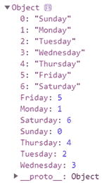

# 为什么打字稿枚举吸-日志火箭博客

> 原文：<https://blog.logrocket.com/why-typescript-enums-suck/>

TypeScript 引入了许多静态类型语言中常见的新语言特性，例如[类](https://www.typescriptlang.org/docs/handbook/classes.html)(现在是 JavaScript 语言的一部分)[接口](https://www.typescriptlang.org/docs/handbook/interfaces.html)、[泛型](https://www.typescriptlang.org/docs/handbook/generics.html)和[联合类型](https://www.typescriptlang.org/docs/handbook/advanced-types.html#union-types)，等等。

但是今天我们要讨论一种特殊的类型，那就是[枚举](https://www.typescriptlang.org/docs/handbook/enums.html)。

Enum 是 Enumerated Type 的缩写，是许多静态类型语言(如 C、C#、Java 和 Swift)的常见语言特性。它是一组命名的常量值，可以在代码中使用。

让我们在 TypeScript 中创建一个枚举来表示一周中的每一天:

```
enum DayOfWeek {
  Sunday,
  Monday,
  Tuesday,
  Wednesday,
  Thursday,
  Friday,
  Saturday
};
```

使用 enum 关键字后跟枚举名称(`DayOfWeek`)来表示枚举。然后，我们定义我们希望对枚举可用的常数值。

现在，我们可以创建一个函数来确定是否是周末，并使用参数 enum:

```
function isItTheWeekend(day: DayOfWeek) {
  switch (day) {
    case DayOfWeek.Sunday:
    case DayOfWeek.Saturday:
      return true;

    default:
      return false;
  }
}
```

最后，我们可以这样称呼它:

```
console.log(isItTheWeekend(DayOfWeek.Monday)); // logs 'false'
```

这是一种在代码基中消除使用幻值的好方法，因为我们有彼此相关的类型安全表示选项。

但是事情并不总是像它们看起来的那样。

如果通过 TypeScript 编译器，您认为会得到什么？

```
console.log(isItTheWeekend(2)); // is this valid?
```

知道这是**有效的类型脚本**可能会让你吃惊，编译器会很乐意为你接受它。

## 为什么会这样？

编写这段代码可能会让您认为已经发现了 TypeScript 类型系统中的一个 bug，但事实证明这是这种类型的枚举的预期行为。

我们在这里所做的是创建一个**数字枚举**，如果我们看一下生成的 JavaScript，可能会更清楚一点:

```
var DayOfWeek;
(function (DayOfWeek) {
    DayOfWeek[DayOfWeek["Sunday"] = 0] = "Sunday";
    DayOfWeek[DayOfWeek["Monday"] = 1] = "Monday";
    DayOfWeek[DayOfWeek["Tuesday"] = 2] = "Tuesday";
    DayOfWeek[DayOfWeek["Wednesday"] = 3] = "Wednesday";
    DayOfWeek[DayOfWeek["Thursday"] = 4] = "Thursday";
    DayOfWeek[DayOfWeek["Friday"] = 5] = "Friday";
    DayOfWeek[DayOfWeek["Saturday"] = 6] = "Saturday";
})(DayOfWeek || (DayOfWeek = {}));
```

如果我们把它输出到控制台:



您会注意到 enum 实际上只是一个带有属性的 JavaScript 对象。

它有我们定义的命名属性，它们被赋予一个数字，代表它们在 enum 中的位置(Sunday 是 0，Saturday 是 6)，但是对象也有数字键，有一个字符串值代表命名的常量。

因此，我们可以将数字传递给需要枚举的函数。枚举本身既是一个数字，也是一个定义的常数。

## 当这有用时

您可能会想，这似乎不是特别有用，因为如果您可以将任意数字传递给需要枚举的函数，这实际上破坏了 TypeScript 的整个类型安全方面。那么它为什么有用呢？

假设您有一个在被调用时返回 JSON 有效负载的服务，并且您希望将该服务的一个属性建模为一个枚举值。

在您的数据库中，您可能将该值存储为一个数字。通过将其定义为 TypeScript 枚举，我们可以正确地转换它:

```
const day: DayOfWeek = 3;
```

在赋值过程中进行的这种显式转换会将 day 变量从一个数字转换为我们的 enum，这意味着当它在我们的代码库中传递时，我们可以更好地理解它所代表的内容。

### 控制枚举的编号

由于枚举成员的编号是根据它们在枚举定义中出现的顺序来定义的，所以在检查生成的代码之前，值是什么可能有点不清楚，但这是我们可以控制的:

```
enum FileState {
  Read = 1,
  Write = 2
}
```

这是一个新的枚举，它模拟了文件可能处于的状态。

它可能处于读或写模式，我们已经明确定义了与该模式对应的**值**(我刚刚编造了这些值，但它可能来自我们的文件系统)。

现在很清楚对于这个枚举什么值是有效的，因为我们已经明确地做了。

### 位标志

但是还有另一个原因，这可能是有用的，那就是为位标志使用枚举。

* * *

### 更多来自 LogRocket 的精彩文章:

* * *

让我们从上面的`FileState`枚举中为文件添加一个新的状态，`ReadWrite`:

```
enum FileState {
  Read = 1,
  Write = 2,
  ReadWrite = 3
}
```

然后，假设我们有一个接受枚举的函数，我们可以编写如下代码:

```
const file = await getFile("/path/to/file", FileState.Read | FileState.Write);
```

注意，我们在`FileState`枚举上使用了`|`操作符。

这允许我们对它们执行按位操作来创建一个新的枚举值——在这种情况下，它将创建 3，这是`ReadWrite`状态的值。

事实上，我们可以用更清晰的方式来写:

```
enum FileState {
  Read = 1,
  Write = 2,
  ReadWrite = Read | Write
}
```

现在`ReadWrite`成员不是手工编码的常量:很明显，它是由 enum 的其他成员的按位运算组成的。

尽管如此，我们必须小心使用枚举。

以下面的枚举为例:

```
enum Foo {
  A = 1,
  B = 2,
  C = 3,
  D = 4,
  E = 5
}
```

如果我们要接收枚举值`E`(或 5)，那是`Foo.A | Foo.D or Foo.B | Foo.C`的逐位运算的结果吗？

因此，如果期望我们使用这样的按位枚举，我们希望确保我们如何得到这个值是非常明显的。

### 控制指标

我们已经看到，默认情况下，一个枚举会被赋予一个数值，或者我们可以显式地对所有枚举赋值。

除此之外，我们还可以在它们的子集上进行:

```
enum DayOfWeek {
  Sunday,
  Monday,
  Tuesday,
  Wednesday = 10,
  Thursday,
  Friday,
  Saturday
}
```

这里，我们指定值 10 代表星期三，但是其他的都保持原样。

那么，JavaScript 会产生什么呢？

```
var DayOfWeek;
(function (DayOfWeek) {
    DayOfWeek[DayOfWeek["Sunday"] = 0] = "Sunday";
    DayOfWeek[DayOfWeek["Monday"] = 1] = "Monday";
    DayOfWeek[DayOfWeek["Tuesday"] = 2] = "Tuesday";
    DayOfWeek[DayOfWeek["Wednesday"] = 10] = "Wednesday";
    DayOfWeek[DayOfWeek["Thursday"] = 11] = "Thursday";
    DayOfWeek[DayOfWeek["Friday"] = 12] = "Friday";
    DayOfWeek[DayOfWeek["Saturday"] = 13] = "Saturday";
})(DayOfWeek || (DayOfWeek = {}));
```

最初，这些值是使用它们在索引中的位置定义的，星期日到星期二是 0 到 2。

然后，当我们在星期三重置顺序时，之后的所有内容都从新的起始位置开始递增。

如果我们要做这样的事情，这可能会有问题:

```
enum DayOfWeek {
  Sunday,
  Monday,
  Tuesday,
  Wednesday = 10,
  Thursday = 2,
  Friday,
  Saturday
}
```

我们已经制作了 Thursday 2，那么我们生成的 JavaScript 看起来像什么呢？

```
var DayOfWeek;
(function (DayOfWeek) {
    DayOfWeek[DayOfWeek["Sunday"] = 0] = "Sunday";
    DayOfWeek[DayOfWeek["Monday"] = 1] = "Monday";
    DayOfWeek[DayOfWeek["Tuesday"] = 2] = "Tuesday";
    DayOfWeek[DayOfWeek["Wednesday"] = 10] = "Wednesday";
    DayOfWeek[DayOfWeek["Thursday"] = 2] = "Thursday";
    DayOfWeek[DayOfWeek["Friday"] = 3] = "Friday";
    DayOfWeek[DayOfWeek["Saturday"] = 4] = "Saturday";
})(DayOfWeek || (DayOfWeek = {}));
```

哦哦，看起来可能有一个问题:2 是星期二和星期四！

如果这是一个来自某种数据源的值，我们的应用程序就会有一些模糊性。

因此，如果我们要设置值，最好设置所有的值，这样它们是什么就很明显了。

## 非数字枚举

到目前为止，我们只讨论了数值型枚举或为枚举值显式赋值的枚举，但枚举不一定是数值，它可以是任何常量或计算值:

```
enum DayOfWeek {
  Sunday = "Sun",
  Monday = "Mon",
  Tuesday = "Tues",
  Wednesday = "Wed",
  Thursday = "Thurs",
  Friday = "Fri",
  Saturday = "Sat"
}
```

这里我们做了一个字符串枚举，生成的代码有很大不同:

```
var DayOfWeek;
(function (DayOfWeek) {
    DayOfWeek["Sunday"] = "Sun";
    DayOfWeek["Monday"] = "Mon";
    DayOfWeek["Tuesday"] = "Tues";
    DayOfWeek["Wednesday"] = "Wed";
    DayOfWeek["Thursday"] = "Thurs";
    DayOfWeek["Friday"] = "Fri";
    DayOfWeek["Saturday"] = "Sat";
})(DayOfWeek || (DayOfWeek = {}));
```

现在我们不能再向`isItTheWeekend`函数传递数字，因为 enum 不是数字。然而，我们也不能传入任意的字符串，因为 enum 知道什么字符串值是有效的。

这确实引入了另一个问题—我们不能再这样做了:

```
const day: DayOfWeek = "Mon";
```

该字符串不能直接赋给枚举类型。相反，我们必须进行显式强制转换:

```
const day = "Mon" as DayOfWeek;
```

这可能会对我们如何使用要用作枚举的值产生影响。

但是为什么要止步于字符串呢？事实上，我们可以在枚举本身中混合和匹配枚举的值:

```
enum Confusing {
  A,
  B = 1,
  C = 1 << 8,
  D = 1 + 2,
  E = "Hello World".length
}
```

假设所有可赋值的值都是同一类型(在本例中是数字)，我们可以用许多不同的方法生成这些数字，包括计算值。如果它们都是常量，我们可以混合类型来创建一个异构枚举:

```
enum MoreConfusion {
  A,
  B = 2,
  C = "C"
}
```

这非常令人困惑，并且很难理解数据在枚举背后是如何工作的。因此，建议您不要使用异构枚举，除非您真的确定这是您所需要的。

## 结论

如果使用得当，TypeScript 中的枚举是对 JavaScript 语言非常有用的补充。

它们可以帮助弄清楚应用程序中可能存在的通常“神奇的值”(字符串或数字)的意图，并给出它们的类型安全视图。

但是，就像一个人工具箱中的任何工具一样，如果它们使用不当，就会变得不清楚它们代表什么以及应该如何使用。

## [LogRocket](https://lp.logrocket.com/blg/typescript-signup) :全面了解您的网络和移动应用

[](https://lp.logrocket.com/blg/typescript-signup)

LogRocket 是一个前端应用程序监控解决方案，可以让您回放问题，就像问题发生在您自己的浏览器中一样。LogRocket 不需要猜测错误发生的原因，也不需要向用户询问截图和日志转储，而是让您重放会话以快速了解哪里出错了。它可以与任何应用程序完美配合，不管是什么框架，并且有插件可以记录来自 Redux、Vuex 和@ngrx/store 的额外上下文。

除了记录 Redux 操作和状态，LogRocket 还记录控制台日志、JavaScript 错误、堆栈跟踪、带有头+正文的网络请求/响应、浏览器元数据和自定义日志。它还使用 DOM 来记录页面上的 HTML 和 CSS，甚至为最复杂的单页面和移动应用程序重新创建像素级完美视频。

[Try it for free](https://lp.logrocket.com/blg/typescript-signup)

.