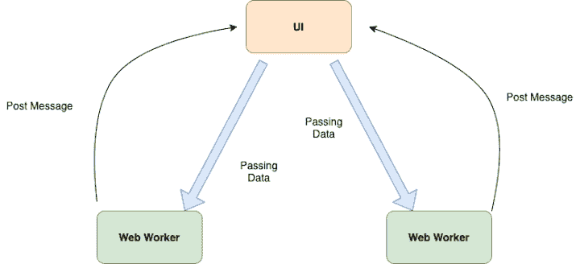
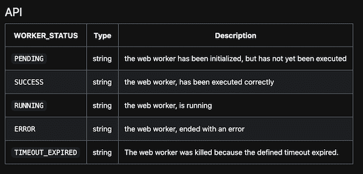
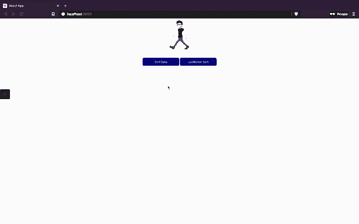
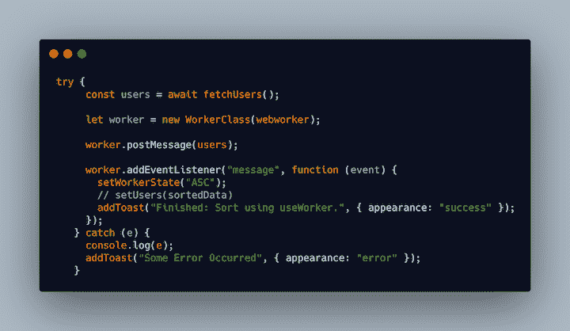
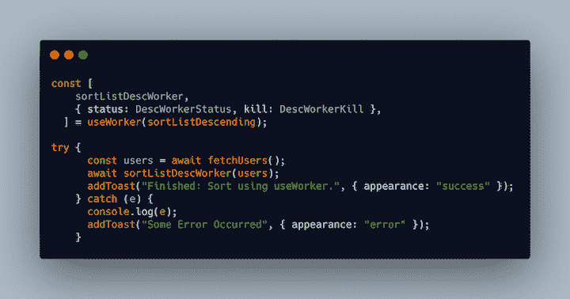

# 为什么你应该使用 useWorker 

> 原文：<https://blog.logrocket.com/why-you-should-be-using-useworker/>

Web workers 是在后台运行任务和其他功能的工作线程。

在本指南中，我们将探索使用 web workers 的基础知识，完成`useWorker`实现，并构建一个演示应用程序，这样您就可以看到运行中的库。我们还将回顾一些真实世界的用例以及关于 web 工作者的有趣事实。

## 为什么要使用 web workers？

您可能会想，“为什么我需要在后台运行任何东西？”看看下面的演示。


正如你所看到的，当你点击按钮时，应用程序的用户界面冻结了几秒钟。停顿后，举杯表示动作完成。

这里我们有两个组件:一个用于渲染动画，另一个用于处理数千条记录的繁重计算。只要你点击按钮，它就开始计算，这导致用户界面冻结。

显然，这导致了低劣的用户体验。用户不应该等待一个特定的动作完成。Web workers 解决了这个问题，它允许您在后台运行大量计算任务，而不会影响 UI 线程。

## 网络工作者如何工作



当您的应用程序需要运行繁重的计算任务时，工作线程将在独立于主 UI 线程的线程中处理计算。您可以将数据从主线程传递给工作线程。

一旦工作线程完成一个任务，它将向主线程发送一条消息。然后，您可以基于该消息更新您的主 UI 线程。

## 履行

为了描绘一幅基本的画面并展示 web worker 的易用性，让我们从实现一个不使用`useWorker`钩子的 web worker 开始。

### Web worker API

创建一个 react 组件，并添加以下代码。

```
import React, { useEffect, useState } from "react";
import { fetchUsers } from "../../utils/sortData";
import { useToasts } from "react-toast-notifications";
import "./index.css";
import webworker from "../../utils/app.worker";
import WorkerClass from "./Worker";
const WebWorker = () => {
  const [workerState, setWorkerState] = useState("DESC");
  const { addToast } = useToasts();

  const sortWorkerData = async () => {};

  return (
    <div className="user-div">
      <button
        className="sort-button"
        onClick={sortWorkerData}
      >
        {" "}
        Worker Sort
      </button>
    </div>
  );
};
export default WebWorker;

```

在这里，我们有一个按钮，当点击时，执行一个繁重的计算任务。让我们把这个功能带给我们的网络工作者。

首先，在 JavaScript 的`Worker`类周围创建一个包装类，`Worker.js`。

```
export default class WebWorker {
  constructor(worker) {
    const code = worker.toString();
    const blob = new Blob(["(" + code + ")()"]);
    return new Worker(URL.createObjectURL(blob));
  }
}

```

这将使用工作线程函数返回一个新的`Worker`对象。

接下来，在组件中导入`Worker`类包装器。

```
import WorkerClass from "./Worker";

```

下一步是创建工作线程来处理计算任务。

```
export default () => {
  self.addEventListener("message", (e) => {// eslint-disable-line no-restricted-globals
    if (!e) return;
    let users = e.data;
    const copy = [...users];
    for (var i = 0; i < copy.length - 1; i++) {
      for (var j = i + 1; j < copy.length; j++) {
        if (copy[i].commentCount < copy[j].commentCount) {
          var t = copy[i];
          copy[i] = copy[j];
          copy[j] = t;
        }
      }
    }
    postMessage(copy);
  });
};

```

上面的代码添加了一个事件监听器，其中线程执行一个计算任务，并在完成后执行`postMessage`。

让我们在组件中导入它。

```
import webworker from "../../utils/app.worker";

```

现在该包装组件了。添加功能。

```
const sortWorkerData = async () => {
    try {
      const users = await fetchUsers();
      let worker = new WorkerClass(webworker);
      worker.postMessage(users);
      worker.addEventListener("message", function (event) {
        setWorkerState("ASC");
        // setUsers(sortedData)
        addToast("Finished: Sort using useWorker.", { appearance: "success" });
      });
    } catch (e) {
      console.log(e);
      addToast("Some Error Occurred", { appearance: "error" });
    }
  };

```

首先，获取所有用户数据，并在实例化`WorkerClass`之前创建一个 worker 对象，它是`Worker`的包装器。

接下来，`postMessage`将用户的数据传给工作线程。一旦计算任务完成，它就触发带有结果的监听事件。


## `useWorker`

到目前为止，我们已经讨论了如何在 React 应用程序中实现 web worker API。web worker API 的一个问题是很难跟踪工作者的状态。

正如你在演示中看到的，很难判断一个工作线程是否正在运行，除非它已经完成。随着应用程序中线程数量的增加，这将变得越来越困难。

`useWorker`为盘子增加了四个主要特征:

1.  跟踪工作线程状态
2.  终止线程的选项
3.  可维护性
4.  可读性

要在您的应用程序中安装`useWorker`:

```
npm i @koale/useworker

```

让我们实现`useWorker`来看看它是如何工作的。

```
import React, { useEffect, useState } from "react";
import {
  fetchUsers,
  sortListDescending,
  sortListAscending,
} from "../../utils/sortData";
import { useWorker, WORKER_STATUS } from "@koale/useworker";
import { useToasts } from "react-toast-notifications";
import "./index.css";
const UserList = () => {
  const [users, setUsers] = useState([]);
  const { addToast } = useToasts();
  const [
    sortListDescWorker,
    { status: DescWorkerStatus, kill: DescWorkerKill },
  ] = useWorker(sortListDescending);
  useEffect(() => {
    async function fetchData() {
      const user = await fetchUsers();
      setUsers(user);
    }
    fetchData();
  }, []);
  const sortWorkerData = async () => {
    try {
      const users = await fetchUsers();
      await sortListDescWorker(users);
      addToast("Finished: Sort using useWorker.", { appearance: "success" });
    } catch (e) {
      console.log(e);
      addToast("Some Error Occurred", { appearance: "error" });
    }
  };
  return (
    <div className="user-div">
      <button
        className="sort-button"
        disabled={DescWorkerStatus === WORKER_STATUS.RUNNING}
        onClick={sortWorkerData}
      >
        {DescWorkerStatus === WORKER_STATUS.RUNNING
          ? `Loading`
          : "useWorker Sort"}
      </button>
      {DescWorkerStatus === WORKER_STATUS.RUNNING ? (
        <button className="sort-button" onClick={DescWorkerKill}>
          Kill Worker
        </button>
      ) : null}
    </div>
  );
};
export default UserList;

```

首先，用一个计算任务繁重的函数实现`useWorker`。

```
 const [
    sortListDescWorker,
    { status: DescWorkerStatus, kill: DescWorkerKill },
  ] = useWorker(sortListDescending);

```

`useWorker`导出三个参数:

1.  工作线程调用函数
2.  工作线程的状态
3.  函数来终止线程

调用工作线程函数以及要传递的数据。

```
  const sortWorkerData = async () => {
    try {
      const users = await fetchUsers();
      await sortListDescWorker(users);
      addToast("Finished: Sort using useWorker.", { appearance: "success" });
    } catch (e) {
      console.log(e);
      addToast("Some Error Occurred", { appearance: "error" });
    }
  };

```

就这么简单！`useWorker`将 web worker 的状态更新到组件。您可以使用它来根据状态更新 UI。



## `useWorker`最终演示



## `useWorker`的主要特点

让我们退一步，回顾一下使用`useWorker`的主要优势。

如前所述，`useWorker`为我们提供了一个很好的包装函数，可以根据工作线程的状态来更新 UI。它还提供了一个包装函数来终止线程。

钩子使你能够使用 web worker API 编写可读和可维护的代码。

让我们看看有和没有`useWorker`的代码是什么样子。

### 不带`useWorker`



### 用`useWorker`



## 结论

我们都知道钩子是 React 生态系统中编写组件的首选方式。将是在应用程序中使用 web workers 的最优雅的方式，主要是由于可读性和可维护性的好处。

自己试试吧，在评论里告诉我们效果如何。编码快乐！

## 使用 LogRocket 消除传统反应错误报告的噪音

[LogRocket](https://lp.logrocket.com/blg/react-signup-issue-free)

是一款 React analytics 解决方案，可保护您免受数百个误报错误警报的影响，只针对少数真正重要的项目。LogRocket 告诉您 React 应用程序中实际影响用户的最具影响力的 bug 和 UX 问题。

[ ](https://lp.logrocket.com/blg/react-signup-general) [  ](https://lp.logrocket.com/blg/react-signup-general) [LogRocket](https://lp.logrocket.com/blg/react-signup-issue-free)

自动聚合客户端错误、反应错误边界、还原状态、缓慢的组件加载时间、JS 异常、前端性能指标和用户交互。然后，LogRocket 使用机器学习来通知您影响大多数用户的最具影响力的问题，并提供您修复它所需的上下文。

关注重要的 React bug—[今天就试试 LogRocket】。](https://lp.logrocket.com/blg/react-signup-issue-free)