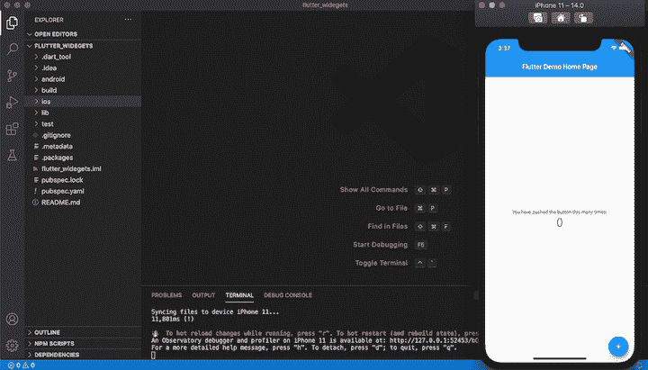
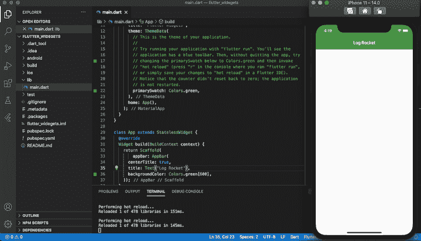
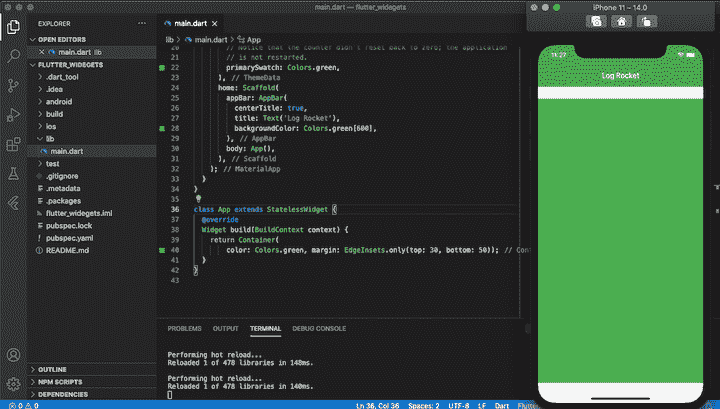
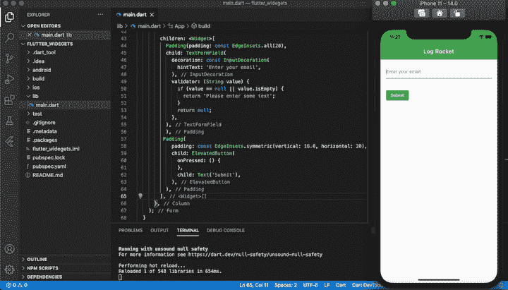
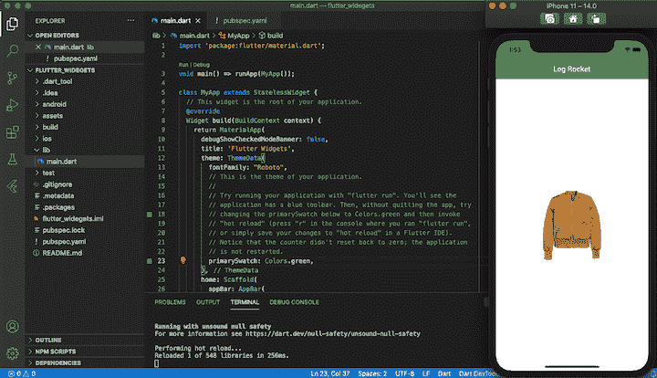

# widgets:Flutter 应用程序的构建模块

> 原文：<https://blog.logrocket.com/widgets-the-building-blocks-of-flutter-apps/>

小部件是任何 Flutter 应用程序的组成部分。知道何时以及如何使用小部件是任何希望用 Flutter 构建跨平台应用的开发者的基本技能。

在本教程中，我们将探索一些最常用的[颤振部件](https://flutter.dev/docs/development/ui/widgets-intro)。我们将演示如何使用小部件来布局您的应用程序，添加文本和输入字段，创建图标和图像，等等。

以下是我们将要介绍的内容:

要跟随这个 Flutter widgets 教程，您应该具备:

*   熟悉 Dart 编程语言
*   用于测试的 iOS 或 Android 模拟器/仿真器
*   代码编辑器(例如 VS 代码)
*   一[对 React](https://blog.logrocket.com/static-site-generation-with-react-from-scratch/) 的基本理解

## 什么是颤振？

[Flutter](https://flutter.dev/) 是由谷歌创建的开源 UI 软件开发工具包，用于从单一代码库开发适用于 iOS、Android、Linux、Mac、Windows、Google Fuchsia 和 web 的应用程序。Flutter 是用 Dart 编程语言编写的，这使得它成为跨平台软件开发的理想框架。

Dart 是一种客户端优化的面向对象语言，具有 C 风格的语法，用于构建移动、web、服务器和桌面应用程序。

### 安装 Flutter SDK

要构建一个 Flutter 应用程序，您需要在开发机器上安装 Flutter SDK。

#### 苹果个人计算机

首先下载 Mac 操作系统的[最新稳定版 Flutter SDK](https://blog.logrocket.com/wp-admin/post.php?post=46301&action=edit&classic-editor) 。

将以下代码复制/粘贴到您的终端中。导航到您的下载文件夹，并将 flutter SDK 解压缩到您的开发文件夹中。

```
 cd ~/development
unzip ~/Downloads/flutter_macos_2.0.3-stable.zip

```

接下来，将颤振工具添加到您的`$PATH`:

```
export PATH="$PATH:`pwd`/flutter/bin"

```

这只会设置您当前的终端会话`$PATH`。要将颤振工具添加到您的全局`$PATH`中，请使用以下代码:

```
export PATH="$PATH:[PATH_OF_FLUTTER_GIT_DIRECTORY]/bin"

```

请务必将`[PATH_OF_FLUTTER_GIT_DIRECTORY]`更改到您的 Flutter SDK 的位置。

运行 Flutter doctor 来安装其他所需的依赖项。运行`which flutter`确认安装成功。您应该会得到与下面类似的输出:

```
  $ which flutter
  /path-to-flutter-sdk/bin/flutter

```

#### Windows 操作系统

下载最新稳定版的 [Flutter SDK for Windows](https://storage.googleapis.com/flutter_infra/releases/stable/windows/flutter_windows_2.0.3-stable.zip) 。

提取下载的。zip 文件，并将 Flutter 文件夹放在您想要的 flutter SDK 安装位置(例如，`C:\src\flutter`)

要从控制台内的任何位置运行 Flutter 命令，请执行以下步骤:

1.  从开始搜索栏，输入`env`并选择**为您的账户**编辑环境变量
2.  在**用户变量**下，检查是否有名为**路径**的条目
3.  如果条目存在，使用`;`作为现有值的分隔符，将完整路径附加到`flutter\bin`
4.  如果条目不存在，创建一个名为`Path` 的新用户变量，将 `flutter\bin` 的完整路径作为其值

现在我们已经安装并设置了 Flutter SDK，让我们实际构建一个 Flutter 应用程序来演示小部件是如何工作的。

打开您的`Terminal`(Mac 用户)或`command prompt`(Windows 用户)。运行以下命令创建一个新的 Flutter 应用程序:

```
flutter create flutter_widegets 

```

打开你的模拟器和颤振运行运行默认的颤振应用。您应该会得到与下面的屏幕截图类似的输出:



设置好基本的 Flutter 应用程序后，让我们仔细看看一些流行的小部件，看看它们如何工作以及何时使用它们。

在这一节中，我们将演示如何使用[材质组件部件](https://flutter.dev/docs/development/ui/widgets/material)在中[创建一个布局。](https://flutter.dev/docs/development/ui/layout)

### 脚手架

支架类就像一个 Flutter 应用程序的架构图。它通常包含章节，如正文、[、`appBar`、](https://blog.logrocket.com/flutter-appbar-tutorial/)、标题等。，包括基本的材料设计视觉布局结构。

将下面的代码复制/粘贴到您的`main.dart`文件中:

```
import 'package:flutter/material.dart';
void main() => runApp(MyApp());
class MyApp extends StatelessWidget {

  @override
  Widget build(BuildContext context) {
    return MaterialApp(
      debugShowCheckedModeBanner: false,
      title: 'Flutter Widgets',
      theme: ThemeData(
        primarySwatch: Colors.green,
      ),
      home: App(),
    );
  }
}
class App extends StatelessWidget {
  @override
  Widget build(BuildContext context) {
    return Scaffold(
        appBar: AppBar(
      centerTitle: true,
      title: Text('Log Rocket'),
      backgroundColor: Colors.green[600],
    ));
  }
}

```

要刷新您的应用程序，请在运行应用程序实例的终端上按`r`。它应该是这样的:



### 容器

如果像我一样，您来自 web 开发背景，您应该熟悉容器。容器是一个`div`，它充当其他`div`的父对象，而其他`div`自动成为它的直接子对象。

在 Flutter 中，`container`带有默认的`padding`，通过在它们周围添加额外的空间来帮助定位它的直接后代或子代。如果您让`child element`或`elements`没有`padding`或`margin`，将会继承默认样式。

当您在容器中指定`width`或`height`或任何`constraints`属性时，它会自动失去其默认行为。你可以通过[官方文档](https://pub.dev/documentation/velocity_x/latest/velocity_x/VxBox-class.html)了解更多关于`container`小部件及其约束的信息。

### 填充和边距

[`EdgeInsets`类](https://api.flutter.dev/flutter/painting/EdgeInsets-class.html)使你能够为你的 Flutter 应用元素的特定方面设置填充和边距。`EdgeInsets`还有其他选项:

```
    - `EdgeInsets.all()`    - `EdgeInsets.only(left: 0, top: 0)`    - `EdgeInsets.symmetric(vertical: 0, horizontal: 0)`    - `EdgeInsets.fromLTRB(left, top, right, bottom)`

```

要查看`EdgeInsets`的运行，用下面的代码更新`main.dart`:

```
import 'package:flutter/material.dart';
void main() => runApp(MyApp());
class MyApp extends StatelessWidget {

  @override
  Widget build(BuildContext context) {
    return MaterialApp(
      debugShowCheckedModeBanner: false,
      title: 'Flutter Widgets',
      theme: ThemeData(
        primarySwatch: Colors.green,
      ),
      home: Scaffold(
        appBar: AppBar(
          centerTitle: true,
          title: Text('Log Rocket'),
          backgroundColor: Colors.green[600],
        ),
        body: App(),
      ),
    );
  }
}
class App extends StatelessWidget {
  @override
  Widget build(BuildContext context) {
    return Container(
        color: Colors.green, margin: EdgeInsets.only(top: 30, bottom: 50));
  }
}

```

当您重新加载应用程序时，它应该是这样的:



### 行和列

`Row`和`Column`是颤振中最常用的两种布局模式。一个`Row`和`Column`每个都有一个子部件列表。它们可以使用带有特定约束的 [`MainAxisAlignment`](https://api.flutter.dev/flutter/rendering/MainAxisAlignment-class.html) 和 [`CrossAxisAlignment`](https://api.flutter.dev/flutter/rendering/CrossAxisAlignment-class.html) 类进行垂直和水平对齐。

```
import 'package:flutter/material.dart';
void main() => runApp(MyApp());
class MyApp extends StatelessWidget {

  @override
  Widget build(BuildContext context) {
    return MaterialApp(
      debugShowCheckedModeBanner: false,
      title: 'Flutter Widgets',
      theme: ThemeData(
        primarySwatch: Colors.green,
      ),
      home: Scaffold(
        appBar: AppBar(
          centerTitle: true,
          title: Text('Log Rocket'),
          backgroundColor: Colors.green[600],
        ),
        body: App(),
      ),
    );
  }
}
class App extends StatelessWidget {
  @override
  Widget build(BuildContext context) {
    return Row(
      mainAxisAlignment: MainAxisAlignment.spaceEvenly,
      crossAxisAlignment: CrossAxisAlignment.center,
      children: <Widget>[
        Container(
          color: Colors.green,
          height: 50,
          width: 100,
          child: Text("First Text"),
        ),
        Container(
          color: Colors.green,
          height: 50,
          width: 100,
          child: Text("Second text"),
        )
      ],
    );
  }
}

```

## 文本小工具

您可能已经注意到，在前面的例子中，我们使用了一个文本小部件。在这一节中，我们将探索 [`Text`类](https://api.flutter.dev/flutter/widgets/Text-class.html)及其可用属性。

[`Text`小部件](https://flutter.dev/docs/development/ui/widgets/text)显示一个单一样式的文本字符串。它有一个可选的样式属性；如果未指定，文本将从其最近的父文本继承属性和样式:

```
Text(
  'Hello, I am Emmanuel!',
  textAlign: TextAlign.right,
  overflow: TextOverflow.ellipsis,
  style: TextStyle(fontWeight: FontWeight.bold),
)

```

假设您想要显示一段具有多个跨度和特定样式的文本。你可以使用 Flutter 的 [`Text.rich`构造函数](https://api.flutter.dev/flutter/widgets/Text/Text.rich.html)来实现:

```
const Text.rich(
  TextSpan(
    text: 'Hello', 
    children: <TextSpan>[
      TextSpan(text: ' beautiful ', style: TextStyle(fontStyle: FontStyle.italic)),
      TextSpan(text: 'world', style: TextStyle(fontWeight: FontWeight.bold)),
    ],
  ),
)

```

在`flutter`中有四个小部件可以用来访问和管理用户输入。我们将讨论其中的两个问题；你可以在 [Flutter 文档](https://flutter.dev/docs/development/ui/widgets/input)中阅读更多关于输入部件的信息。

### 表单域

单个表单字段负责管理和跟踪`FormField`的状态。如果在`[Form](https://api.flutter.dev/flutter/widgets/Form-class.html)`小部件内使用，可以使用 [`FormState`](https://api.flutter.dev/flutter/widgets/FormState-class.html) 上的方法来整体查询或操作表单数据。

比如调用`[FormState.save](https://api.flutter.dev/flutter/widgets/FormState/save.html)`会依次调用每个 [`FormField`](https://api.flutter.dev/flutter/widgets/FormField-class.html) 的 [`onSaved`](https://api.flutter.dev/flutter/widgets/FormField/onSaved.html) 回调。

### 形式

`Form`类是一个可选的容器，用于对`FormField`进行分组(例如，`TextField`)。

现在让我们看看`Form`和`FormField`的运行情况。用下面的代码替换主 Dart 代码:

```
import 'package:flutter/material.dart';
void main() => runApp(MyApp());
class MyApp extends StatelessWidget {

  @override
  Widget build(BuildContext context) {
    return MaterialApp(
      debugShowCheckedModeBanner: false,
      title: 'Flutter Widgets',
      theme: ThemeData(
        primarySwatch: Colors.green,
      ),
      home: Scaffold(
        appBar: AppBar(
          centerTitle: true,
          title: Text('Log Rocket'),
          backgroundColor: Colors.green[600],
        ),
        body: App(),
      ),
    );
  }
}
class App extends StatelessWidget {
  @override
  Widget build(BuildContext context) {
    return Form(
      child: Column(
        crossAxisAlignment: CrossAxisAlignment.start,
        children: <Widget>[
          Padding(padding: const EdgeInsets.all(20), 
          child: TextFormField(
            decoration: const InputDecoration(
              hintText: 'Enter your email',
            ),
            validator: (String value) {
              if (value == null || value.isEmpty) {
                return 'Please enter some text';
              }
              return null;
            },
          ),
          ),
         Padding(
            padding: const EdgeInsets.symmetric(vertical: 16.0, horizontal: 20),
            child: ElevatedButton(
              onPressed: () {
              },
              child: Text('Submit'),
            ),
          ),
        ],
      ),
    );
  }
}

```

这应该会产生以下结果:



要向 Flutter 应用程序添加资产，您需要在根目录中创建一个`assets`文件夹。更新`pubspec.yaml`文件，以便在整个应用程序中为 assets 文件夹中的所有资产提供服务。可以将`fonts`、`images`和`icons`等资产添加到文件夹中，以便从应用程序的任何部分轻松访问。

在应用程序的根目录下创建一个`assets`文件夹。在文件夹中添加图像、字体和图标，打开`pubspec.yaml`，取消对资产和字体部分的注释，并将它们的目标位置设置为您的位置。你的`pubspec.yaml`应该是这样的:

```
name: flutter_widegets
description: A new Flutter project.

version: 1.0.0+1
environment:
 sdk: ">=2.1.0 <3.0.0"
dependencies:
 flutter:
 sdk: flutter

 cupertino_icons: ^0.1.2
dev_dependencies:
 flutter_test:
 sdk: flutter

flutter:

 uses-material-design: true

 assets:
 - assets/images/
 - assets/icons/

 fonts:
 - family: Roboto
 fonts:
 - asset: assets/fonts/Roboto/Roboto-Regular.ttf
 - asset: assets/fonts/Roboto/Roboto-Bold.ttf
 - asset: assets/fonts/Roboto/Roboto-Medium.ttf
 - asset: assets/fonts/Roboto/Roboto-Italic.ttf
 style: italic

```

现在，您可以从应用程序的任何部分访问您的`images`、`fonts`和`icons`。

让我们通过向我们的应用程序添加一个`image`和`font`来看一个工作演示:

```
import 'package:flutter/material.dart';
void main() => runApp(MyApp());
class MyApp extends StatelessWidget {

  @override
  Widget build(BuildContext context) {
    return MaterialApp(
      debugShowCheckedModeBanner: false,
      title: 'Flutter Widgets',
      theme: ThemeData(
        fontFamily: "Roboto",
        primarySwatch: Colors.green,
      ),
      home: Scaffold(
        appBar: AppBar(
          centerTitle: true,
          title: Text('Log Rocket'),
          backgroundColor: Colors.green[600],
        ),
        body: App(),
      ),
    );
  }
}
class App extends StatelessWidget {
  @override
  Widget build(BuildContext context) {
    return Container(
      decoration: BoxDecoration(
        color: Colors.white,
        image: DecorationImage(
          alignment: Alignment.center,
          image: AssetImage("assets/images/jacket4.png"),
        )
      ),
    );
  }
}

```

我们将应用程序的`fontFamly`设置为`Roboto`,并返回位于资产目录下的 images 文件夹中的图像。结果如下:



## 把所有的放在一起

没有一个 Flutter 应用程序是完整的，至少有一两个我们在本教程中探索的小部件。然而，在开始你的 Flutter 应用程序开发之旅之前，你应该掌握其他一些基本的构建模块——也就是 TabBar 和 AppBar

TabBar 使用户能够快速浏览菜单选项，并且只需轻轻一扫就能在类别之间移动。要了解更多信息，请参见我们的 [Flutter TabBar 教程](https://blog.logrocket.com/flutter-tabbar-a-complete-tutorial-with-examples/)。

AppBar 是 Flutter 中的一个专用小部件，用于存放搜索字段、按钮、页面标题等。查看我们的[指南，定制 Flutter AppBar](https://blog.logrocket.com/flutter-appbar-tutorial/) 。

## 使用 [LogRocket](https://lp.logrocket.com/blg/signup) 消除传统错误报告的干扰

[](https://lp.logrocket.com/blg/signup)

[LogRocket](https://lp.logrocket.com/blg/signup) 是一个数字体验分析解决方案，它可以保护您免受数百个假阳性错误警报的影响，只针对几个真正重要的项目。LogRocket 会告诉您应用程序中实际影响用户的最具影响力的 bug 和 UX 问题。

然后，使用具有深层技术遥测的会话重放来确切地查看用户看到了什么以及是什么导致了问题，就像你在他们身后看一样。

LogRocket 自动聚合客户端错误、JS 异常、前端性能指标和用户交互。然后 LogRocket 使用机器学习来告诉你哪些问题正在影响大多数用户，并提供你需要修复它的上下文。

关注重要的 bug—[今天就试试 LogRocket】。](https://lp.logrocket.com/blg/signup-issue-free)