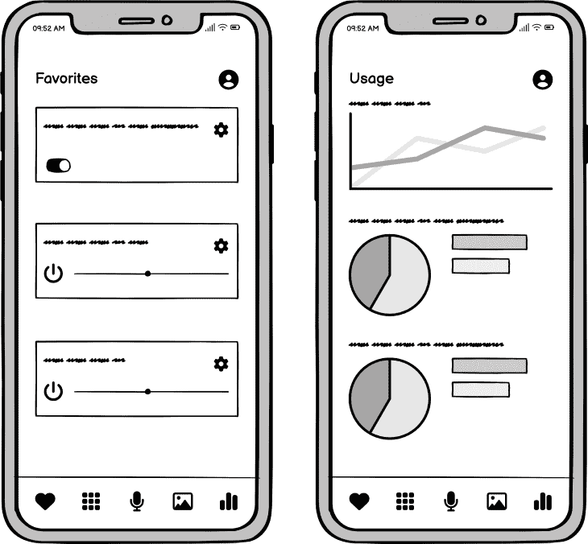
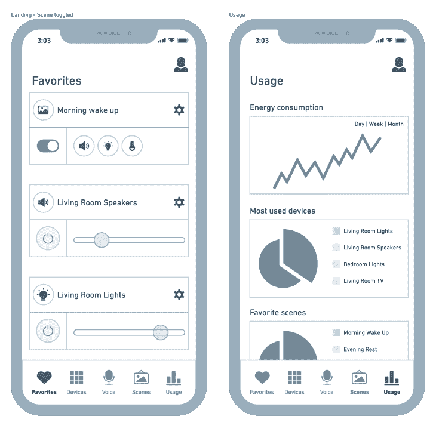
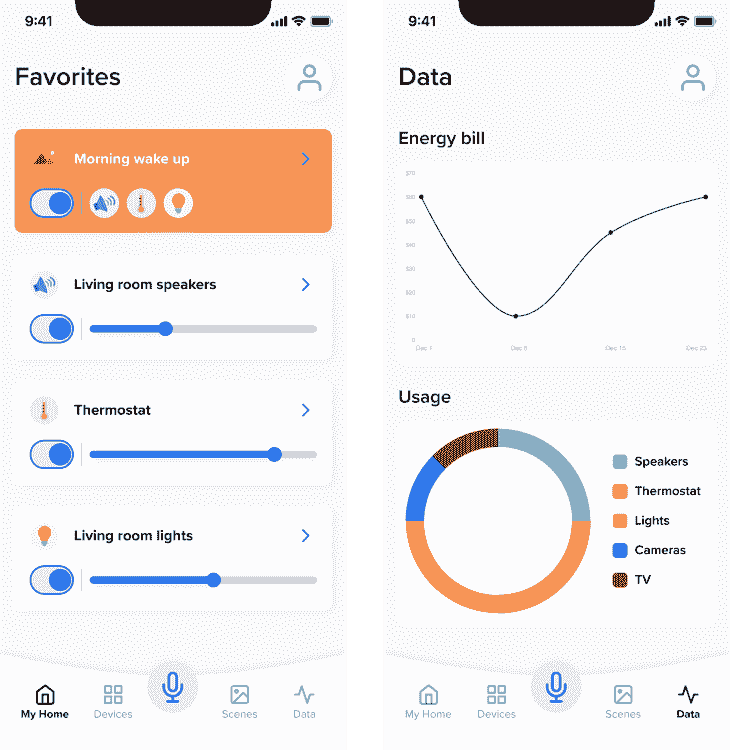
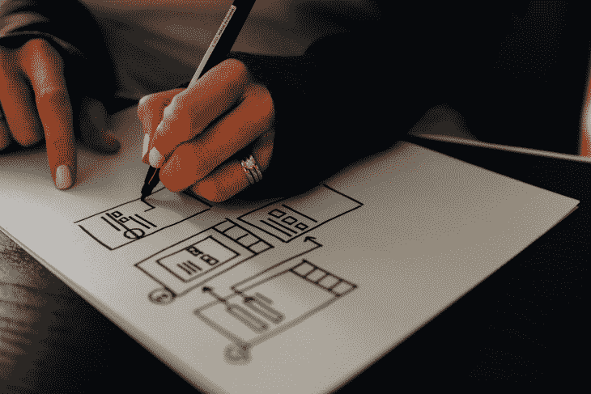
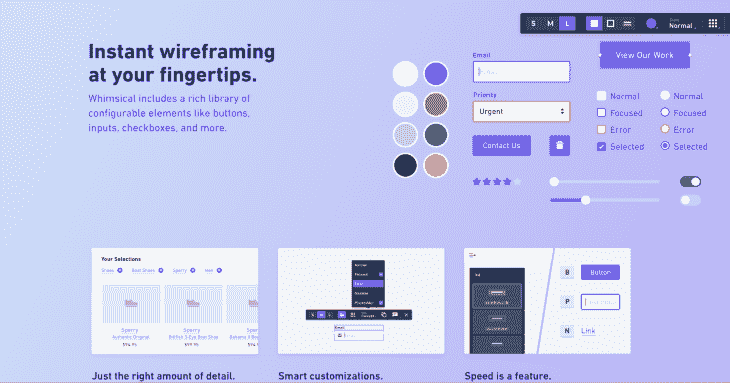
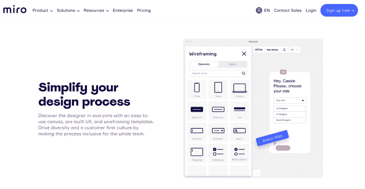
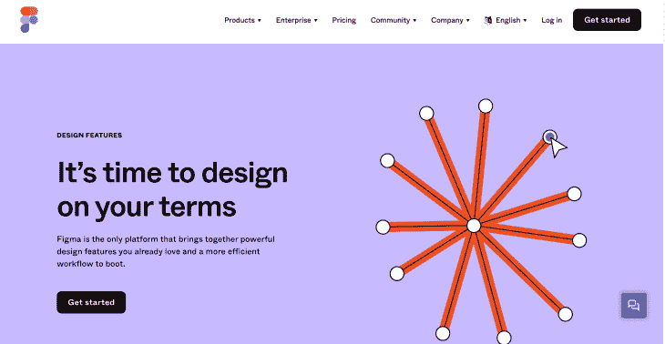

# 响应式设计和良好 UX 的线框

> 原文：<https://blog.logrocket.com/ux-design/wireframing-responsive-design-good-ux/>

交付数字产品的计划和执行涉及很多内容。我们要建造什么？会是什么样子？它将如何运作？每个人都希望产品成功，我们每个人对如何实现都有不同的想法。

为了就我们想要构建什么以及如何构建达成一致，我们需要围绕这些细节进行多次对话——从关于我们要去哪里的战略对话，到关于我们如何实现目标的战术对话。

这些对话需要锚点——我们可以抓住、看到、谈论和辩论的东西。我们需要把头脑中的想法写在纸上，然后进行讨论。要谈论数字产品，我们需要首先对这些产品进行描述，称为线框。

## 什么是线框？

就其核心而言，线框是数字产品的一种表示。它是一种工具，一种技术，人们用它来交流思想，联合团队，共同努力交付最终产品。

线框通常由设计人员创建和使用(尽管其他部门也可以生成和利用它们)，它允许设计人员获取业务想法并以一种允许团队讨论功能、讨论实现和为他们服务的客户创建产品的方式来可视化它们。

线框代表了一个想法的愿景。它们代表了我们如何处理业务问题的高级“假设”可能性。使用抽象的形状、盒子和线条，线框成为人们就产品方向进行对话的一种方式，而无需进入颜色、定位或品牌等细节。

线框也代表了可能的解决方案。通过可视化如何实现一个想法，团队可以讨论一个功能相对于另一个功能的价值，讨论执行企业想要投资的想法所需的妥协。

线框也作为蓝图，表达最终产品，因为它应该建立。线框用于与工程师交流如何从代码中创建产品，在屏幕上显示元素的确切位置，就像建筑师交流如何从头开始建造房子一样。

本质上，线框可以代表许多不同的东西。它们可以代表一种愿景、一种可能性，甚至是最终产品。线框代表什么，它的用途是什么，都归结于为什么要制作它，以及我们所说的线框的类型。

## 存在哪些类型的线框？

当我们考虑想要制作的线框类型时，我们通常会考虑这些线框的保真度，即细节水平。

在与他人合作时，为共享线框选择正确的保真度是最关键的线框技巧之一。如果你想就某个功能的商业价值进行对话，但却带来了一个充满图像、颜色和其他漂亮细节的线框，那么你就冒着对话变成关于这些细节的风险，而不是围绕你是否想首先创造这个产品的更广泛的观点。

你应该带着你想要讨论的细节的线框图来参加会议。但是应该包括多少细节呢？为了促进这些对话，我们可以设计什么样的保真度？本质上，有三种不同类型的线框保真度。

## 低保真度:高级要点

低保真度线框是最不详细、最基本的线框形式。他们倾向于围绕一个想法的实质去掉很多细节，而是关注它的战略价值:我们想生产这个产品吗？它看起来像什么？这个想法的价值是什么，我们为什么要追求它？低保真度线框试图回答这个问题，并通过作为一种可能产品的抽象表现来做到这一点。

低保真度的线框不会“感觉真实”我们不会把它们作为产品发布。相反，它们是一个假想产品的草图、框架和高层次的可能性。他们不关注颜色、排版、品牌、图像或其他通常被认为是“设计”的东西

当你想表达一个想法时，你应该使用它们，但不要陷入关于这个想法的细节的谈话中。低保真度线框感觉像一个概念——一个开始成形但尚未完成的不完整的想法。这让你可以就想法而不是想法的实现进行对话，因为实现感觉好像还没有完成。这就是重点——它并不意味着是完整的。这是一个粗略的草稿，是有意的，这样就有了讨论这个想法优点的空间。

优点:

*   快速制作(在视觉细节上没有太多投资)
*   简单(没有太多细节需要讨论)
*   保持关于想法价值的对话，而不是想法的执行

缺点:

*   抽象到人们可能无法想象的程度
*   不像高保真线框图那样“推销”产品的想法
*   由于缺乏细节，很难开展工作

## 中等保真度:没有细节的细节

中等保真度的线框介于抽象和具体之间。作为一个中间地带，这些类型的线框作为一个想法的一部分细节，一部分愿景。

Midfidelity 线框显示了一个想法的执行，并开始填充该想法的细节，但并不是设计来代表最终产品的。我们能把这个想法带到哪里去？这个特性会出现在哪里？客户将如何使用该产品？Midfidelity 线框开始填充一些东西如何工作的细节，现在团队一致希望首先追求这个想法。

与此同时，midfidelity 并不试图将最后的细节放在适当的位置。相反，他们的作用是围绕这些细节的走向、传达的信息是什么以及它们最终可能是什么样子展开对话。我们花更多的时间在细节上，现在战略已经确定，我们需要考虑执行。

像低保真度一样，中保真度通常保持在灰度范围内。我们开始为产品添加预期的副本，也许还会探索一些视觉元素的细节，比如按钮或卡片。Midfidelity 通过促进围绕这些细节的对话，开始塑造最终产品。

一般来说，当你需要谈论一个想法的执行，但仍在战略性地探索它时，使用中等保真度线框。这是一个中点，允许团队讨论一个想法，并开始将最终的元素放在我们认为他们会去的地方。

优点:

*   足够抽象，可以战略性地谈论
*   详细到可以有策略地谈论
*   比高保真线框投入更少的时间

缺点:

*   不是真正的产品
*   对于一些风险承担者或团队成员来说仍然过于抽象
*   更难与客户一起测试(缺少最终解决方案的细节)

## 高保真:像素完美模型

高保真线框代表最终产品。有时被称为“模型”，高保真线框描绘或“模拟”我们打算向客户发布的内容。他们关注的是我们想要在屏幕上放置每一个元素的合适、修饰、润色和精确的位置。

这是我们品牌的正确视觉设计吗？这个按钮太大了吗？屏幕上的对比度是否足以让客户清楚地看到行动号召？高保真线框有助于这种类型的对话，让团队决定屏幕上每个像素的确切实现。

高保真线框是我们期望最终产品的样子。它们代表了我们打算传递给开发人员的功能规范，以便产品的编码符合这些需求。当我们向客户推出产品时，我们会将元素放在我们想要的确切位置。

不像其他两种形式的保真度，高保真有大量的视觉细节。我们引入品牌颜色、图像、精确的印刷处理和最终文本，因为我们用静态图像来展示最终产品。

高保真线框用于就某个功能进行最终对话。一旦团队在这些最终的线框上签字，它们就作为将要建造的蓝图，并用于生产。当试图将一个想法付诸实施时，它们还被用来向利益相关者或投资者推销，因为它们可以作为产品的愿景，而不必实际编码该产品。

优点:

*   最终产品的代表
*   你看到的就是你将得到的
*   感觉就像真正的产品，而不需要做任何编码

缺点:

*   劳动密集
*   需要设计师来制作
*   如果用在错误的对话中，会分散注意力

## 我如何开始制作线框？

#### 笔和纸

Image source: [https://unsplash.com/photos/io0ZLYbu31s](https://unsplash.com/photos/io0ZLYbu31s)

你不需要一台电脑就可以开始制作数码产品。事实上，制作线框最简单的方法就是用纸和笔。

因为我们想制作低保真度的线框，笔和纸是一个很好的方式来给我们想要的低保真度的不完美，不完整的氛围。这也是一种很好的方式，可以把你脑海中的想法写在纸上——而不是试图操纵一个数字工具，你可以直接画出你在想什么，并与团队分享。

设计师没有充分使用笔和纸，我强烈推荐在使用数字工具添加额外的细节之前，用笔和纸把想法从你的脑海中抹去。

#### 巴尔萨米克

Balsamiq 允许用笔和纸来制作线框，但是是数字化的。他们的线框套件对其元素有一种不完美的感觉，这表明用它制作的线框还没有完全完成。他们感觉像数字餐巾草图，这是一个伟大的事情时，试图设计低保真度。

#### 古怪的

异想天开是我对中等保真度线框的首选。他们有一个易于上手的线框套件，允许预制组件和定制的完美融合，以代表你的想法。

使用拖放界面，异想天开允许人们快速，干净，容易地创建设计。它也是免费的(最多一定数量的对象)，允许人们在不依赖软件的情况下做一些设计。

#### 弥洛松

像异想天开，米罗提供定制线框套件，允许快速和简单的 midfidelity 线框。然而，Miro 往往比异想天开更不容易访问，因为它通常需要许可证。

然而，与异想天开不同，Miro 集成了许多其他工具，能够在一个工具中完成所有的规划和构思有其优势。此外，鉴于 Miro 的受欢迎程度，您的组织可能已经拥有它的许可证。

#### 菲格玛

Figma 是设计数字产品的行业标准。虽然有可能在 Figma 中实现任何级别的保真度，但在为高保真度进行设计时，它确实处于最佳状态。Figma 允许对设计进行任何修改，让设计师可以灵活地随心所欲地进行创意和定制。

与此同时，界面的简单性与云端软件解决方案相结合，使 Figma 相对于其同行具有竞争优势，这使其一跃成为设计行业的佼佼者。

Figma 的另一大竞争优势是其社区——fig ma 专注于促进社区参与其功能和文件，允许设计师制作插件、模板和样本文件，可以在整个社区共享，使每个人的设计更容易。

#### 素描

Sketch 的特性和功能与 Figma 非常相似(在它之前就在上面了)。Sketch 的主要区别在于它不是基于云的，只适用于 MAC 电脑。

这使得它成为一个与其他设计师共享文件的更有限的软件，导致版本问题，来回折腾文件，并将文件同步到第三方解决方案，以保持一致性，良好的文档和更新的工作。

#### Adobe XD

与 Sketch 一样，Adobe XD 也将文件保存在本地，而不是基于云的文件管理。它也有云解决方案，但它们不是产品的重点。作为 Adobe 套件的一部分，Adobe XD 也与 Adobe 套件有许多集成，专注于生活在产品生态系统中。此外，与同类产品相比，Adobe 具有一些更高的保真度功能，如文本、音频和动画，允许更高级和身临其境的原型。

如果你对设计师在行业中使用的工具感到好奇，UX 工具公司每年都会对设计师使用的所有工具进行调查。

## 在正确的对话中使用正确的保真度

对于你的线框，没有任何“正确”的保真度版本。相反，它是关于为正确的对话选择正确的忠诚。你想谈什么？选择一个能促进对话的忠诚度级别(而不是你不想要的级别)。

谈论一个特性的价值？尝试较低的保真度，这样焦点就不在按钮的形状或用于表示功能的特定图标上。想实现最终产品？带来更高水平的保真度，这样你就可以就位置、摆放和颜色进行对话。

了解了忠诚的类型以及何时使用每种类型，你将能够建立一个成功的对话，这将为你的客户带来成功。

*精选图片来源:* [IconScout](https://iconscout.com/icon/info-webpage-wireframe-4323406)

## [LogRocket](https://lp.logrocket.com/blg/signup) :无需采访即可获得 UX 洞察的分析

[LogRocket](https://lp.logrocket.com/blg/signup) 让您可以回放用户的产品体验，以可视化竞争，了解影响采用的问题，并结合定性和定量数据，以便您可以创建令人惊叹的数字体验。

查看设计选择、交互和问题如何影响您的用户— [立即尝试 LogRocket】。](hhttps://lp.logrocket.com/blg/signup)