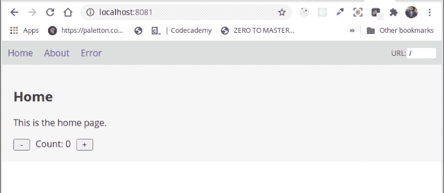
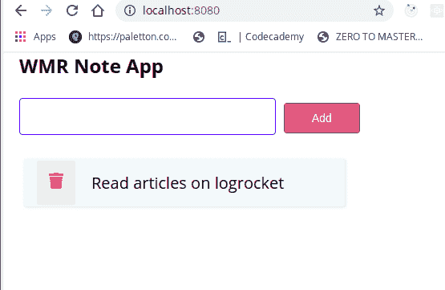
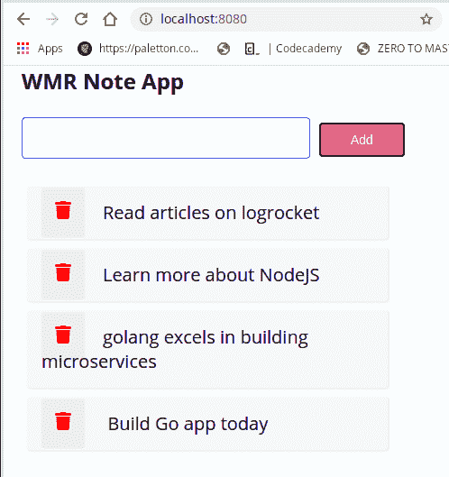

# WMR:web 应用的瑞士军刀

> 原文：<https://blog.logrocket.com/wmr-the-swiss-army-knife-for-web-apps/>

对于许多开发人员和软件工程师来说，一个一体化的开发工具是值得期待的。 [WMR](https://github.com/preactjs/wmr) 是由 [Preact 团队](https://github.com/preactjs)打造的现代网络应用一体化开发工具，体积非常小，没有依赖性。

WMR 开发的特性将使开发者能够从开发到生产构建 web 应用。与许多其他单一开发工具相比，WMR 因以下优势而脱颖而出:

### 表演

WMR 初始化时没有入口点或页面需要配置，它只带有 HTML 文件，这些文件包含带有类型模块的脚本，例如`<script type=module>`。

### 服务器端渲染

WMR 是为了支持开箱即用的服务器端渲染而构建的，它还可以在构建时将应用程序的页面预渲染为静态 HTML。

### 支持类型脚本

WMR 提供现成的打字稿支持。

### 依赖项的安全导入和智能构建

WMR 允许您安全地导入 npm 包而无需安装，这样您就可以导入 npm 包而无需运行`npm install`来安装额外的依赖项。

WMR 开箱即用，可以随时捆绑 npm 依赖项，还可以在构建机器上缓存历史记录。

### 支持 HTTP2

WMR 在开发和生产模式中内置了对 HTTP2 的支持。

### 支持汇总插件

WMR 提供了对[汇总插件](https://github.com/preactjs/wmr#configuration-and-plugins)的支持，即使它不在开发中使用。

Rollup 是 JavaScript 的一个模块捆绑器，它将代码编译得更加复杂，类似于一个库。

## WMR 入门

在本节中，我们将构建一个 notes 应用程序。用户可以写笔记，查看，也可以删除他们写的笔记。

与许多 SSR 框架类似，WMR 允许我们构建自己的组件并以页面的形式呈现它们。利用这一点，我们将把我们的应用程序构建为一个`app`目录中的单个页面，并且我们将在我们项目的`index.js`文件中呈现该应用程序。首先，让我们使用下面的代码块初始化一个新的 WMR 项目。

要使用 WMR 初始化项目，首先，您需要使用包管理器安装包。

使用 npm:

```
npm init wmr wmr-notes-app

```

或者使用纱线:

```
yarn create wmr wmr-notes-app

```

上面的命令初始化了一个空的 WMR 项目，在我们的例子中，第一个命令创建了一个 WMR 项目，用`wmr-notes-app`作为项目名，它可以被替换为您选择使用的任何名称。接下来，让我们为图标安装一个包:

```
npm i react-icons

```

上面的包将用于为我们的应用程序添加图标。

接下来，切换到您的项目目录，并通过运行以下命令启动您的开发服务器:

```
cd wmr-notes-app && npm start 

```

该命令在 [http://localhost:8080](http://localhost:8080) 上启动一个服务器，如果您在本地机器上打开该地址，它将显示一个类似如下的站点:



接下来，让我们重新构建应用程序文件夹，如下所示:


为此，在`public/pages`中，让我们删除以下文件和文件夹、`home`和`about`目录。

这些文件主要用于需要一个`home`和`about`页面的应用程序，完成这些之后，让我们开始构建我们的应用程序。

## 构建 notes 应用程序

我们将首先创建一个名为`app`的新文件夹，并在该文件夹中创建一个名为`index.js`的文件。请注意，文件名可以是您想要的任何名称，只要您认为合适。

接下来，我们创建一个名为`NoteApp`的功能组件，它有两种状态，一种用于创建注释，另一种用于显示当前注释，该组件将返回一个`h1`元素和一个输入字段:

```
import { useState } from 'preact/hooks';
import { FaTrash } from "react-icons/fa";
import styles from './style.module.css';

export default function NoteApp() {
    const [Notes, setNotes] = useState([]);
    const [currNote, setcurrNote] = useState('');

    return (
        <section class={styles.wmr_app}>
            <h1>WMR Note App</h1>
            <div class={styles.inputArea}>
            <input />
         </div>
        </section>
    )
}

```

在上面的代码块中，首先，我们从`preact/hooks`中导入了`useState`钩子，我们还从`module.css`文件中导入了`delete`的图标和样式。

在我们的`NoteApp`组件中，首先，使用 React `useState`钩子，我们为我们的注释初始化了一个初始值，并初始化了另一个状态来处理我们当前的注释，我们的应用程序现在为我们的输入字段返回一个 header 元素和一个 div。在我们刷新浏览器之前，让我们写下`style`，因为我们已经将它包含在我们的`section`和`div`标签中:

```
.wmr_app {
    background: white;
    height: 100vh;
}

@media (min-width: 768.11px) {
    .inputArea {
        color: black;
    }
}

```

## 添加注释

在本节中，我们将编写一个函数，作为向我们的应用程序添加注释的主干，为此我们将初始化一个函数`addNote`,它将接收我们的注释的 ID，并将其设置为我们的应用程序的状态:

```
const addNote = note_content => {
        Notes.push({
            id: Notes.length,
            note: note_content
        });
        setcurrNote('');
    }

```

在上面的代码中，我们初始化了一个常数`addNote`，它接受我们的`Notes`，并使用本地 JavaScript 数组方法 [push](http://w3schools.com/jsref/jsref_push.asp) ，它接受一个 ID 和 note 参数来添加一个新的 note，并将其设置为应用程序的当前状态。push 方法向我们的音符数组添加一个新音符，然后返回数组的新长度。接下来，我们将编写一个从应用程序中删除注释的函数。

## 删除和阅读笔记

这里，我们将编写一个函数来删除我们添加到应用程序中的注释，我们将使用本地 JavaScript 方法`.filter`来检查注释`id`是否不等于我们要从数组中删除的注释的`id`，然后返回数组中的新注释，如下所示:

```
const deleteNote = note_idx => {
    const notes = Notes.filter(note => note.id !== note_idx);
    setNotes(notes);
} 

```

接下来，我们将编写一个函数来显示我们添加的笔记，该函数还会在每个笔记添加到我们的笔记列表后自动为其添加一个删除图标:

```
const extractNotes = () => (
    Object.values(Notes).map(note => (
        <li key={note.id} class={styles.noteItem}>
            <span class={styles.deleteIcon} onClick={ e => deleteNote(note.id) }>
                <FaTrash size={20} color={"red"} />
            </span>
            { note.note }
        </li>
      )
  )

```

在代码块中，我们用`[object.values](https://developer.mozilla.org/en-US/docs/Web/JavaScript/Reference/Global_objects/Object/values)`方法初始化了一个函数`extractNotes`,它以提供数组的相同方式返回数组的值。接下来，我们进行映射，返回一个带有删除按钮的`li`，然后显示返回的注释。

为了完成这个，让我们为列表项和删除图标添加样式:

```
.noteItem {
    padding: 16px;
    border-radius: 3px;
    background-color: #f2f9fb;
    box-shadow: 1px 1px 3px 1px #efefef;
    font-size: 20px;
    max-width: 400px;
    margin: 10px auto;
}
.deleteIcon {
    padding: 14px;
    background-color: #eee;
    border-radius: 3px;
    margin-right: 20px;
}

```

如果我们做得正确，我们的应用程序应该是这样的:



## 总结笔记应用程序

为了结束我们的应用程序，让我们完成呈现我们的应用程序的最后一个组件，这里我们将完成我们的输入字段，并添加一个按钮以向我们的应用程序添加注释，然后呈现我们添加的注释:

```
return (
    <section class={styles.wmr_app}>
        <h1>WMR Note App</h1>
        <div class={styles.inputArea}>
            <input
                class={styles.inputField} 
                type="text" value={currNote} 
                onChange={ e => setcurrNote(e.currentTarget.value) } 
                onKeyUp={ e => e.key == 'Enter' ? addNote(currNote) : null }
            />
            <button class={styles.button} onClick={ () => addNote(currNote) }>Add</button>
        </div>
        <div class={styles.notes_list_wrapper}>
            <ul class={styles.unstyled_list}>
                { extractNotes() }
            </ul>
        </div>
    </section>
  )
} 

```

在上面的代码块中，我们返回一个输入字段，该字段接收一个`onChange`事件，该事件将我们当前的注释设置为输入字段的值。我们还添加了一个`keypress`事件，让`on key up`将输入字段的值添加到我们的笔记中。

接下来，我们添加了一个按钮，将我们的注释输入到我们的应用程序中，之后，我们呈现添加的注释。为了完成我们的应用程序，让我们添加 CSS 属性，然后显示我们最终应用程序的图像:

```
.unstyled_list {
    list-style: none;
    padding: 0;
}

.notes_list_wrapper {
    border-radius: 5px;
    padding: 6px;
    max-width: 400px;
}
.button {
    font-size: 14px;
    border: 1px solid purple;
    background-color: palevioletred;
    color: white;
    border-radius: 4px;
    padding: 10px 34px;
    margin: 10px;
}
.button:hover {
    border: 1px solid purple;
    background-color: purple;
}
@media (min-width: 768.11px) {
    .inputField {
        border: 1px solid blue;
        padding: 10px;
        font-size: 21px;
        border-radius: 4px;
    }
    .inputField:hover, .inputField:focus {
        outline: none !important;
        box-shadow: none !important;
        border: 1px solid green;
    }
}

```

我们最终的应用程序应该是这样的:



## 结论

在这篇文章中，我们学习了 WMR，它的特性，以及如何使用 WMR 来构建一个 notes 应用程序，我们也看到了如何使用`module.css`来添加样式到我们的应用程序中。本文中使用的代码可以在 [GitHub](https://github.com/iamfortune/Preact-wmr) 上找到。

## 使用 [LogRocket](https://lp.logrocket.com/blg/signup) 消除传统错误报告的干扰

[](https://lp.logrocket.com/blg/signup)

[LogRocket](https://lp.logrocket.com/blg/signup) 是一个数字体验分析解决方案，它可以保护您免受数百个假阳性错误警报的影响，只针对几个真正重要的项目。LogRocket 会告诉您应用程序中实际影响用户的最具影响力的 bug 和 UX 问题。

然后，使用具有深层技术遥测的会话重放来确切地查看用户看到了什么以及是什么导致了问题，就像你在他们身后看一样。

LogRocket 自动聚合客户端错误、JS 异常、前端性能指标和用户交互。然后 LogRocket 使用机器学习来告诉你哪些问题正在影响大多数用户，并提供你需要修复它的上下文。

关注重要的 bug—[今天就试试 LogRocket】。](https://lp.logrocket.com/blg/signup-issue-free)