# 在 Swift 中使用日历

> 原文：<https://blog.logrocket.com/working-calendars-swift/>

如果你在移动应用程序中使用过任何类型的表单，那么你就会知道在表单中处理日期是多么的复杂。在本文中，我们将学习如何在 SwiftUI 应用程序中实现一个日历来处理和操作日期。

SwiftUI 提供了一个 [`DatePicker`](https://developer.apple.com/documentation/swiftui/datepicker) 控件供用户选择绝对日期，但是作为一个成熟的日历 UI，它有一些局限性。在本教程中，我们还将使用一个名为`[FSCalendar](https://github.com/WenchaoD/FSCalendar)`的流行日历库，这是一个完全可定制的 iOS 日历库。我们最终的应用程序将如下图所示:


您可以在这个 [GitHub 资源库](https://github.com/hrupesh/SwiftUICalendars/tree/master)中找到本教程的完整代码。我们开始吧！

## 目录

我们将讨论以下内容:

## 创建 SwiftUI 项目

在编写任何代码之前，我们需要一个正常工作的 SwiftUI 应用程序。让我们现在就创建它；打开 Xcode，你会看到一个屏幕显示`Welcome to Xcode`，如下图所示:

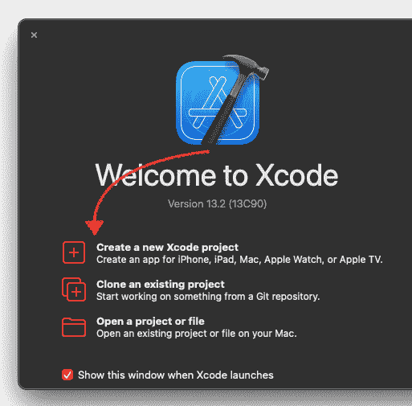

选择**创建一个新的 Xcode 项目**，Xcode 将会启动，弹出`choose project template`:

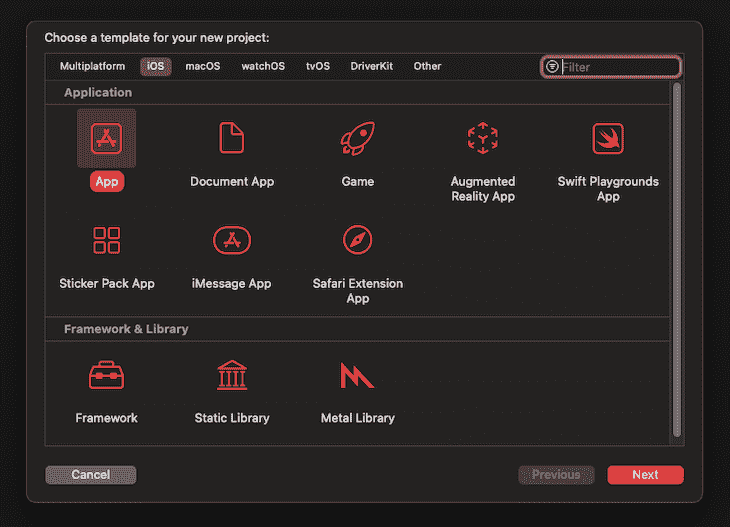

我们将选中的选项保留为默认选项`App`，然后点击**下一个**。为您的项目输入一个名称，然后点击**下一个**。既然我们已经成功地创建了 SwiftUI 项目，让我们在我们的设备或模拟器上运行它。

要在设备上构建应用程序，请从 Xcode 的顶部栏中选择它，然后单击左侧的**播放**按钮开始构建:


如果一切正常，您将在设备上看到一个空白屏幕，上面写着“你好，世界！”文本在中间。

## 在 SwiftUI 中显示带有`DatePicker`的日历视图

为了在我们的 Swift 应用程序中创建日历 UI，我们将从 SwiftUI 中的`[DatePicker](https://developer.apple.com/documentation/swiftui/datepicker)`开始。这种结构主要用于从用户界面中选择日期，它非常容易使用和控制。

让我们将`DatePicker`添加到我们的视图体中。将以下代码添加到`ContentView.swift`文件中:

```
import SwiftUI

struct ContentView: View {
    @State var selectedDate: Date = Date()
    var body: some View {
        // Added DatePicker with selection equal to State variable selectedDate
        DatePicker("Select Date", selection: $selectedDate)
                  .padding(.horizontal)
    }
}
....

```

您可能已经注意到，我们添加了带有两个参数的`DatePicker`，`Select Date`和`selection`。

第一个`String`参数是日期选择器的标题，显示在 UI 上选择器控件的旁边。第二个参数`selection`是一个重要的参数，它采用类型为`Date`的`Binding`变量。`Date`变量随着从`DatePicker`控件选择的日期或时间的改变而改变。

为了将`Binding`传递到`selection`参数中，我们创建了一个名为`selectedDate`的`Date`类型的`State`变量，它的初始值是当前日期。我们还向组件添加了一些水平填充。

上面代码的 UI 输出将类似于下图:


现在，我们可以打开一个日历视图，从滚轮选择器中选择日期和时间，它们存储在`selectedDate`变量中。现在，让我们在 UI 上显示它。

用以下代码替换`ContentView`正文中的代码:

```
VStack(alignment: .center, spacing: 0) {
    Text(selectedDate.formatted(date: .abbreviated, time: .standard))
        .font(.system(size: 28))
        .bold()
        .foregroundColor(Color.accentColor)
        .padding()
        .animation(.spring(), value: selectedDate)
    Divider()
    Spacer()
    DatePicker("Select Date", selection: $selectedDate)
        .padding(.horizontal)
}
.padding(.vertical, 200)

```

上面的代码将产生以下用户界面:

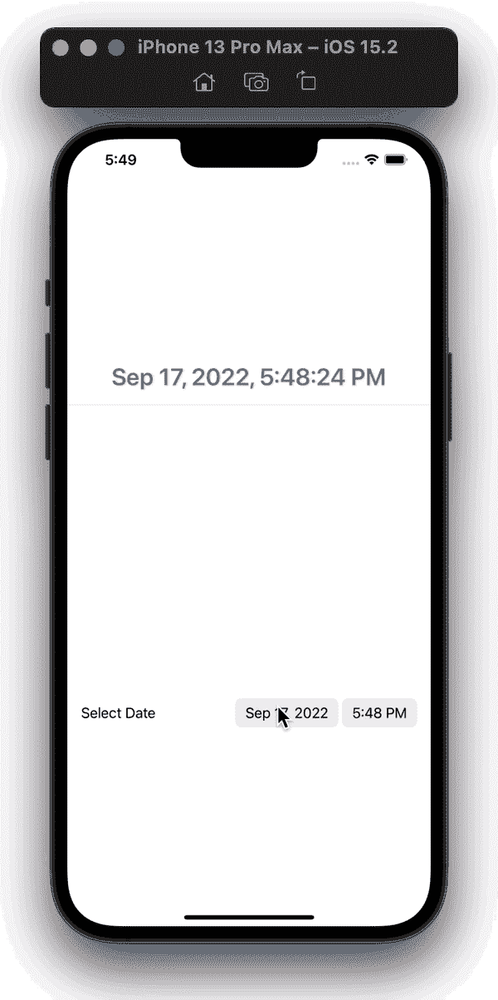

我们已经在应用程序中实现了一个日期选择器，但是我们还没有完成。我们希望在我们的 UI 中显示一个将一直显示的日历视图。为此，我们将使用`DatePicker`组件的`[datePickerStyle](https://developer.apple.com/documentation/swiftui/view/datepickerstyle(_:))`修饰符。我们可以使用这个修改器以任何我们想要的预定义样式显示`DatePicker`。

我们将使用`graphical`样式，它将`DatePicker`显示为一个总是打开的`CalendarView`。我们现在不需要`time`组件，所以我们将在`DatePicker`初始化器中传递`displayedComponents`。在 UI 上显示时，我们也省略了`selectedDate`中的时间部分。

经过上述更改，我们的`ContentView`的`body`中更新后的代码将如下所示:

```
VStack() {
    Text(selectedDate.formatted(date: .abbreviated, time: .omitted))
        .font(.system(size: 28))
        .bold()
        .foregroundColor(Color.accentColor)
        .padding()
        .animation(.spring(), value: selectedDate)
        .frame(width: 500)
    Divider().frame(height: 1)
    DatePicker("Select Date", selection: $selectedDate, displayedComponents: [.date])
        .padding(.horizontal)
        .datePickerStyle(.graphical)
    Divider()
}
.padding(.vertical, 100)

```

上面的代码将产生下面的用户界面:

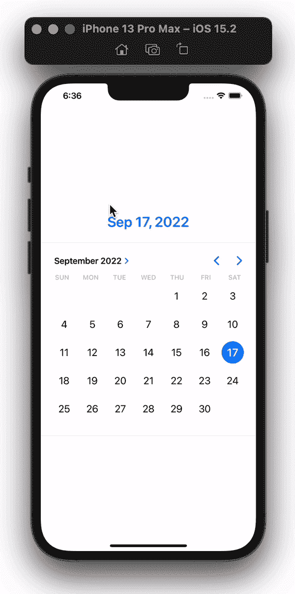

## 将`TabView`添加到应用程序中

到目前为止，我们已经使用`DatePicker`集成了一个类似日历的视图。但是我们可以通过使用一个叫做`[FSCalendar](https://github.com/WenchaoD/FSCalendar)`的流行的 iOS 库来改进这一点。

但首先，我们需要在我们的应用程序 UI 中分离这两个屏幕。为此，我们将使用`TabView`，它将在我们的应用程序中创建两个选项卡，一个用于带有`DatePicker`的`CalendarView`，另一个用于`FSCalendar`。

让我们首先将我们在上一节中创建的 UI 移动到另一个 SwiftUI 文件中。在 Xcode 中创建新的`SwiftUI`文件，命名为`DatePickerCalendar`。将`ContentView`正文中的代码粘贴到`DatePickerCalendar`正文中:

```
import SwiftUI

struct DatePickerCalendar: View {
    @State var selectedDate = Date()
    var body: some View {
        VStack {
            FormattedDate(selectedDate: selectedDate, omitTime: true)
            Divider().frame(height: 1)
            DatePicker("Select Date", selection: $selectedDate,
                       in: ...Date(), displayedComponents: .date)
                .datePickerStyle(.graphical)
            Divider()
        }
    }
}

struct DatePickerCalendar_Previews: PreviewProvider {
    static var previews: some View {
        DatePickerCalendar()
    }
}

```

在上面的代码中，您会注意到我们已经实现了两项更改。首先，我们在`DatePicker`初始化器中添加了`in`参数，允许用户在给定的范围内选择日期。在本例中，我提供了从以前到现在的所有日期。

是一个助手视图，我创建它是为了让代码看起来干净。它基本上与我们之前用来在 UI 上显示`selectedDate`的`Text`组件相同，只是有一些样式修饰符。

要创建`FormattedDate`视图，创建一个新的`SwiftUI`文件，将其命名为`FormattedDate`，并在其中添加以下代码:

```
import SwiftUI

struct FormattedDate: View {
    var selectedDate: Date
    var omitTime: Bool = false
    var body: some View {
        Text(selectedDate.formatted(date: .abbreviated, time: 
              omitTime ? .omitted : .standard))
            .font(.system(size: 28))
            .bold()
            .foregroundColor(Color.accentColor)
            .padding()
            .animation(.spring(), value: selectedDate)
            .frame(width: 500)
    }
}

struct FormattedDate_Previews: PreviewProvider {
    static var previews: some View {
        FormattedDate(selectedDate: Date())
    }
}

```

我们还需要为我们的日历视图创建一个新文件，它将实现`FSCalendar`库。创建一个名为`CalendarView`的新`SwiftUI`文件，并在`body`中添加以下代码:

```
Text("This is Calendar View")

```

现在，让我们将`TabView`添加到我们的`ContentView`文件中:

```
TabView {
    DatePickerCalendar()
      .tabItem {
        Label("DatePicker Calendar", systemImage: "calendar.badge.plus")
            .padding()
      }
    CalendarView()
      .tabItem {
        Label("Fullscreen Calendar", systemImage: "calendar")
            .padding()
      }
}
.onAppear {
    let appearance = UITabBarAppearance()
    appearance.backgroundColor = UIColor(Color.purple.opacity(0.2))
    appearance.shadowColor = UIColor(.purple)
    appearance.backgroundEffect = UIBlurEffect(style: .extraLight)
    UITabBar.appearance().standardAppearance = appearance
    UITabBar.appearance().scrollEdgeAppearance = appearance
}

```

在上面的代码中，我们在`TabView`中添加了两个视图。第一个是我们之前创建的`DatePickerCalendar`，第二个是空的`CalendarView`。每个视图都有一个`tabItem`修饰符，它定义了在标签栏中显示什么。我们还在`TabView`上添加了一个 [`onAppear`](https://developer.apple.com/documentation/swiftui/tabview/onappear(perform:)) 实例方法来改变`TabView`的外观。

现在，我们将有下面的用户界面:

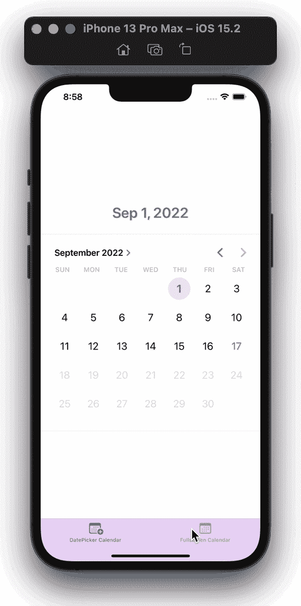

## 将`FSCalendar`安装到我们的项目中

现在，让我们安装`FSCalendar`库。要添加新的库，在 Xcode 中，进入**文件** → **添加包**，如下图所示:

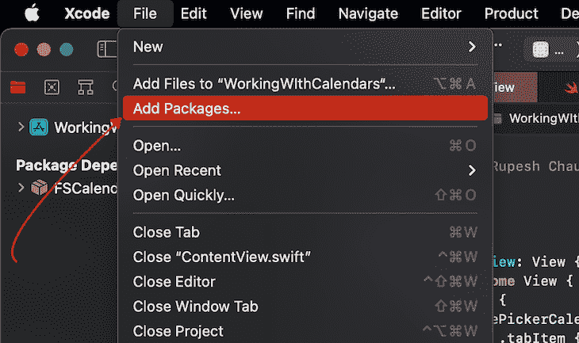

点击**添加(+)** 按钮，然后点击**添加 swift 包集合**:


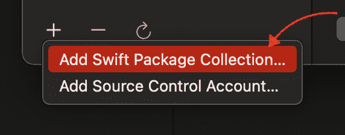

然后，将以下链接粘贴到输入中，并**继续**:

```
https://github.com/WenchaoD/FSCalendar
```

这是我们将使用的包的存储库 URL:


就是这样！您现在已经将`FSCalendar`添加到您的项目中。如果一切顺利，您现在会在项目导航器菜单中 Xcode 左侧的**包依赖关系**中看到`FSCalendar`:

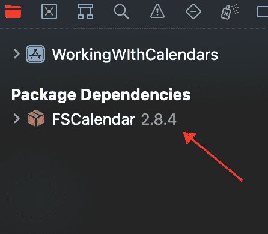

## 将来自`FSCalendar`的 UIKit 视图与`UIViewRepresentable`整合

现在，我们已经安装了`FSCalendar`，但是我们不能直接使用这个库，因为它不支持开箱即用的 SwiftUI。因此，我们需要利用这个库提供的 UIKit 视图。

为此，我们将使用`[UIViewRepresentable](https://developer.apple.com/documentation/swiftui/uiviewrepresentable)`作为 UIKit 视图的包装器，以在 SwiftUI 视图层次结构中显示它。关于这个的更多信息，你也可以参考[官方文档](https://developer.apple.com/tutorials/swiftui/interfacing-with-uikit)。

首先，我们将在同一个文件中创建一个视图，它返回`UIViewRepresentable`。然后，我们将在其中实现一些方法，这将创建一个 UIView 并允许我们与它通信:

```
import UIKit
import FSCalendar
....

struct CalendarView: View {
    var body: some View {
      CalendarViewRepresentable(selectedDate: $selectedDate)
    }
}

struct CalendarViewRepresentable: UIViewRepresentable {
    typealias UIViewType = FSCalendar

    func makeUIView(context: Context) -> FSCalendar {
      return FSCalendar()
    }

    func updateUIView(_ uiView: FSCalendar, context: Context) {}

    func makeCoordinator() -> Coordinator {
        Coordinator(self)
    }

    class Coordinator: NSObject, 
          FSCalendarDelegate, FSCalendarDataSource {
            var parent: CalendarViewRepresentable

            init(_ parent: CalendarViewRepresentable) {
                self.parent = parent
            }
    }
}

```

在上面的代码中，我们实现了三个方法和一个类:

*   `makeUIView`:创建将在 UI 上呈现的 UIView。现在，我们直接返回一个`FSCalendar`的实例，我们将在以后的工作中改变它，以便对日历有更多的控制
*   `updateUIView`:用于更新视图状态。在本教程中，我们不需要这个。
*   `makeCoordinator`:用于创建自定义实例，我们可以使用该实例在 SwiftUI 和 UIKit 视图之间进行通信
*   `Coordinator`:从`makeCoordinator`返回的自定义实例

使用上面的代码，我们现在在应用程序中有了一个`FSCalendar`视图，默认情况下看起来像下面的图片:

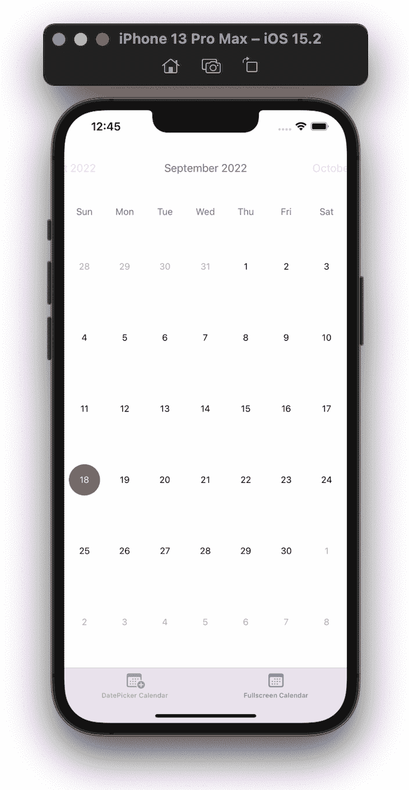

## 用`FSCalendar`显示日历视图

我们已经成功地在我们的应用程序 UI 中呈现了一个日历视图。现在，让我们设置用户在日历上选择的日期值。为此，我们将在我们的`CalendarViewRepresentable`中创建一个`calendar`变量，并在用户在 UI 上执行交互时定制它:

```
struct CalendarView: View {
  // Added a @State var to track the selected date by user
  @State var selectedDate: Date = Date()

  var body: some View {
        VStack {
            // Displaying the selected date
            FormattedDate(selectedDate: selectedDate, omitTime: true)
            // Passing the selectedDate as Binding
            CalendarViewRepresentable(selectedDate: $selectedDate)
        }
  }
}

struct CalendarViewRepresentable: UIViewRepresentable {
  ...
  // Creating a object of FSCalendar to track across the view
  fileprivate var calendar = FSCalendar()

  // Getting selectedDate as a Binding so that we can update it as 
  // user changes their selection 
  @Binding var selectedDate: Date

  func makeUIView(context: Context) -> FSCalendar {
          // Setting delegate and dateSource of calendar to the
          // values we get from Coordinator
          calendar.delegate = context.coordinator
          calendar.dataSource = context.coordinator
          // returning the intialized calendar
          return calendar
  }

  ....

    class Coordinator: NSObject, 
                        FSCalendarDelegate, FSCalendarDataSource {
        ....
        // Implementing the didSelect method of FSCalendar
        // this is fired with the new date when user selects a new date
        // in the Calendar UI, we are setting our selectedDate Binding
        // var to this new date when this is triggered
        func calendar(_ calendar: FSCalendar, 
                        didSelect date: Date,
                        at monthPosition: FSCalendarMonthPosition) {
            parent.selectedDate = date
        }
    }

  ....
}

```

现在，我们的日历用户界面将如下图所示:

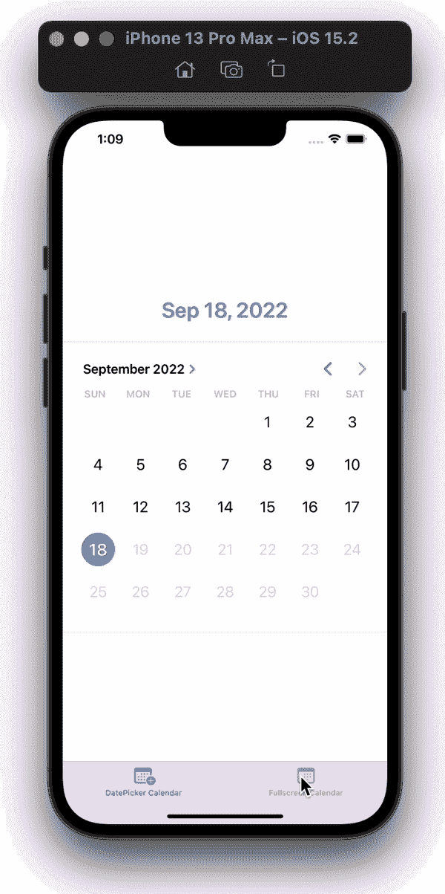

## 自定义日历用户界面

现在，我们已经在 SwiftUI 应用程序中实现了一个工作日历，让我们自定义该日历。带有许多可定制的特性。你可以在 GitHub repo 看到它们的完整版本。

在我们的日历中添加了一些自定义特性和样式后，我们的`CalendarView`文件中的最终代码如下所示:

```
import SwiftUI
import UIKit
import FSCalendar

struct CalendarView: View {

    @State var selectedDate: Date = Date()

    var body: some View {
              CalendarViewRepresentable(selectedDate: $selectedDate)
                .padding(.bottom)
                .padding(EdgeInsets(top: 40,
                          leading: 0, bottom: 0, trailing: 0))
                .background{
                    AsyncImage(url: URL(
                                string: "https://images.pexels.com/photos/1939485/pexels-photo-1939485.jpeg")){ img in
                        img.resizable(resizingMode: .stretch)
                            .blur(radius: 4, opaque: true)
                    } placeholder: {
                        LinearGradient(colors: [.red.opacity(0.4),
                                      .green.opacity(0.4)],
                                      startPoint: .top,
                                      endPoint: .bottom)
                    }
                }
                .ignoresSafeArea(.all, edges: .top)
    }
}

struct CalendarViewRepresentable: UIViewRepresentable {
    typealias UIViewType = FSCalendar

    fileprivate var calendar = FSCalendar()
    @Binding var selectedDate: Date

    func makeUIView(context: Context) -> FSCalendar {
        calendar.delegate = context.coordinator
        calendar.dataSource = context.coordinator

        // Added the below code to change calendar appearance
        calendar.appearance.todayColor = UIColor(displayP3Red: 0,
                                                  green: 0,
                                                  blue: 0, alpha: 0)
        calendar.appearance.titleTodayColor = .black
        calendar.appearance.selectionColor = .orange
        calendar.appearance.eventDefaultColor = .red
        calendar.appearance.titleTodayColor = .blue
        calendar.appearance.titleFont = .boldSystemFont(ofSize: 24)
        calendar.appearance.titleWeekendColor = .systemOrange
        calendar.appearance.headerMinimumDissolvedAlpha = 0.12
        calendar.appearance.headerTitleFont = .systemFont(
                                                ofSize: 30, 
                                                weight: .black)
        calendar.appearance.headerTitleColor = .darkGray
        calendar.appearance.headerDateFormat = "MMMM"
        calendar.scrollDirection = .vertical
        calendar.scope = .month
        calendar.clipsToBounds = false

        return calendar
    }

    func updateUIView(_ uiView: FSCalendar, context: Context) {}

    func makeCoordinator() -> Coordinator {
        Coordinator(self)
    }

    class Coordinator: NSObject, 
          FSCalendarDelegate, FSCalendarDataSource {
        var parent: CalendarViewRepresentable

        init(_ parent: CalendarViewRepresentable) {
            self.parent = parent
        }

        func calendar(_ calendar: FSCalendar, 
                      didSelect date: Date,
                      at monthPosition: FSCalendarMonthPosition) {
            parent.selectedDate = date
        }

        func calendar(_ calendar: FSCalendar, 
                  imageFor date: Date) -> UIImage? {
            if isWeekend(date: date) {
                return UIImage(systemName: "sparkles")
            }
            return nil
        }

        func calendar(_ calendar: FSCalendar, 
                      numberOfEventsFor date: Date) -> Int {
            let eventDates = [Date(), Date(),
                                Date.now.addingTimeInterval(400000),
                                Date.now.addingTimeInterval(100000),
                                Date.now.addingTimeInterval(-600000),
                                Date.now.addingTimeInterval(-1000000)]
            var eventCount = 0
            eventDates.forEach { eventDate in
                if eventDate.formatted(date: .complete, 
                              time: .omitted) == date.formatted(
                                date: .complete, time: .omitted){
                    eventCount += 1;
                }
            }
            return eventCount
        }

        func calendar(_ calendar: FSCalendar, shouldSelect date: Date, at monthPosition: FSCalendarMonthPosition) -> Bool {
            if isWeekend(date: date) {
                return false
            }
            return true
        }

        func maximumDate(for calendar: FSCalendar) -> Date {
            Date.now.addingTimeInterval(86400 * 30)
        }

        func minimumDate(for calendar: FSCalendar) -> Date {
            Date.now.addingTimeInterval(-86400 * 30)
        }
    }
}

func isWeekend(date: Date) -> Bool {
    let dateFormatter = DateFormatter()
    dateFormatter.dateFormat = "EEEE"
    let day: String = dateFormatter.string(from: date)
    if day == "Saturday" || day == "Sunday" {
        return true
    }
    return false
}

```

上面的代码将给出类似下图的输出:

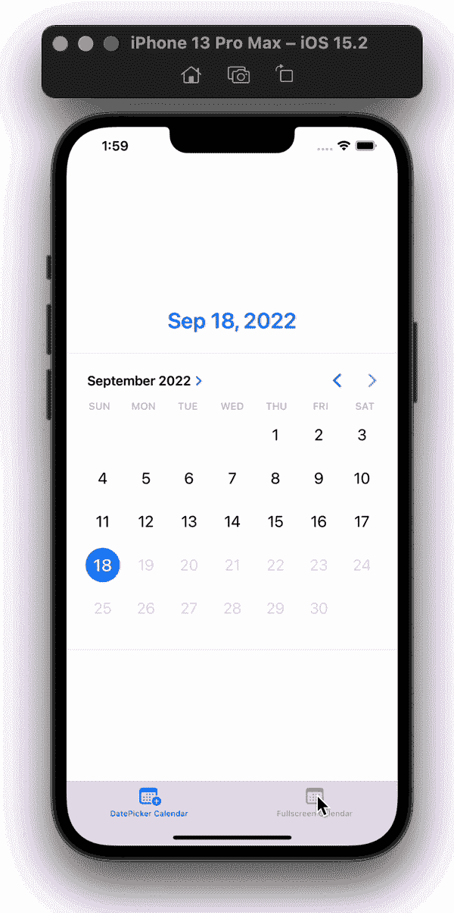

## 结论

在本教程中，我们学习了如何使用`DatePicker`控件创建一个`CalendarView` UI。我们还学习了如何实现一个日历库，通过在 SwiftUI 应用程序中整合一个`UIViewRepresentable`来呈现 UIKit 视图，从而实现我们的最终 UI 结果。

感谢阅读！

## 使用 [LogRocket](https://lp.logrocket.com/blg/signup) 消除传统错误报告的干扰

[](https://lp.logrocket.com/blg/signup)

[LogRocket](https://lp.logrocket.com/blg/signup) 是一个数字体验分析解决方案，它可以保护您免受数百个假阳性错误警报的影响，只针对几个真正重要的项目。LogRocket 会告诉您应用程序中实际影响用户的最具影响力的 bug 和 UX 问题。

然后，使用具有深层技术遥测的会话重放来确切地查看用户看到了什么以及是什么导致了问题，就像你在他们身后看一样。

LogRocket 自动聚合客户端错误、JS 异常、前端性能指标和用户交互。然后 LogRocket 使用机器学习来告诉你哪些问题正在影响大多数用户，并提供你需要修复它的上下文。

关注重要的 bug—[今天就试试 LogRocket】。](https://lp.logrocket.com/blg/signup-issue-free)