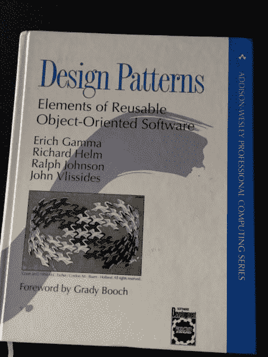
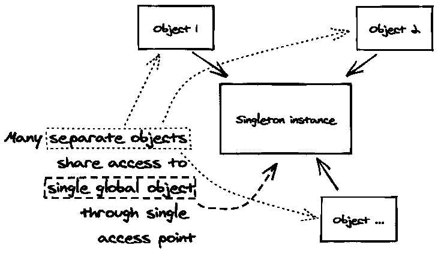
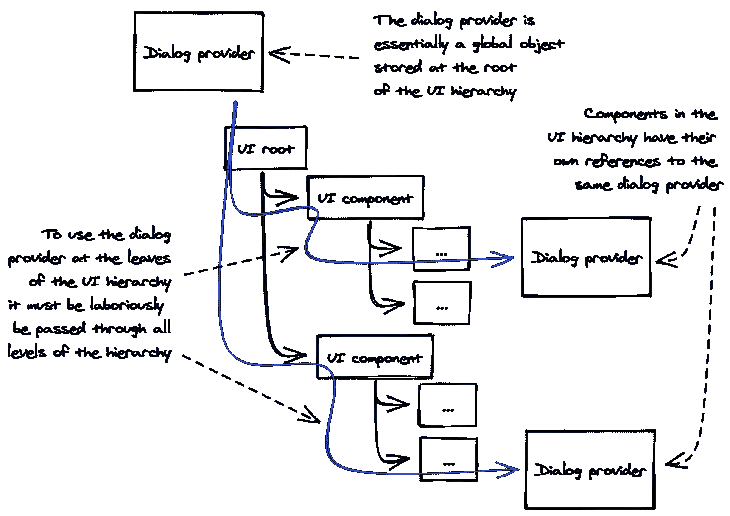

# 你对单身族的看法是错误的

> 原文：<https://blog.logrocket.com/youre-wrong-about-singletons/>

[单胎](https://en.wikipedia.org/wiki/Singleton_pattern)。他们是你最可怕的噩梦——或者至少是你被引导去相信的。

他们真的那么差吗？为什么他们被认为是邪恶的？他们总是站在公众舆论的对立面吗？

单件被称为设计模式。它们也被称为反模式。那到底是哪个？当然不可能两者兼得。

以下是我的忏悔:我仍然使用单件。但是我找到了一种减轻缺点的方法，所以我愉快地使用单身族来获得他们的好处，而不会遭受他们的问题。

在这篇博文中，我们探讨了单身族从何而来，哪里出了问题，以及你现在可以做些什么来利用单身族实现他们原本想要的好处——没有罪恶感或恐惧。请继续阅读，了解更多信息。

## 背景

考虑到围绕着单身人士的恐惧和厌恶，你可能会惊讶地发现他们并非生来邪恶。事实上，在单身族是邪恶的观念渗透到整个博客世界之前，单身族已经被普遍使用了至少 10 年。让我们快速浏览一下历史。

单身族是在 1995 年通过“[四人帮](http://wiki.c2.com/?GangOfFour)”的经典软件开发书籍*设计模式*(如图 1 所示)介绍给世界的，尽管在这本书出版之前，单身族的概念(如果不是真正的名字*单身族*)已经存在很多年了。



**Figure 1**: My personal copy of the *Design Patterns* book by the Gang of Four. This book introduced the world to the singleton design pattern in 1995.

在为这篇文章做研究时，我想知道对单身人士的喜爱何时停止。至少到 2007 年，仇恨已经开花结果。这是我能找到的最早的(仍然在线的)博客文章。我还在 2008 年的返程机上发现了[这个](https://web.archive.org/web/20080605110817/http://www.riedquat.de/prog/singletonsAreEvil)。然后[快进到 2020 年的这个](https://maximilianocontieri.com/singleton-the-root-of-all-evil)。

因此，在针对单身人士的愤怒浮出水面之前，他们已经享受了 10 多年的使用。这是一个很好的尝试，但是自从它们被认为是反模式以来，已经过去了 10 年。这让我想知道为什么过了这么久我们还在谈论这个。人们不应该已经停止使用单件了吗？

然后我意识到，我自己实际上从未停止使用汗衫。事实上，我仍然经常使用它们。我知道他们有多坏；多年的争论没有逃过我的注意。然而不知何故，我找到了让单身族工作的方法。

我今天的代码比以往任何时候都更干净、更优雅。我使用单例，但是我也做重要的自动化测试，并且我一直在轻松安全地重构我的代码。被诽谤的 singleton 怎么可能没有破坏我的开发过程呢？

对我来说，发展是一个不断改进和进化的过程。是的，单身族时不时会给我带来麻烦，但是我把他们赶走了吗？不会，因为单例还是有用的。的确，这就是为什么人们仍然使用它们；如果人们不再使用它们，我们就不会再争论它们了。

我没有抛弃单例设计模式，而是发展了它。我了解了它的问题(第一手资料),并调整了我使用它的方式。我找到了一种使用单件的方法，而没有(到目前为止)众所周知的缺点。一会儿我会告诉你怎么做。

## 什么是独生子女？

让我们从单例模式的简单概述开始，只是为了让您快速了解。

有时候在编码的时候，我们需要全局对象的概念。这是一个在我们的应用程序中只有一个实例的对象。*设计模式*使用了下面的例子:打印机假脱机程序、文件系统和窗口管理器。这些类型的对象可以而且应该只有一个实例。

singleton 设计模式让类负责自己的创建并控制对实例的访问，这样它的单实例特性就不会被破坏。因此，我们可以确保这个对象不会被创建超过一次。

单体模式是*设计模式*中涵盖的为数不多的创造模式之一。这只是创建对象的众多方法之一。



**Figure 2**: Illustration of the traditional singleton design pattern.

## 单身族的现代例子

为了理解什么是 singleton 以及它有什么用处，让我们考虑一些更现代的可以用 singleton 表示的对象的例子。

### 对话提供程序

一个很好的例子是对话提供者。基于 UI 的应用程序可以显示对话框来收集用户的输入。我们只有一个对话框提供者的实例是有意义的，这样我们就可以控制如何使用它。例如，我们可能希望一次只在屏幕上显示一个对话框。

图 3 展示了我们如何使用一个对话框提供者作为单例来简单快速地将它连接到 UI 层次结构中的深层嵌套对象。

清单 1 和清单 2 中的代码是一个示例，展示了如何用 JavaScript 编写这个对话框提供程序。


**Figure 3**: Directly connecting deeply nested objects in our UI hierarchy to a singleton dialog provider.

### 实体储存库

这里还有一个例子可能会吸引你。几乎每个应用程序都需要某种形式的数据存储，这通常使用存储库模式来实现。将我们的呼吸对象存储为单例对象是非常诱人的，这样就可以在代码中的任何地方轻松访问它们。

不过，这不仅仅是为了方便:拥有我们的实体存储库的单例实例意味着我们有一个地方来实现我们的实体的缓存和优化，以便后续的数据加载不必去文件系统或数据库。

##### 清单 1:我们的对话框提供者在 TypeScript 中的示例单例实现

```
export class DialogProvider {

    //
    // Gets the singleton instance.
    // Lazily creates the singleton when first called.
    //
    public static getInstance(): DialogProvider {
        if (!this.instance) {
            this.instance = new DialogProvider();
        }

        return this.instance;
    }

    //
    // Instance of the singleton, after it has been created.
    //
    private static instance?: DialogProvider;

    // 
    // Presents the dialog box to the user.
    //
    public async showDialog(question: string): Promise<string> {
        // ... code here to display the dialog box ....
    }

    //
    // ... other functions go here ...
    //
}

```

##### 清单 2:使用单例的例子

```
string question = ...
string answer = await DialogProvider.getInstance().showDialog(question);
// ... do something with the answer received from the user ...

```

### 布线依赖性

传统上，当通过我们的代码库连接依赖项时，我们有两种选择:

1.  贯穿我们潜在的深度嵌套代码结构的所有依赖关系(参见图 4 中的图示)
2.  将依赖项作为全局对象直接访问



**Figure 4**: When not using a singleton for the dialog provider, we must wire this dependency all the way through our deeply nested UI hierarchy.

第一种选择是乏味和痛苦的，这样的硬连接使得重构我们的应用程序变得困难。

第二种选择是直接访问一个全局对象，这要容易得多，但是，这又使得重构我们的应用程序变得困难。

可以说，第二种选择更好。这两种选择都会导致难以修改的硬连线代码。但是第二个更容易实现，并且以后需要更改的布线也更少——因为我们不需要通过所有的中间层来布线。

但是全球化是不好的，对吗？好吧，在单胎发明的时候就不是了。

那时，计算机程序不像现在这样庞大复杂，自动化测试也很少见。单例设计模式引入了对访问的控制，同时仍然保留了从我们代码库中的任何地方直接访问的便利。在某种程度上，单例设计模式使全局对象的使用合法化。

## 问题开始了

多年来，我们的计算机程序变得越来越大，越来越复杂。开发它们的团队越来越大。自动化测试变得流行起来。

单体设计模式被过度使用，并且可能经常被误用。singleton 的问题已经显现到了被称为反模式的地步。

单例本身并不比仅仅访问一个全局对象好到哪里去，这意味着所有的问题:

*   依赖于单例的对象不容易被隔离出来进行测试
*   我们的代码库是硬连线的，重构它并不容易
*   从全局对象变成非全局对象(如果我们在特定情况下判定单例是错误的)特别困难。想象一下，必须通过您的代码库连接它

单件(实际上任何全局引用)和副作用可能是遗留应用难以重构和难以适应自动化测试的最大原因。

## 你用错了单件

让我们面对现实吧——编码很难。每一种设计模式、每一种技术、每一种最佳实践都可能被错误地使用，也可能被过度使用。一个编码者的设计模式是另一个编码者的反模式。

独生子女也不例外。

事情是这样的，**你错误地使用了单件。在大多数情况下，我们可能甚至不关心是否有单例实例，我们主要只是希望在有意义的时候有一个易于访问的对象的便利性(后来，当它不再有意义时，我们希望有一种简单的方法来纠正这种情况)。**

我们还喜欢不用担心启动订购问题的便利性。理想情况下，我们只是希望启动依赖项能够自行解决，并找出它们自己的初始化顺序。这是我们从自我创建的惰性实例化单例中得到的很棒的东西。

所以一般来说，我们喜欢单身的便利，而不必承担任何负面的东西。有没有一种既有独生子女的好处又没有缺点的方法？

是的，肯定有！

## 固定单件

单身太他妈方便了。人们仍在使用它们是有原因的！

我们如何使用单例模式，但仍然能够进行自动化测试，并拥有一个可重构的架构？

我们可以拯救独生子女，这比你想象的要容易。让我们对它进行一些修改:

1.  单例类本身不应该对自己的创建负责
2.  其他类不应该硬链接到单例

解决这些问题并不困难，但是我们真正需要的是让它像最初的 singleton 一样方便，依赖关系的连接是自动的。我们不希望必须通过一个依赖项连接整个代码库，以使它出现在需要访问的任何地方。这种手动布线是乏味的，并且是方便的反面。

我们需要的是另一种设计模式——能够在我们的代码库中自动连接依赖关系的东西。

### 戴拯救了世界

好消息是[依赖注入(DI)](https://en.wikipedia.org/wiki/Dependency_injection) ，一种稍晚出现的设计模式，拯救了单例模式。Singletons 与 DI 的结合为我们提供了 singletons 的便利，而没有悔恨或内疚(参见清单 3 和清单 4 中使用 [Fusion DI 库](https://github.com/ashleydavis/fusion)的示例代码)。

自动依赖注入正是我正在谈论的；有时被称为[控制反转(IoC)](https://en.wikipedia.org/wiki/Inversion_of_control) 。它自动创建和连接我们的依赖项。

我们可以使用 DI 通过我们的代码库连接我们的全局对象(又名单例),而不必做任何手动设置。这种自动化使得重写和重构应用程序中组件之间的连接变得很简单，即使这些连接是针对单例的。

当一个依赖项被注入到一个对象中时，该对象不需要知道它实际上是连接到一个单体的！然后，对于自动化测试，我们注入一个模拟对象作为依赖，而不是真正的对象。这意味着我们可以对依赖于单例的对象进行自动化测试。

自动化 DI 还为我们的应用程序确定初始化顺序。它自动地并且[懒洋洋地](https://en.wikipedia.org/wiki/Lazy_initialization)实例化依赖关系和依赖关系的依赖关系，并且在需要它们之前以正确的顺序和正确的时间创建它们。

单身者不再需要管理他们自己的创作。DI 框架管理它们的创建，所以单例对象可以像普通对象一样被实例化，因此我们可以在自动化测试中实例化它们，并对它们运行测试。

单身族的问题已经烟消云散了！

现在，有些人会争辩说我所描述的仅仅是 DI，而不是 singletons。

嗯，那只是语义。我认为这是我们如何创建和消费全局对象的进化；这是我们如何使用单例的进化。

从我的角度来看，我从未停止使用单件。在我为 TypeScript 创建的 [DI 库中，我甚至仍然称它们为 singleton(清单 3 展示了如何使用 Fusion DI 库定义 singleton)。](https://www.npmjs.com/package/@codecapers/fusion)

##### 清单 TypeScript 中可注入依赖项的、延迟创建的单例示例

```
import { InjectableSingleton } from "@codecapers/fusion";

export interface IDialogProvider {
    // 
    // Presents the dialog box to the user.
    //
    showDialog(): Promise<void>
}

@InjectableSingleton("IDialogProvider")
export class DialogProvider implements IDialogProvider {

    // 
    // Presents the dialog box to the user.
    //
    public async showDialog(): Promise<void> {
        // ... code here to display the dialog box ....
    }

    //
    // ... other functions go here ...
    //
}

```

##### 清单 4:依赖示例——将延迟创建的单例注入 TypeScript 类

```
import { InjectProperty } from "@codecapers/fusion";

export class SomeUIComponent {

    @InjectProperty("IDialogProvider")
    dialogProvider!: IDialogProvider;

    // ... other code here ...

    public async onButtonClicked(): Promise<void> {
        await this.dialogProvider.showDialog();
    }
}

```

要了解 Fusion DI 框架的更多信息，您可以[阅读我之前的博文](https://blog.logrocket.com/roll-your-own-dependency-injection/)。

## 结论

单件被认为是设计模式和反模式，但是你需要记住一个人的设计模式是另一个人的反模式。

所有的设计模式都可能被应用到错误的情况下(在这种情况下，它们变成了反模式),所有被误用或过度使用的设计模式都会造成损害。我希望你从这篇博文中了解到，事情并不全是黑白分明的。有许多灰色的阴影。

可以说，singleton *是*最被滥用和应用最差的设计模式，这就是为什么它遭受了如此强烈的反对。但不要只相信你听到的；你需要能够自己思考这些事情。批判性地思考，并在形成观点之前尝试一下。

人们还在抱怨单身是有原因的！这是因为他们仍然在使用，即使在被认为是邪恶的 10 年后！

为什么现在还在用单件？是因为一些开发者没有注意到单身是不好的吗？不，这是因为尽管有各种潜在的缺点，单身实际上是方便和有用的。如果开发人员不使用 singletons，我们就再也听不到他们的消息了。

如果你打算使用单例，请确保你也使用依赖注入。DI 拯救了单身一族。使用 DI 意味着我们可以拥有全局的单例对象，并且可以受益于自动化的依赖连接和使用 mocking 进行隔离以支持自动化测试的能力。

我们可以使用单例设计模式来实现其最初的预期好处，而不会将我们自己暴露在通常与单例相关的风险中。

所以不要担心，只使用单件。*

确保你也使用了 DI。

## 通过理解上下文，更容易地调试 JavaScript 错误

调试代码总是一项单调乏味的任务。但是你越了解自己的错误，就越容易改正。

LogRocket 让你以新的独特的方式理解这些错误。我们的前端监控解决方案跟踪用户与您的 JavaScript 前端的互动，让您能够准确找出导致错误的用户行为。

[](https://lp.logrocket.com/blg/javascript-signup)

LogRocket 记录控制台日志、页面加载时间、堆栈跟踪、慢速网络请求/响应(带有标题+正文)、浏览器元数据和自定义日志。理解您的 JavaScript 代码的影响从来没有这么简单过！

[Try it for free](https://lp.logrocket.com/blg/javascript-signup)

.